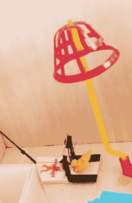

# 老鼠陷阱游戏用作一个真正的老鼠陷阱

> 原文：<https://hackaday.com/2018/08/06/mouse-trap-game-used-as-an-actual-mouse-trap/>

就在你认为你已经探索了 YouTube 上所有奇怪的东西的时候，[肖恩·伍兹]出现了，他的频道致力于测试不同类型的捕鼠器。他的每周视频展示了一切事物的构造和最终效果，从可以在野外制作的原始陷阱，到观众发送的 3D 打印作品。但他的最新视频可能是迄今为止最奇怪的一个，因为他找到了一种方法来[使用经典的*捕鼠器】*棋盘游戏来捕捉真实的啮齿动物](https://www.youtube.com/watch?v=_ogOkocvldw)。

 嗯，算是吧。首先，[肖恩]承认这个“陷阱”完全不切实际，只是为了好玩。考虑到这个东西被装在一个小冰箱大小的盒子里，这应该是很明显的。第二，能够试驾这个米尔顿·布拉德利驱动的小工具的幸运啮齿动物实际上是这个家庭的宠物龙猫，它显然相当平静，我们敢说已经习惯了这种恶作剧。

整个装置的关键来自两个传统的捕鼠器，一个在游戏中更富想象力的同一设备的两端。第一个陷阱用于拉动曲柄，当老鼠踩在垫子上时，曲柄使棋盘游戏开始(一块带衬垫的木头防止横木实际上击中动物)。该游戏通过其怀旧的惯例，以金属球滚下轨道和跳跃板上的小雕像为特色，最终触发第二个真正的老鼠陷阱。在这种情况下，捕鼠器会拉动一根绳子，绳子会在箱子的开口处关上一扇门。

假设你的目标啮齿动物非常有耐心，没有被塑料机械的刺耳声音吓到，那么整个事情就完美了。用他的频道的说法，这就是所谓的“现场捕捉”陷阱，因为它不会伤害老鼠，并让你在事后轻松地移除它们。在这样羞辱了它之后，这是你最起码应该做的。

虽然可能是最独特的，但它肯定不是我们在 Hackaday 讨论过的唯一一个捕鼠器。这个聪明的汽水瓶陷阱可以便宜又容易地制造出来，但是如果你想要昂贵又复杂的东西，你可以用树莓酱。

感谢皮特的提示。]

 [https://www.youtube.com/embed/_ogOkocvldw?version=3&rel=1&showsearch=0&showinfo=1&iv_load_policy=1&fs=1&hl=en-US&autohide=2&wmode=transparent](https://www.youtube.com/embed/_ogOkocvldw?version=3&rel=1&showsearch=0&showinfo=1&iv_load_policy=1&fs=1&hl=en-US&autohide=2&wmode=transparent)

