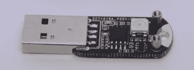

# “鼠语者”让你继续工作，甚至在你需要休息的时候

> 原文：<https://hackaday.com/2022/12/19/mouse-whisperer-keeps-you-working-even-when-you-need-a-break/>

当生活递给你柠檬时，你会做柠檬水，对吗？当生活交给你恼人的侵入性在家工作政策，要求你呆在电脑前，即使你真的真的需要去洗手间，但不能相信你会像一个负责任的成年人一样，不会在回来的路上被电视或冰箱转移注意力，怎么办？在这种情况下，你可以构建类似于[鼠语者](https://hackaday.io/project/188677-mouse-whisperer)的东西——因为恶意的遵从是最好的遵从。

公平地说，[ andrey.malyshenko ]确实列出了相当于自动鼠标摆动器的其他似乎合理的用例。像我们许多人一样，[andrey]不喜欢从屏幕锁定状态重新登录，并且认识到并不是工作的每一分钟都需要盯着屏幕。当然，还需要生物休息，鼠标耳语者就是为了适应这些用例而设计的。

 这个设计相当紧凑，只比一个无线鼠标转换器多占一点空间。插入 USB 端口后，ATtiny85 大部分时间处于闲置状态，等待通过 TTP223 检测手指在裸露焊盘上的触摸。然后，加密狗进入一个例行程序，用鼠标指针描绘懒惰的圆圈，并在板上闪烁 RGB LEB，因为闪光灯很酷。鼠标持续摆动，直到你从非常重要的工作中回来，再次触摸键盘。

现在，如果有人真的在远程监控你，鼠标指针会看起来有点可疑。不过不用担心，代码使用了一个*。h 文件来定义圆，所以其他模式应该是可能的。无论哪种方式，鼠标耳语者都是一个不错的解决方案，它比我们见过的[一些替代品](https://hackaday.com/2011/06/02/trick-mouse-keeps-the-screen-saver-at-bay/)更加紧凑和集成。