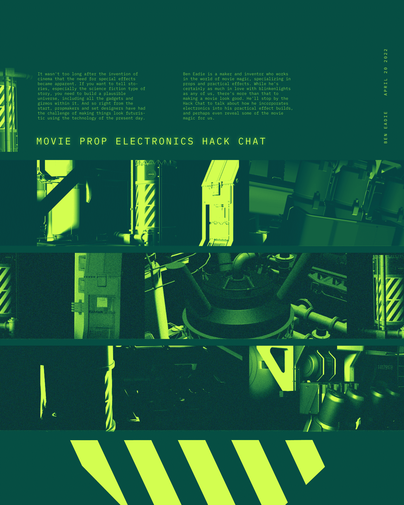

# 电影道具电子黑客聊天

> 原文：<https://hackaday.com/2022/04/18/movie-prop-electronics-hack-chat/>

加入我们太平洋时间 4 月 20 日星期三中午与 Ben Eadie 的[电影道具电子黑客聊天](https://hackaday.io/event/184753-movie-prop-electronics-hack-chat)！

电影发明后不久，对特效的需求就变得显而易见了。如果你想讲故事，尤其是科幻类型的故事，你需要建立一个似是而非的宇宙，包括其中所有的小工具和小发明。所以从一开始，道具制作人和布景设计者就面临着挑战，要用当今的技术让事物看起来具有未来感。

预算和时间限制的现实常常使这一至关重要的世界建设沦为盲目的实践。但并不总是如此。本·伊蒂(Ben Eadie)是一名制造者和发明家，他在电影魔法世界工作，专攻道具和实用效果。虽然他肯定和我们一样热爱闪光灯，但让电影好看不仅仅是这些。他会停下来聊聊他是如何将电子技术融入到他的实际效果中的，甚至可能会为我们展示一些电影魔术。

我们的黑客聊天是在 [Hackaday.io 黑客聊天群发消息](https://hackaday.io/messages/room/2369)中的实时社区活动。本周，我们将于太平洋时间 4 月 20 日星期三中午 12:00 坐下来讨论。如果你被时区束缚住了，我们有一个[方便的时区转换器](https://www.timeanddate.com/countdown/generic?iso=20220420T12&p0=224&msg=Movie+Prop+Electronics+Hack+Chat&font=cursive)。

