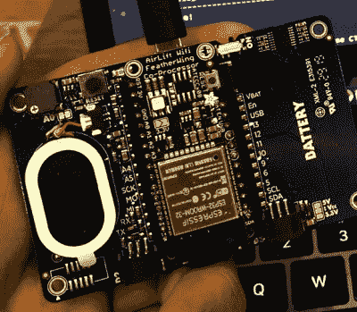

# MQTT 和会议徽章互联网

> 原文：<https://hackaday.com/2020/02/18/mqtt-and-the-internet-of-conference-badges/>

今天，几乎每一个现代消费设备都出于某种原因想要连接到互联网。从你的车库开门器到每个智能灯泡，物联网已经全面到来。但对于我们最喜爱的会议徽章来说，情况就不一样了。想要探索一下这个概念， [[Ayan Pahwa]开始创建他自己的 MQTT 连接徽章](https://codensolder.com/blog/cloudbadge)，他称之为 CloudBadge。

 由于这更多的是一个软件实验，所有的硬件都是现成的。徽章本身是一个 Adafruit PyBadge，通常没有任何联网功能，但背面有一个羽毛兼容的标题。除此之外,[Ayan]还增加了一个空运翼，这使他可以将 ESP32 用作协处理器。他还在挂绳上添加了一条 NeoPixel LEDs，不过如果你不想引起太多关注，这些 led 当然可以省去。

剩下的只是软件的问题。[Ayan]编写了一些代码，使用 PyPadge 和 ESP32 的组合硬件通过 MQTT 连接到 Adafruit.io。连接后，用户可以通过云服务更改屏幕上显示的名称和 RGB LEDs 的颜色。如果你在一个实际的会议徽章上使用这样的东西，这个概念可以很容易地扩展到做一些事情，比如当佩戴者想要看到的演讲即将开始时，徽章的 led 闪烁。

现代会议徽章[已经从简单的闪烁发光二极管](https://hackaday.com/2019/11/04/gigantic-fpga-in-a-game-boy-form-factor-2019-supercon-badge-is-a-hardware-siren-song/)走了很长一段路，提供了在会议结束后很长一段时间内你可能仍在工作的挑战。对安全的担忧以及在活动期间维护必要基础设施的挑战通常意味着它们不包括网络功能，但像 CloudBadge 这样的项目表明这个想法肯定有价值。

 [https://www.youtube.com/embed/I8-We4pXWps?version=3&rel=1&showsearch=0&showinfo=1&iv_load_policy=1&fs=1&hl=en-US&autohide=2&wmode=transparent](https://www.youtube.com/embed/I8-We4pXWps?version=3&rel=1&showsearch=0&showinfo=1&iv_load_policy=1&fs=1&hl=en-US&autohide=2&wmode=transparent)

