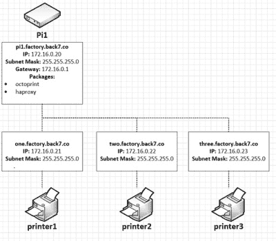

# 多台 3D 打印机，一个 Pi 来管理它们

> 原文：<https://hackaday.com/2020/02/24/multiple-3d-printers-and-one-pi-to-rule-them-all/>

如果你有一台台式 3D 打印机，你很有可能听说过 OctoPrint。这个 web 前端通常运行在 Raspberry Pi 上，允许您从任何具有浏览器的设备上通过网络监视和控制打印机。但是如果你有两台打印机呢？还是 20？每台打印机都有自己的 Pi，这种后勤工作很快就会变得不舒服，[这就是为什么[Jay Doscher]一直在研究一种简化事情的方法。](https://back7.co/home/scaling-octoprint-with-a-raspberry-pi)

 利用 Raspberry Pi 4 增强的处理能力和一些老式的 Linux 技巧，[Jay]现在可以从一台设备控制多台打印机。诀窍是运行 OctoPrint 后端的多个实例，并将它们分配给虚拟网络接口，这样它们就不会互相干扰。这需要一些定制的`systemd`单元文件在 Raspbian 上建立和运行，他已经很友好地将它们包含在文章中。

但是在 Pi 上运行 OctoPrint 的多个副本只是成功的一半。仍然需要一种方法来区分哪一台打印机是哪一台。在正常情况下，当 Pi 启动时，会为打印机分配随机的虚拟串行端口。为了避免混淆，[Jay]解释了如何使用定制的`udev`规则来确保每台打印机都有自己唯一的设备节点。即使你不想争论多台 3D 打印机，这也是一个有用的技巧，如果你发现自己很难跟踪你的 USB 设备的话。

如果你想知道为什么[杰伊]需要这么多的 3D 打印机同时运行，我们听说他们一直在忙着为[委托复制他的热门项目](https://hackaday.com/2020/01/24/a-raspberry-pi-terminal-thats-always-within-reach/)生产零件。伙计们，下次当你想知道是否有办法从我们的这个小爱好中获得快乐时，这是值得考虑的。