# 共同打造的幸福:MCH2022 是如何发生的

> 原文：<https://hackaday.com/2022/08/02/mutually-crafted-happiness-how-mch2022-happened/>

就在几天前， [MCH2022，](https://mch2022.org/)一个在荷兰举行的为期六天的黑客营结束了——将大约三千名黑客聚集在一起。这是我第一次去这样的大型黑客营地，因为我只去过较小的营地，这个故事来自一个现在才遇到复杂性和错综复杂的人。这是它如何在内部运行的故事。

[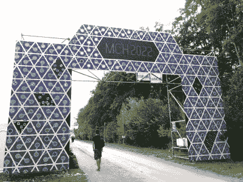 ](https://hackaday.com/wp-content/uploads/2022/07/hadimg_mch2022_intro_pic0.jpg) MCH2022 是荷兰一个黑客营系列的继承者——你可能听说过上一个， [SHA，2017 年组织的。](https://hackaday.com/2017/08/25/shacamp-2017-a-personal-review/)“MCH”的官方意思是可能包含黑客——而那些，它绝对包含了。各种各样的黑客可以休息、见面和闲逛的活动——早就应该了，事实上，由于无处不在的疫情，这个活动推迟了一年。这不是一个像会议一样的活动，你会期待一个时间表，餐饮和娱乐-很多使 MCH 酷的是每个黑客的独特投入。

就像许多其他类似的营地一样，这是一个志愿者组织的活动——除了几个对决策没有影响力的赞助商之外，没有任何公司支持它；这是黑客的活动，是为黑客举办的。荷兰有一个健康的黑客空间文化，他们之间有大量的合作，形成了一个自组织的志愿者网络，这种合作产生了神奇的效果。

# 细致复杂和谐

[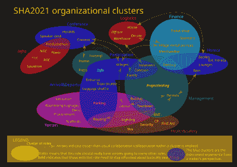](https://hackaday.com/wp-content/uploads/2022/07/hadimg_mch2022_teams.png)2022 年的夏天对活动组织者来说是一个繁忙的时期——人们渴望出去一起玩一次，所以租赁设备、寻找服务和雇佣工人变得更加困难。合同必须尽早签署，2022 年初的“早点拿到票，让营地发生”倡议帮助众筹到了初始投资。准备工作结束了，无数的人各自扮演着几个[关键角色](https://wiki.mch2022.org/Teams)——这个试探性的图表可能会帮助你对复杂性有所了解。

如你所见，有大量的事情需要准备。我们这些熟悉活动组织的人都知道在这些方面会有多少事情出错，带来严重的后果。相反，夏令营进行得很顺利；事实上，额外增加的一年似乎有助于更细致地准备事情，甚至有一些乐趣。妇幼保健徽章本身就是一件艺术作品，其设计和目的都经过深思熟虑，无疑值得单独撰写一篇文章。

有些复杂性是为了帮助我们这些游客做好准备。甚至在你开始打包旅行之前，你首先会遇到的是 MCH 关于[露营](https://wiki.mch2022.org/Camping)的维基页面——详细列出你应该或不应该带的[东西、](https://wiki.mch2022.org/What_to_bring)每个人需要注意的[方面和法律限制](https://wiki.mch2022.org/How_to_survive)。如果你需要一份下一次黑客营旅行的打包清单，你可以放心地求助于 MCH Wiki 的相应页面——是的，就是这么详尽。

 令我惊喜的是妇幼保健支付系统的周到。当然，你会时不时地想要一顿饭，在酒吧买一瓶冰镇鸡尾酒，也许还会买一些红酒。你可能会像我一样，提前从自动取款机里取出一些钞票。然而，如此大规模的现金管理是一件非常痛苦的事情，正如我们在[介绍中所了解到的。](https://media.ccc.de/v/mch2022-109--may-contain-hackers-2022-opening)令我着迷的是二维码代金券系统，它旨在取代现金用于营地的官方用途，功能与现金一样好，具有所有的隐私，没有任何负面影响，再加上一个卡处理系统，适用于所有拥有合适卡的人——Visa 不会这样做——支付一如既往地舒适。在乡村，现金仍然是购买和捐赠的唯一选择；对于食品付款，我用一些现金换了一个二维码，就搞定了。

# 至少参观一些会谈

黑客事件的规则适用于此——谈话会被记录下来，以后随时可以观看，但在夏令营结束后，你不能以自己的速度体验其他一切。因此，我并没有参加太多的会谈，把自己限制在大约七场——这并不是很多，因为在六天的时间里有超过一百场预定的会谈。也就是说，如果没有所有的讲座，MCH 将是不完整的——让我们黑客分享我们所做的重要事情，无论是有影响力的，娱乐性的，教育性的，还是这三者的混合，你绝对应该去这样的营地参加一些讲座。

我很高兴能在那里看到[对 Android 权限范例的全新审视](https://media.ccc.de/v/mch2022-90-no-permissions-needed)隐藏着明显的信息泄露载体、[对微生物和生物燃料的洞察、](https://media.ccc.de/v/mch2022-155-hacking-with-microbes)对我们关于技术回收的思考方式的大胆重构、以及对多核处理器的侧信道攻击的一次旅程[。](https://media.ccc.de/v/mch2022-279-fault-injection-on-a-modern-multicore-system-on-chip)有很多黑客行为可以见证，适合各种口味，大多数视频[似乎已经可用](https://media.ccc.de/c/MCH2022/MCH2022%20Curated%20content) ( [YouTube](https://www.youtube.com/MCH2022NL) )，给我们每个人几十个小时的黑客故事添加到我们的工作播放列表中。

然而，你不能真的把自己局限在演讲中，因为妇幼保健的每个部分都提供了更多的东西——除了必须的 CTF 和一堆与徽章相关的挑战。从研讨会和小型黑客会议，到精心运输的艺术项目和多样化的村庄，希望向您展示您从未体验过的黑客生活的方方面面，有很多东西需要了解。尤其是这些村庄，值得拥有自己的故事。

# 需要黑客来养育一个村庄

村庄是同一顶帐篷下的物理保护伞，从大到小——大多数对外部访客和许多私人访客开放。一些村庄是主题性的，比如组织定期课程的[开锁村](https://wiki.mch2022.org/Village:Lockpicking)，一些是黑客空间和黑客空间团体，以一群成员的形式到达，并建立一个迷你大使馆，一些是朋友和同事团体，使用他们的帐篷作为在营地活动之间闲逛和休息的空间。妇幼保健鼓励你加入一个村庄并提供帮助，营地上的各个村庄使妇幼保健更加活跃。

[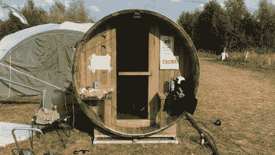](https://hackaday.com/wp-content/uploads/2022/07/hadimg_mch2022_villages_pic1.jpg)

作为村庄的一部分，你可以组织自己的会议——邀请人们在你的村庄做事情的活动，无论是硬件黑客基础知识的演示，[晨跑](https://wiki.mch2022.org/Session:Trail_Run)以一些新发现的能量开始新的一天，用 ESP32、和 80 年代的音乐支持的[关于技术伦理的对话](https://wiki.mch2022.org/Session:Ethical_Dialogue)[驾车实践。既然有可能把一辆装满东西的公共汽车带到这样一个黑客营地，许多人确实这么做了。也就是说，你不会像看到 DJ 设备、扬声器、便携式烤架、冰箱，甚至一个小型桶形桑拿浴室那样看到数控机器，有人会猜测，这是芬兰黑客空间带来的。当然，你不需要拘泥于一个模板。](https://wiki.mch2022.org/Session:Wardriver.uk_-_open_source_wardriving_with_the_ESP32)

Milliways [是一个黑客集体](https://wiki.milliways.info/index.php?title=Main_Page)——其中，他们在 MCH 组织了一个免费的小吃摊；[名副其实，](https://hitchhikers.fandom.com/wiki/Milliways)任何旅行者都可以到达。当然，免费的食物在有人制作之前是不会出现的，每天，你都会看到一些志愿者黑客切蔬菜，做玉米饼馅，一边做一边聊天。在一个小时的时间内，食物将从“原料”变成“一顿饭”，这要感谢一群黑客让这一切成为现实。我不清楚 Milliways 的所有原料来自哪里——我更愿意假设，就像它的名字一样，人们依赖于一些精明的投资。

 [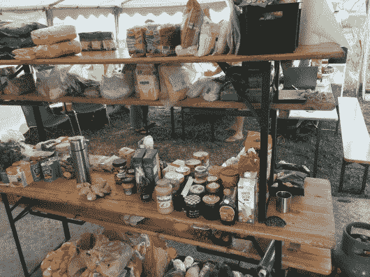](https://hackaday.com/2022/08/02/mutually-crafted-happiness-how-mch2022-happened/hadimg_mch2022_villages_pic2/)  [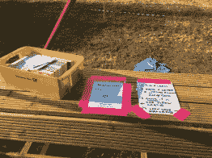](https://hackaday.com/2022/08/02/mutually-crafted-happiness-how-mch2022-happened/hadimg_mch2022_villages_pic3/)  [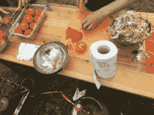](https://hackaday.com/2022/08/02/mutually-crafted-happiness-how-mch2022-happened/hadimg_mch2022_villages_pic7/)  [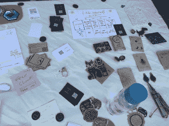](https://hackaday.com/2022/08/02/mutually-crafted-happiness-how-mch2022-happened/hadimg_mch2022_villages_pic6/)  [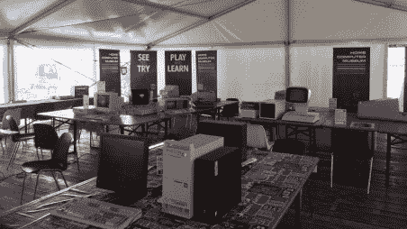](https://hackaday.com/2022/08/02/mutually-crafted-happiness-how-mch2022-happened/hadimg_mch2022_villages_pic8/)   

[复古计算村](https://wiki.mch2022.org/Village:Retro)为我们带来了一系列令人惊叹的复古系统，而[复古游戏村](https://wiki.mch2022.org/Village:RetroGaming)有你可以花时间玩的游戏机。[生物黑客村](https://wiki.mch2022.org/Village:HackTheHealth)带来了一堆人们可以测试的医疗设备，包括一个插在土豆上的血糖仪传感器——就血糖仪而言，土豆具有人体的所有特征。[食物黑客基地](https://wiki.mch2022.org/Village:FoodHackingBase)每天都有关于自己的香料和一系列食物制作设备的活动，每天都很忙碌，对任何想分享食物制作技能的人开放，我在那里遇到一些最友好的人是有道理的。

正如你可能已经注意到的那样，食物是相当多村庄的主食，这并不奇怪——这是侵入黑客心灵的最快途径之一。这些村庄中有很多是正在进行的项目，将会出现在下一个营地——请留意。所有的村庄都让每个人把自己的一部分带到妇幼保健中心——这是建立一个人们真正喜欢的营地的要求。

# 小心处理基础设施问题

一些快餐车受到了邀请，功能完美的厕所和淋浴器被送来了，还有一场现场激光装饰的视觉秀——还有声音支持。然而，MCH 营地所依赖的远不止这些，首先也是最重要的，是一个不知疲倦、背景各异的团队让营地得以实现。任何来访者都可以也应该成为这个团队的一员——即使不是通过组织一个村庄或帮助营地的一个基本方面，事实上，你总是可以做些什么来帮助妇幼保健顺利运作。

天使系统将是你帮助这个阵营运作的引子，和许多像你一样的黑客一起。如果你发现自己有几个小时的空闲时间，要做的事情就是登录天使系统，注册一个班次。这些任务中的大部分都可以由任何人来完成，但是拥有像驾照或急救培训这样的选择会为你提供额外的帮助。两者都没有，我和我的朋友报名参加了跑步轮班——暂停任何随机和紧急的任务，你不想让其他志愿者分心。最后，没有什么紧急的和意想不到的事情需要我们去处理——这证明了那天晚上营地运作得有多好。

其他基础设施必须提前准备好。网络基础设施是一个防故障的，甚至有点过度设计的爱的劳动——没有中断或减速的迹象，无论如何，你不会发现自己长时间独自带着笔记本电脑。一个预期的 DECT 电话网络正在运行，曾经非常有用的医疗中心随时准备应对任何问题。无论是会谈、基础设施、村庄，还是整个营地的方向，事情都做得很好。

# 这一切汇集在一起

你会在这里交到朋友，用我们第一天遇到的某个人的话来说，你会找到一个让你感觉像朋友的地方。无论是共同的兴趣，参与其中一个村庄或天使活动，晚上开派对，还是友好的意大利人乐于与你分享格拉巴酒，都不缺少结识志同道合的黑客的机会。在这五天里，当我和我的朋友四处走动时，营地的每个角落都有随机遭遇。[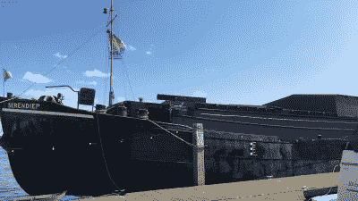](https://hackaday.com/wp-content/uploads/2022/07/hadimg_mch2022_more_pic2.jpg)

我们在这个营地为自己设定了一些个人挑战，比如获得我们在船上焊接的第一次体验[(完成！)，](https://twitter.com/FairywrenTech/status/1550854316193374209)或者更换一个 0.4 毫米间距的 BGA 来固定我们同事的笔记本电脑[(完成，](https://twitter.com/WifiCable_/status/1551916139328012296)笔记本电脑就复活了！).请注意，那艘船不是普通的船——它原来是一艘[私人实验室的船，](https://www.serendiep.nl/en)恰当地命名为 Serendiep，由一个艺术家集体在《疫情时报》上建造，因此配备了舞台区和招待客人的手段。它的私人实验室区最吸引我们——当然，除了所有与艺术相关的东西之外，船主们还在研究类似紧凑型废物堆肥装置的东西。

营地为我们准备的东西比我们最初计划的要多得多。chaos post——一个营地内部的邮件系统，里面有一大堆明信片——引起了我们的注意，我们花了几个小时来投递其他游客制作的明信片。这也给了我们一个理由去参观妇幼保健的各个领域，否则我们可能不会去的地方。由于 MCH 是在一个湖边举行的，我们的 ChaosPost 任务之一是将一块巧克力送到每小时运营的渡轮上——我们最终在那艘渡轮上进行了一次短途旅行，往返于另一个海岸，与一些可爱的人一起像我们一样享受风景优美的路线。

 后来，在营地上，两个德国人在一个写着“免费东西”的超大帐篷里吸引了我们的注意——其中一个人正试图处理掉一堆占用他地下室空间的旧设备。我和我的朋友翻箱倒柜，开始和他们聊起任何事情，最后被邀请吃一些新鲜的烤汉堡，一个小时后带着一些我们现在在营地结束后使用的有用的零碎东西离开。营地的每个角落都为我们准备了这样的惊喜——人们准备分享他们的故事和发现，或者分享一些令人兴奋的经历。

在营地的不同时间点，我发现自己追着一辆小卡车跑，我忘记了我们的一些物品，为 Milliways 餐切蔬菜，偶然发现一个帐篷，有人在那里测试他们的实验软件，将数据集转化为声景，谈论进入 USB PD 解码的简单方法，听别人认真的故事，并不时找到一张桌子，上面有各种漂亮的贴纸。偶尔，一辆小型临时车辆会从我们身边经过，许多车辆都覆盖着 LED 灯条，有些明显是由悬浮滑板改装而成的。这些天给了我们相当大的冒险，充满了所有不同黑客带来的可观的随机性。

 [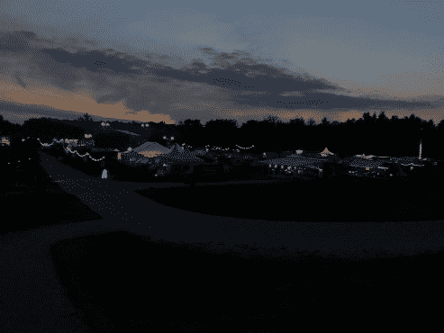](https://hackaday.com/2022/08/02/mutually-crafted-happiness-how-mch2022-happened/hadimg_mch2022_night_pic3/)  [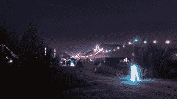](https://hackaday.com/2022/08/02/mutually-crafted-happiness-how-mch2022-happened/hadimg_mch2022_night_pic1/)  [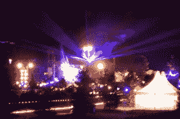](https://hackaday.com/2022/08/02/mutually-crafted-happiness-how-mch2022-happened/hadimg_mch2022_night_pic4/)    [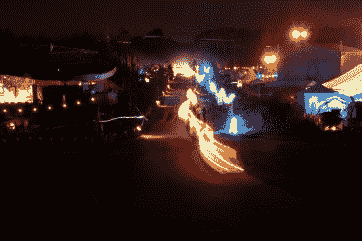](https://hackaday.com/2022/08/02/mutually-crafted-happiness-how-mch2022-happened/hadimg_mch2022_night_pic2/) 

气候并不是最友好的——两天的热浪正好排在日程中间。谢天谢地，对我们所有人来说，事情进展得很顺利，医疗中心已经准备好帮助那些需要帮助的人。到了晚上，气温会下降，营地会活跃起来。发光二极管、火焰喷射器和卤素灯将会发光，大大弥补了阳光的不足。一些区域组织聚会，背景音乐充满活力，另一些区域举行小型安静的聚会和谈话，这两个区域之间有足够的距离，再加上指定的安静区域，那些想睡觉的人可以舒服地睡觉。

# 夏令营结束了，但还在继续

所有的组织者、志愿者和参与者都投入了精力，参加 MCH2022 真是太棒了。很多人为这个夏令营做出了贡献——每当你周围的下一个夏令营兴起时，你应该考虑做出自己的贡献，并看到它成长为比你一个人的努力更大的东西。

虽然这个营地可能有黑客，但发生的事情无法控制。无论是谈话录音、图片、故事、[回忆、](https://wiki.mch2022.org/Memories)项目还是可能从 MCH 互动中涌现出来的友谊，即使你不在那里，我也希望这次为期一周的黑客务虚会的积极影响能够在我们的社区中挥之不去。

> MCH2022 正式结束！感谢所有人带来的精彩活动！
> 
> —mch 2022(@ mch 2022 camp)[2022 年 7 月 26 日](https://twitter.com/MCH2022Camp/status/1551956674675613696?ref_src=twsrc%5Etfw)