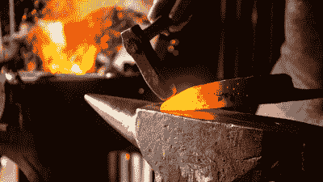
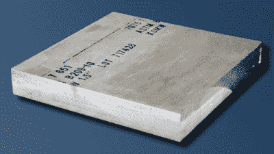
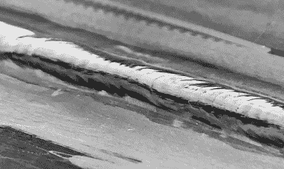

# 纳米粒子为“不可焊接”的铝带来巨大变化

> 原文：<https://hackaday.com/2019/04/15/nanoparticles-make-mega-difference-for-unweldable-aluminum/>

尽管大部分被隐藏起来，焊接仍然是社会的重要组成部分。它是粘合剂，将我们驾驶的汽车、我们居住的建筑、我们使用的电器和重型机械的框架粘合在一起，使我们不断前进。每年，我们都在不懈地寻找更强更轻的材料，以简化我们未来交通和太空探索的旅程。

这些未来材料中的一些已经存在了几十年，但焊接它们所需的技术却落后了。加州大学洛杉矶分校塞缪尔利工程学院的一组研究人员最近找到了解开铝合金 7075 可焊性的钥匙，这种铝合金是在 20 世纪 40 年代开发的。[通过向混合物中添加碳化钛纳米颗粒，他们能够创造一种比碎片本身更强的结合](https://samueli.ucla.edu/nanotechnology-enables-engineers-to-weld-previously-un-weldable-aluminum-alloy/)。

A blacksmith at work. Via [BBC](https://ichef.bbci.co.img/ic/1200x675/p02q80dl.jpg).

## 焊接的热史和肮脏史

简单地说，焊接被定义为“不使用紧固件连接金属和塑料”。最常见的是熔焊，用火焰或电极将母材熔化在一起。非熔焊包括钎焊和铜焊。在这些方法中，第三种金属被用作填充物来帮助连接部件。

焊接可以追溯到中世纪，最早的焊工是铁匠。这些勇敢的、满身煤烟的人只用火、锤子和极大的耐心就把铁片切割并连接在一起。工业革命将焊接的需求提高了几个数量级，因为那个时代的许多机器都是通过铸造熔融金属制造的。这带来了一个建立在新的铸造焊接工艺基础上的整个子行业，包括加热碎片，用螺栓固定它们周围的模具，并倒入熔化的金属。

当电在 20 世纪出现时，照明设备中使用的碳弧棒激发了电弧焊的想法。电弧焊的工作原理是在电源(弧焊机)和待焊金属之间建立电路。接地线夹在工件上，正极引线连接到装有弹簧的夹子上，夹子上有一个 12-14 英寸的电极。这种焊条由母合金匹配的填充金属组成，金属表面涂有一层加热时会变成气体的焊剂材料。这种气体保护工件和填充金属免受空气中杂质的影响，同时形成焊缝。不利的一面是，它还会产生必须被铲掉的固化污物渣。

氧乙炔气焊紧随电弧焊之后出现，第一次世界大战推进了这两种方法。随着飞机制造业开始起飞，对轻质、耐用金属的需求以及将它们焊接在一起的人员激增。一种被称为 GTAW(气体保护钨极电弧焊)、Heli-Arc 或 TIG(钨极惰性气体保护焊)的新型焊接开始流行起来。虽然很难掌握，TIG 焊接提供了更好的控制，并给出了良好的结果。

AA7075 plate, available from [Midwest Steel and Aluminium](https://www.midweststeelsupply.com/store/7075aluminumplate)

## 并非所有的合金都是盟友

许多常见的焊接金属是几种不同金属的合金。这是因为纯金属对于汽车和建筑物的框架来说太软了(也太贵了)。唯一的问题是一些合金的组成金属不能很好地融合在一起。当加热时，不同的金属流动不均匀，裂纹沿着焊接接头发展。这一致命弱点使得许多强度高、信誉好的合金在焊接应用中毫无用处。

AA7075 就是这些合金中的一种。这种有几十年历史的铝、锌、镁和铜的混合物非常坚固，但重量很轻。它是许多应用的理想选择，尤其是重视燃油效率和电池保护的应用。唯一的问题是 AA7075 在焊接时极易开裂。尽管广泛用于铆接在一起的飞机机身，AA7075 通常被认为是不可焊的。

Successful arc weld of AA7075 using titanium carbide-infused filler rod. Via [UCLA](https://samueli.ucla.edu/nanotechnology-enables-engineers-to-weld-previously-un-weldable-aluminum-alloy/).

## 黑仔填料

由研究生马克西米利安·索科卢克和李小春教授领导的加州大学洛杉矶分校研究小组赋予了这种合金新的生命。他们找到了一种方法，将两片 AA7075 钨极氩弧焊接在一起，不会出现任何裂纹。

TIG(钨极惰性气体)焊接使用位于焊炬内部的非自耗电极钨电极。在焊接过程中，焊炬释放氦气或氩气，保护焊缝免受杂质影响。由相容的合金制成的单独的填充丝可以用来完成连接，尽管对于较厚的基底金属来说不需要。

这篇论文描述了[在混合物中加入碳化钛纳米颗粒如何让它们产生一种被证明比碎片本身更强的结合](https://samueli.ucla.edu/nanotechnology-enables-engineers-to-weld-previously-un-weldable-aluminum-alloy/)。金属丝的填充金属注入了碳化钛纳米颗粒，这增强了熔化区金属的机械性能。使用电子显微镜，研究人员研究了接头的横截面，发现纳米颗粒改变了合金的凝固机制。事实上，它们提供了如此多的强化，以至于熔化区的金属实际上变得比母体金属更硬。

Results of welding with AA7075 filler, ER5356 filler, and nanotreated AA7075 filler rods. Notice the cracking in (b) and (c) but not (d). Via [Nature](https://www.nature.com/articles/s41467-018-07989-y/figures/1).

最终的接头非常坚固，抗拉强度高达 392 兆帕。用稍微通俗一点的术语来说，这意味着它可以承受世界上最深的海洋海沟马里亚纳海底三倍以上的压力。这不仅对 AA7075 来说是个好消息，也为其他高等级、以前不可焊接的合金创造了新的机会。