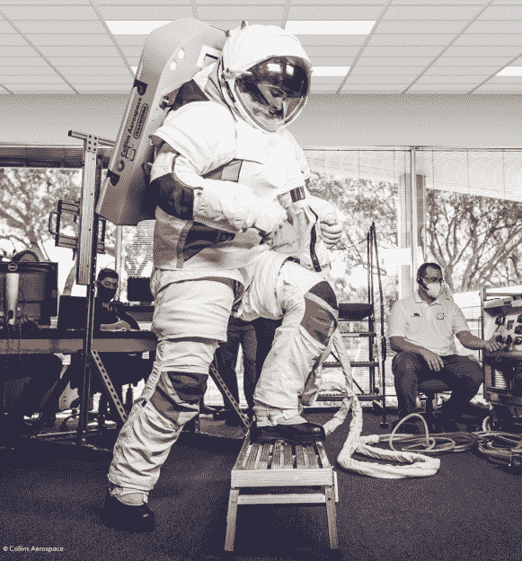
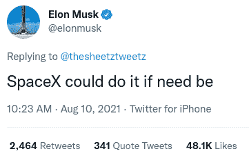

# 美国宇航局向商业伙伴寻求宇航服

> 原文：<https://hackaday.com/2022/06/03/nasa-turns-to-commercial-partners-for-spacesuits/>

当国际空间站上的美国宇航局宇航员不得不爬上轨道设施的外部进行维护或维修时，他们会穿上一套称为舱外机动装置(EMU)的宇航服。这种笨重的衣服本质上是一个独立的小型航天器，于 1981 年推出，允许航天飞机机组人员离开轨道飞行器，在飞船洞穴般的货舱中工作。虽然宇航服在 90 年代末有了小的升级，但它们在很大程度上仍然是 20 世纪 70 年代技术的产物。

不仅现有的电动车组已经过时，而且它们只被设计用于太空，而不是地表。随着美国宇航局的目光投向月球，并最终投向火星，在离开国际空间站之前，该机构需要为宇航员配备升级和现代化的宇航服，这已经不是什么秘密了。因此，最终成为探索舱外机动装置(xEMU)的发展至少可以追溯到 2005 年，当时它是最终被取消的星座计划的一部分。

NASA’s own xEMU suit won’t be ready by 2025.

不幸的是，经过十多年的开发和据报道 4.2 亿美元的开发成本，xEMU 仍然没有准备好。由于载人登月仍暂定于 2025 年进行，美国宇航局决定让他们的商业合作伙伴来解决这个问题，最近[与两家公司签订了宇航服](https://www.nasa.gov/press-release/nasa-partners-with-industry-for-new-spacewalking-moonwalking-services)的合同，该宇航服既可以在月球上工作，也可以取代国际空间站轨道使用的老化 EMU。

作为探索舱外活动服务(xEVAS)合同的一部分，两家公司都将获得 xEMU 开发期间收集的数据，尽管他们预计将创造新的设计，而不是 NASA 已经在工作的副本。受商业船员计划的成功启发，该计划催生了 SpaceX 的 Crew Dragon，该合同还规定，两家公司将保留对该计划期间开发的宇航服的完全所有权和控制权。事实上，美国宇航局甚至鼓励这些公司为成品宇航服寻找更多的商业客户，希望竞争激烈的市场有助于降低成本。

不可否认的是，NASA 与商业供应商的合作已经为货物和船员带来了回报，因此有理由相信他们会回到井里满足下一代宇航服的需求。这些公司也有足够的动力来提供可行的产品，因为该合同的潜在最大价值为 35 亿美元。但随着 2025 年的迅速临近，在宇航服被送往月球之前，contact 需要进行轨道测试，最大的问题是两家公司是否还有足够的时间越过终点线。

## 竞争对手

在 6 月 1 日的公告中，美国宇航局透露，它已经将下一代宇航服的合同授予 Axiom Space 和 Collins Aerospace，该宇航服可以为国际空间站的机组人员提供服务，直到 2030 年暂定退休，并支持作为 Artemis 计划一部分的月球探索。虽然公告提到了一个令人向往的目标，即最终在载人火星任务中使用该宇航服的某种变体，但这不是合同的具体要求。

那些关注最近太空发展的人可能会认出公理这个名字。该公司寻求开发他们自己的国际空间站的私人继任者，该空间站将作为轨道实验室的扩展，直到它准备好被分离并作为自由飞行站运行。作为准备工作的一部分， [Axiom 最近对 ISS](https://hackaday.com/2022/04/25/axioms-private-iss-mission-was-no-space-vacation/) 进行了一次私人资助的任务，在此期间进行了几项与未来空间站硬件的设计和开发有关的实验。

A prototype of Collins Aerospace’s spacesuit.

在新闻发布会上，Axiom 总裁兼首席执行官 Michael T. Suffredini 透露，在被 xEVAS 合同选中之前，他的公司已经在研究自己的宇航服设计，这是有道理的，因为他们的目标是最终摆脱 NASA 的官僚主义来运营他们的空间站。事实上，Axiom 将能够保留宇航服的设计，即使它的开发将由航天局资助，这对该公司来说也是一个巨大的福音，这可能是他们最初同意这项安排的原因之一。

虽然 Axiom Space 是“新空间”公司的定义，但 Collins Aerospace 绝不是。作为雷神技术公司的子公司，他们设计了阿波罗月球宇航服，并且是当前电动车组的主承包商。说他们在宇航服游戏方面有一些经验是一种保守的说法。

让一家敏捷的商业太空初创公司与一家根深蒂固的航空航天公司竞争，就像 SpaceX 和波音公司之间的竞争一样，看哪家公司可以率先设计和建造自己的载人飞船。“新空间”的竞争者在那一轮中大获全胜，但现在预测任何事情都还为时过早。

## SpaceX 的意外事件

一些人可能会对 SpaceX 没有获得 xEVAS 计划的合同感到惊讶，因为该公司已经设计了他们自己的超级英雄灵感服装，用于他们的船员龙飞船上。2021 年，埃隆·马斯克甚至在推特上说，如果能确保美国宇航局坚持 2025 年登月截止日期，他的公司将接受建造月球兼容宇航服的挑战。

 但实事求是地说，NASA 已经将 Artemis 计划的大部分放在了 SpaceX 的肩上。从授予该公司在月球门户站的[建设和补给中的关键角色，到选择 Starship 作为将人员带到月球表面的着陆器，毫不夸张地说，美国的月球雄心几乎完全依赖于加州霍桑公司。对于美国宇航局在月球上建立长期存在，Artemis 计划需要保持一定程度的多样性。将项目的每一步都交给一家公司去做实在是太冒险了，即使这家公司拥有超越竞争对手的记录。](https://hackaday.com/2021/02/18/nasa-selects-spacex-to-launch-lunar-gateway/)

也就是说，SpaceX 不必等待美国宇航局的邀请来开发新的宇航服。今年 2 月，该公司宣布[他们将展示船员龙压力服的改良版本](https://spacenews.com/spacex-and-isaacman-to-partner-on-series-of-crewed-dragon-and-starship-flights/)，这将允许在私人北极星黎明任务中从太空舱进行舱外活动(EVA ),目前计划在 2022 年底进行。因此，无论该公司是否被正式要求拿出一个把靴子放在月球上的后备计划，看起来他们很有可能正在努力。