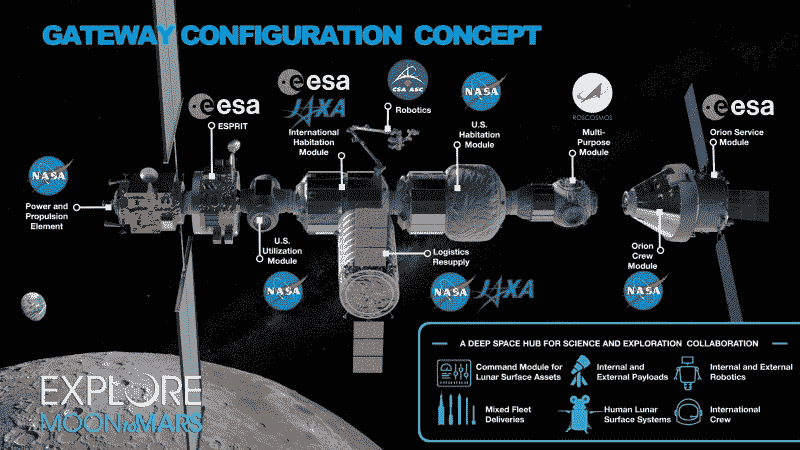

# 美国宇航局的持续探月计划

> 原文：<https://hackaday.com/2020/05/05/nasas-plan-for-sustained-lunar-exploration/>

阿波罗计划证明了人类可以登上月球并做有用的工作，但由于后勤和技术的限制，单个任务被缩短了。整个项目花费了 280 亿美元(调整后为 2830 亿美元)，宇航员在月球表面总共只停留了大约 16 天。相比之下，国际空间站的建造成本估计为 1500 亿美元，自 2000 年 11 月以来一直处于使用状态。阿波罗是一项不可思议的技术成就，但不是探索我们最近的天体邻居的一种特别划算的方式。

利用从阿波罗计划中吸取的经验教训、现代技术以及与国际和商业伙伴的合作，美国宇航局最近公布了他们在未来十年内在月球上建立持续存在的计划。以阿波罗的孪生姐妹命名的阿耳忒弥斯计划，将不仅仅是一系列一次性的任务。完全实现后，它不仅包括宇航员将在月球表面工作和生活数月的永久前哨站，还包括月球轨道上的空间站，该空间站提供后勤支持，并为深空技术提供试验场，这些技术最终将被人类用于火星任务。

这是一个短期内雄心勃勃的计划，但美国宇航局认为它反映了自人类上次离开相对安全的低地球轨道以来所取得的令人难以置信的技术进步。国际空间站运营了 20 年，使相关国家获得了组装和维护大型轨道综合体的实践经验，几十年的机器人任务磨练了精确动力着陆所需的技术。通过结合自阿波罗计划结束以来获得的所有知识，Artemis 计划希望最终在月球上和周围建立一个连续的人类存在。

## 轨道组件

美国国家航空航天局表示，随着该机构推进对月球表面的大规模探索和开发，绕月轨道空间站将是一项无价的资产。这个被宇航局称为“入口”的空间站将为宇航员和他们的航天器提供一个集合点，从而允许更复杂的任务。例如，一个比阿波罗任务中使用的更大更有能力的着陆器可以在分配的工作人员到达之前在 Gateway 进行组装和检查。从表面返回后，着陆器可能会在空间站进行翻新和补充燃料，以用于另一项任务，而不是被丢弃。

除了支持月球活动，美国国家航空航天局表示，Gateway 还可以用作深空研究的实验室，就像国际空间站用于低地球轨道一样。它的位置将有利于太阳物理学研究和地球观测，几个可以安装在空间站外部的科学模块已经在进行中。

在国际空间站建设期间发展的关系的基础上，美国航天局将与日本、加拿大和欧洲航天局合作开发关键的网关模块。虽然细节尚未最终确定，但预计俄罗斯航天局 Roscosmos 最终将贡献自己的模块。

尽管美国宇航局自己的太空发射系统具有令人难以置信的有效载荷能力，但预计许多门户模块最终将由商业运载火箭运送到月球，以降低成本。该机构还开始寻找能够定期向空间站进行补给飞行的商业合作伙伴，SpaceX 最近获得了第一份“门户物流服务”合同。

## 建立营地

展望更远的未来，美国宇航局表示，他们希望在月球上建立一个名为“阿尔特弥斯大本营”的永久性前哨基地，一次可以容纳几名宇航员数月。大本营的确切位置尚未确定，但该提议称，靠近南极的某个地方是合理的选择，因为它可以提供长时间的阳光，并可以直接回到地球。许多参考资料提到了沙克尔顿环形山周围的区域，因为人们相信在它阴暗的底部有大量的水冰沉积。该地区的地形也相对平坦，这将使着陆和水面航行更加容易。

The LTV would support exploration near Artemis Base Camp

为此，该提案还提到在基地营地需要几辆地面车辆。月球地形车(LTV)将是相当于阿波罗任务中著名的“月球车”的现代版[，而可居住移动平台将是一个更大的车辆，能够支持远离大本营的长途跋涉。没有这个移动指挥中心，美国国家航空航天局说，宇航员将无法探索距离大本营几公里以外的地方。](https://hackaday.com/2015/05/11/hanging-out-with-someone-who-walked-on-the-moon/)

随着时间的推移，阿耳忒弥斯基地营地的基础设施将得到扩大和改善。随着美国国家航空航天局获得在月球表面建造建筑的实际经验，将建造更多的设施，提供从发电到废物处理的一切。

美国宇航局没有给出任何建立阿耳忒弥斯基地营地的时间表，只是说它将在计划的 2024 年阿耳忒弥斯三号任务后的某个时候发生，这将是 50 多年来人类首次登上月球。这种规模的装置可能需要几十年才能建成，但鉴于该机构的目标是在月球上建立永久存在，这不一定是一个问题。

## 梦想与现实

美国国家航空航天局结束了这份 13 页的提案，称在 Artemis 项目中吸取的经验教训将使该机构走上 21 世纪 30 年代人类登陆火星的轨道。它说，一个完全实现的网关可以让机组人员为长达数月的飞往红色星球的飞行进行训练，并且为月球开发的地面车辆可以很容易地重新用于火星。月球永远不可能成为人类火星任务独特挑战的完美替代，但毫无疑问，在低地球轨道之外的进一步操作经验将是有益的。

也就是说，在金属弯曲和硬件推出之前，这一切都只是一个想法。正如我们一次又一次地在美国宇航局的大型项目中看到的，确保必要的资金总是一个挑战。该机构还必须应对政治突发事件，因为一个持续几十年的项目需要得到多位总统的持续批准。事实上，绝对不能保证宇航员有一天会从大本营出发，开着他们的 ltv 去探索沙克尔顿环形山的边缘；但是我们可以希望。