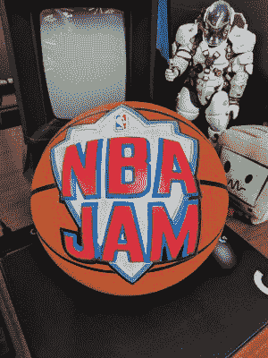

# SNES 上的 NBA 即兴表演正在升温

> 原文：<https://hackaday.com/2018/12/03/nba-jam-rom-hack-on-snes-is-heating-up/>

这是一款罕见的游戏，能够弥合体育游戏迷和那些铁杆游戏玩家之间的差距。Midway 在 1993 年发布 NBA Jam to arcades 时，能够将这两个群体带到共同的基础上。这款游戏一炮而红，同年被移植到 16 位家用游戏机上。妥协是在那些港口期间做出的，所以一年后以 NBA Jam:锦标赛版的形式试图使它们更符合街机版本。然而，在[eskayelle] NBA Jam 的中心:超级任天堂上的 TE 走得还不够远。现在他们发布了[一个完全重做 NBA Jam: TE](http://www.romhacking.net/hacks/4097/) 的 ROM hack，它被称为“双 Z Mod”。

The original NBA Jam ball (courtesy of Steve Lin)

ROM hack 背后的概念是带来球迷应得的 NBA Jam 游戏。从 90 年代初开始，流行文化的各个方面都被融入其中(不仅仅是前总统)。根据 ROM 黑客的笔记，一些被打包到 mod 中的东西包括:

原始游戏的资产已经恢复，例如真人快打横幅。修改了某些玩家，让他们更有“阿卡德”的感觉。
·与飞人乔丹一起飞向新的高度！
扮演“蠕虫”，丹尼斯·罗德曼，在至少四个团队中。
·忘记新秀，现在作为 1992 年的梦之队打球。
大量新的秘密角色，包括:胡克·霍根、大卫·霍索夫、T-800 版的阿尼等等。
·扩大名册现在就像输入“Konami 码”一样简单

(提示:标题屏幕菜单上的 B、A、B、A、上、下、B、A、左、右、B、A)

为了回报 ROM 黑客社区，[eskayelle]甚至[提供了一系列有用的工具](http://www.romhacking.net/documents/790/)来帮助潜在的 SNES ROM 黑客构建他们自己的 NBA Jam:TE remix。该文件详细说明了改变球员照片、球队颜色、数据和修饰的方法。由于双 Z mod 专注于尽可能成为 90 后，也许这一系列教程将导致当前的 NBA 名册更新。

要玩 NBA Jam TE Double Z mod，您可以使用 Retrode 这样的设备，它可以轻松地将原始弹夹转储到 PC 上。从那里转储的 rom 可以使用 IPS 补丁程序进行修补，如 LunarIPS，这就像在浏览器窗口中找到两个文件并点击“应用补丁”一样简单。如果你需要看到双 Z 模式的运行，下面有一个剪辑。

 [https://www.youtube.com/embed/PpCLy4sy9dY?version=3&rel=1&showsearch=0&showinfo=1&iv_load_policy=1&fs=1&hl=en-US&autohide=2&wmode=transparent](https://www.youtube.com/embed/PpCLy4sy9dY?version=3&rel=1&showsearch=0&showinfo=1&iv_load_policy=1&fs=1&hl=en-US&autohide=2&wmode=transparent)

