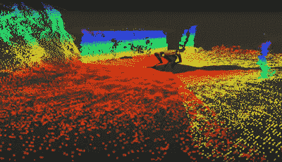
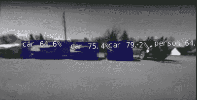

# 需要镇对面的小吃吗？发送 Spot！

> 原文：<https://hackaday.com/2022/05/02/need-a-snack-from-across-town-send-spot/>

从他的 YouTube 频道来看，显然对机器人略知一二。通常这些项目涉及安装在某种轮式平台上的机器人手臂，但这次是一些非常著名的黄色机器人腿的曲调，形状是波士顿动力公司的 spot。前提很简单——完全通过语音命令告诉机器人你想要什么零食，然后他就去取了。但是，我们并不是在谈论导航到同一房间的冰箱。我们谈论的是快步走出前门，沿着街道，穿过马路去参观最喜欢的餐馆。Spot 将完全自主地订购零食并带回。

Spot’s depth cameras provide localized navigation and object avoidance information

Local AI vision system handles avoiding those pesky moving objects

这里有很多事情要做，所有这些都是相当大的计算任务。首先，没有基于云的语音控制，ala Google voice 或 Alexa。机器人的工作前提是完全自主，这意味着任何方面都没有互联网连接。所有的语音识别、语音转文本和语音合成都是使用基于 NVIDIA 丽娃 GPU 的 AI 语音 SDK 在本地执行的，运行在 Spot 背部的本地 NVIDIA Jetson AGX Orin 上。一个前置网络摄像头为此提供音频。语音识别应用程序监听唤醒短语，然后将快餐订单转换为文本，以便稍后在到达目的地时重播。导航由 [Microstrain RTK GNSS 模块](https://www.microstrain.com/inertial-sensors/3dm-gq7)负责，该模块具有所有需要的鲁棒性，如双天线，以及针对信号不稳定地区的惯性后备。导航在现实世界中是没有用的，这就是 Spot 的深度传感器相机的用武之地。这些使局部障碍回避成为可能，就像我们以前都见过的通常的现场行为一样。但是过马路不被路过的货车压坏别人几万块钱的五金怎么办？Spot 的板载流媒体摄像头被输入到 [NVIDIA dash cam net AI 平台](https://catalog.ngc.nvidia.com/orgs/nvidia/models/tlt_dashcamnet)，该平台能够实时识别移动的障碍物，如汽车、人类和其他任何可能四处游荡并挡路的物体。总而言之，这是一个很酷的项目，展示了人工智能在机器人重要任务中的未来潜力，比如在我最需要的时候给我拿啤酒，即使它来自当地的街角商店。

我们喜欢这里的机器人。通过隐形二维码的一点帮助，机器人可以帮你修剪草坪，在你的房子里导航，甚至帮助你种植食物。长期以来承诺的机器人辅助的未来，现在可能看起来更像现在。

 [https://www.youtube.com/embed/yNozb8ljpgI?version=3&rel=1&showsearch=0&showinfo=1&iv_load_policy=1&fs=1&hl=en-US&autohide=2&wmode=transparent](https://www.youtube.com/embed/yNozb8ljpgI?version=3&rel=1&showsearch=0&showinfo=1&iv_load_policy=1&fs=1&hl=en-US&autohide=2&wmode=transparent)

