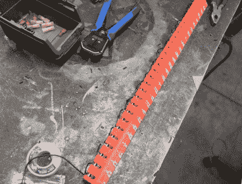

# 负强化:钻头版

> 原文：<https://hackaday.com/2021/03/20/negative-reinforcement-drill-bits-edition/>

理论上，拥有大量的~~玩具~~工具是很有趣的，但令人悲伤的现实是，这种乐趣只取决于所应用的组织级别。听听那些发现组织本身令人兴奋的人的话:你有多少零零碎碎的东西真的不重要，只要每样东西都有地方放，并且你在一天结束时收拾好你的玩具。

 【曲柄城】总是把钻头到处乱放，而不是放回它们的钻头盒里。因为他对叫喊反应良好，所以他决定[建造一个智能钻头存储系统，如果他拿出一个钻头并且在十分钟内没有放回原处，这个系统就会斥责他](https://www.youtube.com/watch?v=upGWAt4Zb3s)。

但是[曲柄城]做的远不止这些。该系统安装在一个非常漂亮的 DIY 支架上，支撑着他的新铣床和钻床，并在钻头抽屉下面有空间容纳某种无处不在的红色工具箱。

所有的比特现在都在一个适合抽屉宽度的 3D 打印索引中。[Cranktown City]试图使用菊花链成对的螺钉作为每个钻头后面的触点，可以判断钻头是否在家，但太大的阻力会干扰信号。他最终在每个钻头后面使用了一个小小的限位开关。如果任何一位被删除，来自索引的输入信号就会变低，这就会触发 Arduino Nano 做两件事:它会点亮抽屉唇边美丽的切割字母后面的一条红色 led，并开始向上计数。每隔十分钟，如果有一位或多位丢失，抽屉就会抱怨并发出人身攻击。休息后看看演示并制作视频，但要等到你把工具放好之后。(你什么都没学到吗？)

好吧，那你怎么处理成千上万的杂乱的钻头呢？[卡尺和 Python 脚本应该可以做到](https://hackaday.com/2020/11/17/sorting-thousands-of-drill-bits/)。

 [https://www.youtube.com/embed/upGWAt4Zb3s?version=3&rel=1&showsearch=0&showinfo=1&iv_load_policy=1&fs=1&hl=en-US&autohide=2&wmode=transparent](https://www.youtube.com/embed/upGWAt4Zb3s?version=3&rel=1&showsearch=0&showinfo=1&iv_load_policy=1&fs=1&hl=en-US&autohide=2&wmode=transparent)

