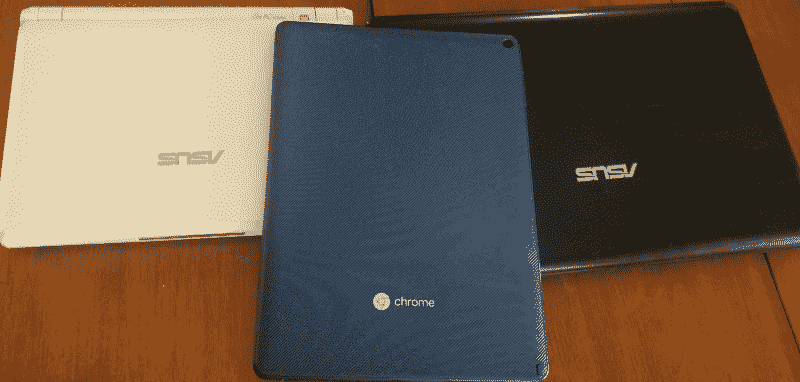
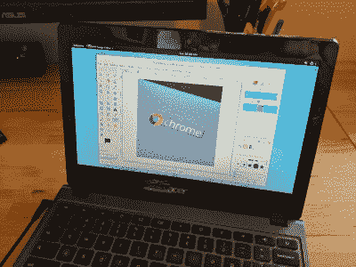

# 上网本:下一代——chrome book

> 原文：<https://hackaday.com/2020/06/24/netbooks-the-next-generation-chromebooks/>

上网本已死，Chromebook 万岁。本月早些时候，列文·戴写了一篇关于上网本怀旧之旅的文章。那是必读的，去看看然后回来。你回来了？很好。今天，我要证明 Chromebook 是上网本皇冠的合法继承人，为了实现它的潜力，我将向你展示如何从你的 Chromebook 中挖掘出 Linuxy 的所有优点。

我也是一个上网本行家，从 2009 年的华硕 Eee 901 开始。从那以后，我也自豪地拥有了一台 Eee PC 1215B，偶尔还会用到它。直到最近，我才最终咬紧牙关，用基于 AMD 的戴尔笔记本电脑取代了它。

很长一段时间以来，我一直对一个走 Chromebook 路线的好朋友感兴趣。他使用三星 Chromebook Plus，并经常使用它来 SSH 到他的开发机器。在读了 Lewin 的文章后，我再次对上网本产生了兴趣，并决定看看 Chromebook 是否能填补这一空白。我最后用的是宏碁 Chromebook Tab 10，代号 Scarlet。价格合适，平板电脑外形非常适合参考 pdf 文件。

Behold, my netbook credentials.

ChromeOS 的默认体验并不糟糕。你拥有桌面 Chrome 的功能，以及运行几乎任何 Android 应用的能力。这是一个好的开始，但很难像 Linux 上网本那样成为黑客的乐园。但是我们仍然可以在这个硬件上运行 Linux。有三种不同的方法可以让 Chromebook 成为你自己的虚拟黑客空间:Crostini、Crouton 和完整的操作系统替换。

## 官方解决方案:克罗斯蒂尼

Crostini 是官方支持的在 Chromebook 上运行 Linux 应用程序的方式。如果你的设备支持的话，这是一个精炼的过程。Crostini 使用虚拟化来沙箱化 Linux 安装，所以有一些旧设备永远不会得到支持。如果您想使用 Crostini，请确保您购买了受支持的设备。

Crostini 的设置特别简单。进入 ChromeOS 设置，转到 Linux 部分，按下按钮启用它。ChromeOS 将下载一个 Debian 镜像并完成所有的安装。它会要求您输入用户名，仅此而已。一旦设置好了，你就有了一个准备运行的 Debian 系统。

Apt 像预期的那样工作，并且整个 Debian 软件集合都是可用的。任何图形程序都被转发到 ChromeOS 图形层，因此您可以按照预期与它们进行交互。连音频都转发。

从各方面考虑，克罗斯蒂尼相当灵活。你可以把默认的 Debian 系统换成 Fedora、Kali、Arch 或其他发行版。在 x86 Chromebook 上，可以安装 Steam 并运行 OGL 加速游戏。如果你正在寻找一个完整的桌面体验，甚至有[指南来安装一个桌面环境](https://chromeunboxed.com/installing-a-linux-desktop-on-your-chromebook/)像 KDE。

甚至有一个不受支持的 USB 标志，可以将几乎任何设备转发到 Linux 虚拟机。想设计一个 Arduino 吗？是啊，有可能。另一个实验性标志增加了将端口转发到 Linux VM 的能力。这开启了进行网络编程和其他各种任务的能力。关于 Crostini 最好的部分是它仍在积极开发中，功能也在不断增加。例如，最近添加了一个实验性的音频捕获标志。我发现了解更多关于 Crostini 开发的最好资源之一是名副其实的 [r/Crostini subreddit](https://www.reddit.com/r/Crostini/) ，特别是[他们的 wiki](https://reddit.com/r/Crostini/wiki/index) 。

尽管克罗斯蒂尼很聪明，但它确实依赖于你的设备被谷歌列入白名单。如果你坚持使用不在 Crostini 支持列表上的硬件，还有另一个选择: [Crouton](https://github.com/dnschneid/crouton) 。

## 油炸面包丁

我不想卷入哪个更美味的争论，但是油炸面包丁确实有一些独特的优势。最大的优势是它可以在任何安装了 devmode 的 ChromeOS 设备上运行。Crouton 不是运行 VM，而是基于 chroot，所以可以直接访问硬件。另一方面，油炸面包丁需要将你的设备置于开发者模式，也就是官方的生根过程。如果你愿意使用 dev 模式，以及它所需要的 powerwash，那么安装 crouton 所需的步骤很简单。

Crouton running Gnome and Gimp on a Chromebook

下载 crouton 二进制文件，安装到正确的位置，运行`sudo crouton -t xfce`下载并设置镜像。安装完成后，`sudo enter-chroot startxfce4`启动 chroot 并启动 XFCE 桌面。从那里，安装 Crouton 扩展和 xiwi，你就可以在 ChromeOS 桌面上运行 linux 应用程序 GUI 了。它比克罗斯蒂尼稍逊一筹，但确实有效。

因为我们有来自 dev 模式的 root，所以很容易使用一些技巧，比如添加一个 udev 规则来将设备重定向到 chroot。想要直接使用内置摄像头吗？油炸面包丁可以做到。

## 完整的操作系统替换

为了完全控制你的设备，唯一的选择就是完全抛弃 ChromeOS，安装一个 Linux 发行版。在 x86 设备上， [chrx](https://chrx.org/) 是用 ChromeOS 双引导全脂 Linux 发行版的流行选项。甚至一些 Arm 型号[可以被说服启动支持其芯片组的 Linux 发行版](https://archlinuxarm.org/platforms/armv7/samsung/samsung-chromebook)，但是要小心，你已经超出了谷歌官方支持的范围。之前并没有阻止我们。

有一个发行版是专门为 Chromebooks 设计的， [GalliumOS](https://galliumos.org/) 。这是一个精简的 Xubuntu，旨在在轻量级 Chromebook 硬件上运行良好。当然，这里有一个陷阱。GalliumOS 只能在[的特定设备](https://wiki.galliumos.org/Hardware_Compatibility)上运行。Arm 设备完全不受支持，一些较旧的机器还有其他各种不兼容。

谷歌确实增加了对传统引导模式的支持，这使得安装完整的 Linux 操作系统更加容易。即使您的设备有固件写保护开关，也有可能将设备置于开发模式，并通过古老的 BIOS 进程启动。

## 最后的想法

这篇文章的大部分内容都是我之前提到的宏碁平板电脑写的。这种体验让我想起了很多在上网本上工作的经历。我已经安装了 Crostini，并且已经通过测试了大量的程序。并非一切都完美，但每次更新都会带来修复和功能。

Chromebook 是你的下一个上网本吗？也许吧。现代 Chromebook 是一款令人印象深刻的硬件，它带来了很多可攻击性。

如果你走 Chromebook 这条路，一定要在评论中让我们知道它是如何为你工作的，并发送一些其他 Chromebook 相关的黑客！