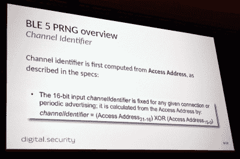
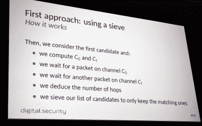

# 新的蓝牙 5 频道跳跃反向工程的干扰和劫持

> 原文：<https://hackaday.com/2019/08/10/new-bluetooth-5-channel-hopping-reverse-engineered-for-jamming-and-hijacking/>

蓝牙低能耗(BLE) 5 自 2016 年以来一直存在，最新版本 5.2 于今年发布。没有太多的硬件在使用新的热点。这并没有阻止[[Damien cau quil](https://twitter.com/virtualabs)]对 BLE 5 的新跳频技术进行挑剔，并更新他的 BtleJack 工具，以允许使用新协议嗅探、干扰和劫持硬件。

可以想象，BLE 标准是一个复杂的庞然大物，它的一部分就是这里的主题:基于 PRNG 的跳频方案，它与 BLE 4.x 和更早的版本有很大的不同。新标准称为信道选择算法(CSA) #2，使用 65535 个可能的信道，而其前身仅使用 37 个信道。配对的设备同意按顺序遵循所有可能信道的随机列表，以便它们在各跳之间保持同步。这是为了帮助避免碰撞，使更多的 ble 设备可以在近距离工作。这一点很重要，因为很快就会发现，无论如何，这都不是一个可靠的安全措施。

 要开始频道跳跃，两个设备必须首先就跳跃的顺序达成一致，确保它们在每次跳跃后都会相遇。为此，它们都通过 PRNG 算法运行相同的 32 位种子数，生成一个列表，然后将严格按照顺序执行。但事实证明这并不难理解。所需要的只是访问地址，如果您已经在嗅探数据包，其前 16 位是公开可用的，而后 16 位是递增跳地址列表的计数器。

如果你想干扰或劫持 BLE 5 号的通信，你需要确定使用的是哪个“随机”频道列表，以及作为该列表索引的计数器的值。为此，[Damien]在两个不同的通道上嗅探数据包。这些频道在频道列表中循环时会被反复使用，因此计算每个频道之间出现的时间可以表明这些频道在列表中相距多远。

 在实践中，【达米恩】首先实现了一个筛子(与厄拉多塞寻找素数的[筛子的概念相同)，它以所有可能性的列表开始，并删除那些不包含两个通道之间匹配定时的可能性。继续这样做，最终，你会将你的列表缩减到一个可能的频道顺序。](https://en.wikipedia.org/wiki/Sieve_of_Eratosthenes)

这当然有效，但存在时间问题，有时意味着您可以学习种子，但无法在事后与它同步。他的第二种方法使用模式匹配。通过测量 11 个连续频道上的跳跃，他能够在一分钟或更短的时间内与目标设备同步。由此，干扰或劫持方法开始发挥作用。这个方案的随机性实在是微不足道。更稳健的技术将使用两个设备中的内部状态来生成下一个跳频信道。这对于攻击者来说会更加难以理解。从设备的角度来看，CSA #2 的计算能力非常低，这对于最常使用 BLE 的低功耗物联网设备来说至关重要。

如前所述，[Damien]很难在野外找到任何使用 BLE 5 标准的硬件。他的概念验证基于一对 nRF52840 开发板。因为它需要更多的测试，代码还没有合并到 BtleJack 的主版本中，但是你仍然可以通过 GitHub 上的 BtleJack repo 获得它。