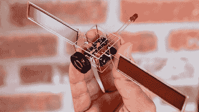
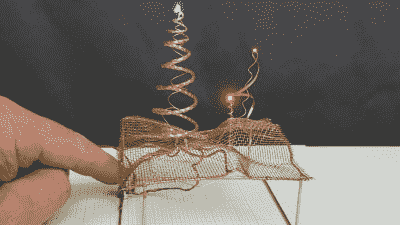

# 新竞赛:电路雕塑挑战

> 原文：<https://hackaday.com/2020/08/18/new-contest-circuit-sculpture-challenge/>

我们将带回我们最受欢迎的比赛之一，[黑客日赛道雕塑挑战赛](https://hackaday.io/contest/174093-circuit-sculpture-art-contest)！把你的功能电路变成艺术，让它们超越实用！

去年展出的

[太阳能电路雕塑](https://hackaday.com/2019/04/04/solar-circuit-sculpture-pumms-the-night-away/)。

电线和电路板是创造美丽项目的绝佳媒介，对于这个项目，我们希望铜和电路板(或缺少)都成为美丽的一部分。你的雕塑可以是黄铜棒上脆而有角的弯曲，漆包线的老鼠窝，有机形状的多氯联苯，或者完全狂野的东西。唯一的限制是需要有某种类型的工作电路。

三件参赛作品将被选为最实用、最美丽和最佳视频类别的最高获奖者，并获得 Digi-Key 提供的 200 美元组件，Digi-Key 是本次比赛的赞助商，还将制作一个日历，上面有前十二件雕塑的图像。

[*由【Michael Aichlmayr】*](https://hackaday.com/2020/05/12/a-twisted-tale-of-woven-wires/)*创作的奇妙景观将赛道雕塑的“雕塑”部分推向了新的高度。告诉我们你创作的故事，包括深入探究你是如何建造这座雕塑的，以及你经历了哪些试验和错误来完成它。过去的许多电路雕塑都包括夹具制作，以获得恰到好处的电线弯曲，因此我们在 Tindie credit 获得了最佳夹具制作的第四名，奖金为 100 美元。*

 *立即在 Hackaday.io 上启动您的项目，并使用项目页面左侧栏中的“提交项目至:”按钮，参加[Circuit Sculpture Challenge](https://hackaday.io/contest/174093-circuit-sculpture-art-contest)。您必须在 11 月 10 日之前提交参赛作品。*