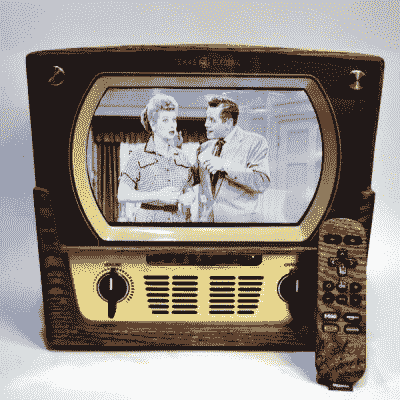

# 新竞赛:重塑复古

> 原文：<https://hackaday.com/2021/05/04/new-contest-reinvented-retro/>

从复古的硬件中汲取灵感，有很多方法可以让东西看起来很棒。将今天的未来派功能与过去的线条、色彩和俗气相结合是成功组合的捷径。所以为什么不试一试，让我们看看你有什么？这就是 Hackaday 的[重塑复古大赛](https://hackaday.io/contest/179304-reinvented-retro-contest)的主旨，这场比赛从现在开始，一直持续到六月。

The is [a very cool Roku](https://hackaday.com/2016/05/14/custom-case-lends-retro-look-to-smart-tv/)

这款智能电视应该有助于你用复古的方式思考。你永远不会知道它不是股票…除非当它开始通过[藏在](https://hackaday.com/2016/05/14/custom-case-lends-retro-look-to-smart-tv/)里面的 Roku】猎鹰与冬兵。适合和完成这个是惊人的，木纹遥控器是一件艺术品！

那会是什么呢？1960 年的库里尔格？旋转电话中的台灯[？GHz 示波器曾经是 CRT 的栖身之所？或许是 90 年代风格的树莓派笔记本电脑](https://hackaday.com/2021/03/02/the-70s-are-calling-to-shed-some-light/)？你来决定什么是“复古”的意思，只是要确保你彻底炫耀的建设！

Digi-Key 赞助了这次比赛，三名获胜者将从他们的仓库中获得 200 美元的购物狂欢。在 Hackaday.io 上制作一个项目页面，并使用左侧栏中的“提交项目至…”下拉菜单将其输入到[重塑复古大赛](https://hackaday.io/contest/179304-reinvented-retro-contest)中。