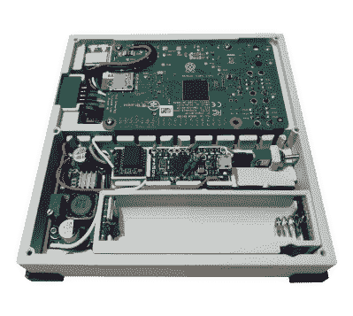

# 新 Micro YARH。为熟练操作员设计的 IO

> 原文：<https://hackaday.com/2021/01/05/new-micro-yarh-io-designed-for-skilled-operators/>

几个月前我们给你带来了犹太人的消息。IO，一款令人印象深刻的便携式 Raspberry Pi，具有坚固的外观和独特的可拆卸键盘设计。该设计最吸引人的一个方面是一切都是由现成的模块构建的；只需要几根跳线和一些废弃的 perfboard 就可以将 3D 打印外壳内的所有东西连接起来。

这种建筑风格的缺点是成品比实际需要的要大一点。但新雅阁的情况并非如此。IO 微。手掌大小的便携式电脑看起来几乎和原来的一模一样，尽管它在缩小的过程中不得不放弃了可移动键盘。触摸板也不见了，尽管有了 Pimoroni Hyper Pixel 四英寸 IPS 显示屏的触摸屏功能，这不是什么大问题。

 有什么隐情？嗯，看一眼我们就能告诉你这个很难建造。首先，您需要从 Pi 3B+上移除以太网和 USB 连接器。USB 端口被重新定位，但以太网可以理解地必须留在剪辑室的地板上。不用担心 GPIO 引脚，显示器会占用所有这些引脚，但您可能需要将 I2C 线连接到机箱侧面的母头，以便您可以添加外部硬件和传感器。

你还需要在那里安置一个 Arduino Pro Micro，通过 I2C 将电池的状态信息传递给操作系统。如果你想节省一点布线，你可能会离开 DS3231 RTC 模块，但这取决于你多久能与 NTP 同步。

虽然它可能比它的前身更难组装，但它肯定不是不可接近的。同样，不需要定制 PCB 或外来元件。你可能要比以前做更多的焊接(和脱焊)工作，但这不是一般的黑客读者做不到的。对于你的麻烦，你将得到一个非常便携的 Linux 机器，它已经成熟，可以进行黑客攻击和修改。

如果要花时间和精力来组织一个小时。IO 比你现在愿意投资的要多一点，[总有像 DevTerm](https://hackaday.com/2020/12/08/devterm-beats-cyberdeck-builders-to-the-punch/) 这样的商业选择。但是不管你是用原版还是这个新的微型版，我们认为你自己完成整个过程的满足感是值得的。