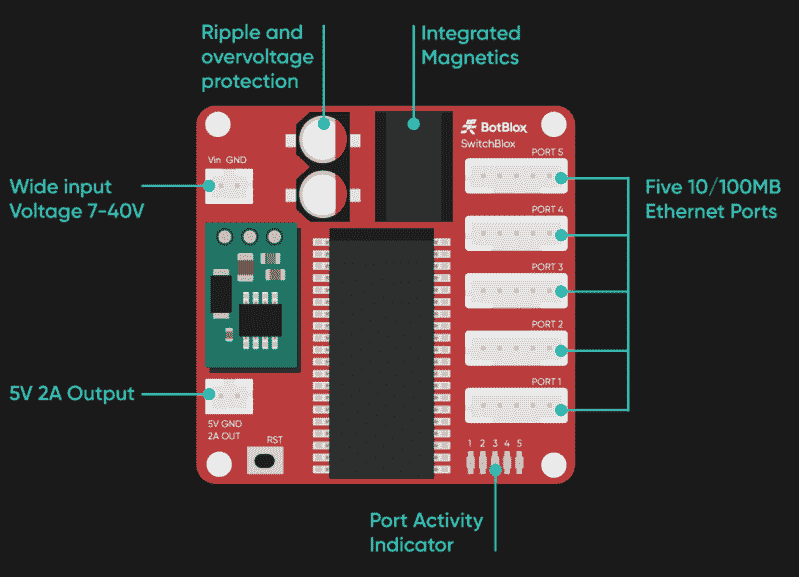
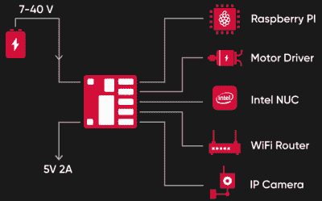

# 新的一天:一个开源的以太网交换机在你的手中

> 原文：<https://hackaday.com/2020/04/21/new-part-day-an-open-source-ethernet-switch-in-the-palm-of-your-hand/>

当你花 3 美元就能买到支持 WiFi 的微控制器时，我们现在看到的许多项目都抛弃了以太网就不足为奇了。但是有线网络的时代还远未结束，仍然有大量的硬件可以从接入网络中受益。但是在你的项目中加入一个以太网需要一个交换机，这意味着又一个硬件需要被塞进去。

 看到人们对小巧轻便的以太网交换机的需求， [BotBlox 开发了 SwitchBlox](https://github.com/botblox/SwitchBlox) 。这款 45 毫米见方的主板拥有构建 5 台设备有线网络所需的一切，无所不有。笨重的 RJ45 插孔和成排的闪光灯都不见了，它们对机器人底盘内部没有任何好处。但这也不是说这是一次简单的经历。这款小巧的开关具有自动交越功能，支持 7 V 至 40 V 的输入电压，并通过 SPI 提供管理功能。

如果你想尽快启动并运行，一个完全组装好的 SwitchBlox 可以直接从 BotBlox 购买 149.00 。但是如果你不是特别着急，并且对节省成本感兴趣，你可以创建你自己版本的知识共享许可委员会。C++管理固件和 Python 管理 GUI 还没有准备好，但是您将能够使用提供的 KiCad 设计文件构建一个“哑”版本的交换机。

他们报告中公布的原理图使用微芯片 KSZ8895MQXCA 作为以太网控制器，脉冲 HX1344NL 为单个表面贴装封装中的所有端口提供磁性。有趣的是，BotBlox 在其产品页面上显示的两幅图像包括不同的零件号，如磁性元件的 H1102FNL 和 PT61017PEL，以及以太网控制器的 Pulse H1164NL。

## 重新连接网络

毫无疑问，WiFi 极大地改变了我们连接设备的方式。事实上，很有可能你正在从一个甚至没有能力连接到有线网络的设备上阅读这些文字。如果你想让一个设备快速连接到互联网，这是很难的。

但是 WiFi 当然不是完美的。首先，您必须解决无线通信固有的问题，例如高延迟和易受干扰。由于您需要指定一个接入点和一个加密密钥(希望如此),因此在进行初始连接时还会涉及到逻辑问题。相比之下，以太网将在几乎任何环境中为您提供一致的性能，配置通常很简单，只需插上电缆，让 DHCP 来处理其余的问题。

 不幸的是，整个“插入”部分会变得棘手。考虑到它们的尺寸，在你的项目中放一个以太网交换机作为内部总线只有在你有足够的空间并且重量不是问题的情况下才有效。因此，尽管在你的机器人中建立一个网络来连接树莓派、电机控制器、摄像头等可能很有吸引力，但这很少是实际的。

这个小开关可能会改变这一点，事实上，它是在开源许可下发布的，这意味着黑客和制造商可以自由地将它集成到他们的设计中。随着开源管理固件的加入，该设备具有一些真正迷人的潜力。当与单板计算机或适当强大的微控制器相结合时，你就拥有了一个完全开源的家用路由器；这是我们这些注重隐私和安全的人多年来梦寐以求的事情。