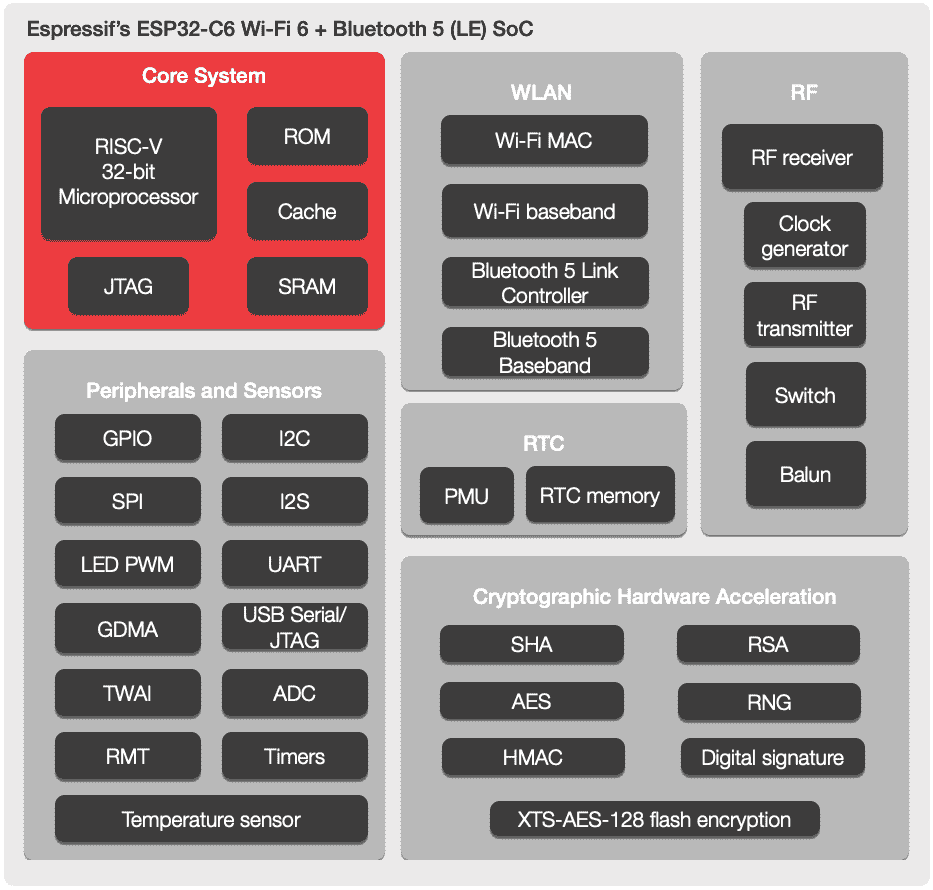

# 新零件日:Espressif ESP32-C6 包括 WiFi 6 和 RISC-V 内核

> 原文：<https://hackaday.com/2021/04/11/new-part-day-espressif-esp32-c6/>

如果你是 Hackaday 的读者，那么你几乎肯定会遇到一个令人印象深刻的部分。双微控制器系列 ESP8266 和 ESP32 突然出现，立即成为各种项目的经济型微控制器选择。我们已经看到该系列最近随着 ESP32-C3(封装了一个黑客友好的 RISC-V 内核)和 ESP32-S3 的大量 IO 和全新的 CPU 外设而扩展。现在我们第一次看到了 ESP32-C6；基于 RISC-V 的全新设计，采用当前最热门的 Wi-Fi 标准；无线网络 6。

除了标准的 Espressif 框图和新闻稿之外，这里没有太多内容，所以我们将尽可能梳理出细节。从图中可以看出，标准的接口集即将推出；他们甚至说“ESP32-C6 类似于 ESP32-C3”，所以我们会让你参考[[Jenny]对那部分的精彩报道](https://hackaday.com/2021/01/09/new-part-day-espressif-esp32-s3/)。在其他无线电方面，ESP32-C6 延续了 Espressif 支持蓝牙 5.0 的趋势。值得注意的是，这部分包括编码和 2 Mbps 蓝牙物理层，允许大幅延长范围或速度翻倍。再说一次，这不是[第一个支持这些功能的 ESP32](https://www.espressif.com/en/news/ESP32_C3) ，但是当制造商超越最低规格时，我们总是很感激。

Welcome to the ESP32-C6

头条功能当然是 Wi-Fi 6(又名 802.11ax)。不幸的是，这仍然只是 2.4GHz 的一部分，所以如果你正在寻找 5GHz 的支持(Wi-Fi 6E 中的[或 6 GHz](https://hackaday.com/2020/05/07/what-will-you-do-with-an-extra-1-2-gigahertz/))，这不是你的一部分。虽然 Wi-Fi 6 带来了一系列功能，从明显更高的速度到对网状网络的更好支持，但这也不是这里的重点。Espressif 带来了一套以物联网为中心的功能；OFDMA 和 MU-MIMO 的两项无线电改进，以及协议特性目标唤醒时间。

OFDMA 和 MU-MIMO 都是允许多个连接的设备同时与接入点通信的不同方式。OFDMA 允许设备更有效地分割和共享信道；允许 AP 更灵活地分配其受限的无线资源。通过 OFDMA，接入点可以选择将整个信道分配给单个设备，或者将其分割以同时在多个设备之间进行复用。MU-MIMO 的工作原理类似，但使用整个天线。单用户 MIMO (SU-MIMO)允许 AP 和连接的设备各自使用一个以上的天线进行通信。相比之下，多用户 MIMO (MU-MIMO)允许接入点和设备在多个设备之间同时共享天线阵列，定向分组。

最后是目标唤醒时间，这是最简单的。它的工作原理非常类似于蓝牙低能耗(4。x 和 5。x)连接间隔的概念，允许设备在下次通信时进行协商。这使得更关注功率而不是吞吐量的设备能够协商更长的时间间隔，在此期间它们可以关闭无线无线电(或更多处理器)以延长电池寿命。

这些无线功能本身是有用的，但还有另一个潜在的好处。一些新奇的无线模式只有在*每一个*连接的设备都支持的情况下才能在网络上使用。一个有 10 个 Wi-Fi 6 设备和一个 W-Fi 5 (802.11ac) one 的 Wi-Fi 6 网络可能无法使用所有的花哨功能，从而将整个网络降级到最低公分母。最近低成本物联网设备的激增意味着廉价无线电台的相应激增(通常是 Espressif 零件！).将新的 Wi-Fi 6 独有功能包含在肯定是可访问的部分中，是缓解我们已经紧张的家庭网络问题的良好开端。

我们什么时候能在野外看到 ESP32-C6？我们仍在等待消息，但我们会尽快让你知道我们可以得到一些开发硬件来尝试。

感谢黑客之友[[Fred temper ton](https://twitter.com/FredTemperton)]在它还新鲜的时候发现它！