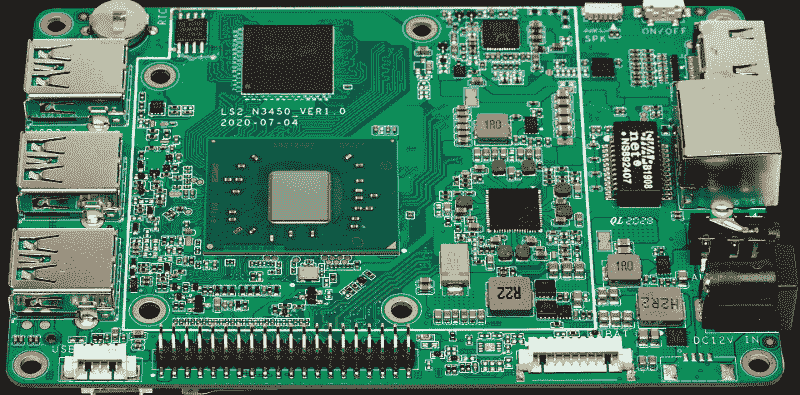
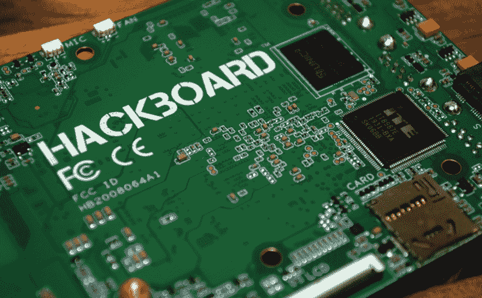

# 新零件日:Hackboard 2，一台 X86 单板计算机

> 原文：<https://hackaday.com/2020/12/22/new-part-day-hackboard-2-an-x86-single-board-computer/>

从旧的 Gumstix 主板到每个人都喜欢的 Raspberry Pi，普通的单板计算机(SBC)传统上至少有一个共同点:ARM 处理器。但这并不是说黑客和制造商对配有 x86 处理器的 SBC 不感兴趣。这就是为什么 99 美元的 Hackboard 2 如此令人兴奋的原因。以现代 x86 芯片为核心，它类似于一个小尺寸的台式机主板，但具有我们在黑客友好型 SBC 中期望的所有额外功能。

这有什么大不了的？一句话，兼容性。这些小型计算设备避开了我们大多数人自 20 世纪 80 年代以来一直在台式机和笔记本电脑上使用的 x86 架构，这一事实最初带来了软件兼容性问题，但 ARM 的优势在很大程度上超过了这一问题。最新的 NVIDIA Jetson 运行在 ARM 芯片上，原因和你口袋里的智能手机一样:它们比 x86 更小、更便宜、更节能。

然而，他们很少更强大。即使是最新最棒的 Raspberry Pi 4，由于其四核 Cortex-A72 而经常被吹捧为可行的台式机替代品，也将被最慢的英特尔赛扬 CPU 彻底击败。性能差距实在太大了。虽然 Pi 可以令人钦佩地处理黑客社区要求它完成的大多数任务，但总会有人呼吁将原始处理能力放在首位。

Hackboard 2 在全速状态下吸收了近 40 瓦的功率，不是你想用于太阳能气象站的单板机。但是，如果你正在组装一个机顶盒来播放视频和运行偶尔的仿真器，其赛扬 N4020 处理器和英特尔 UHD 600 GPU 代表了这种尺寸的设备可用的最强大的组合。

## 全套服务

赛扬处理器也意味着 Hackboard 2 可以运行 Windows，如果你喜欢这种东西的话。虽然黑客类型通常更乐于在他们的 ARM 板上运行 Linux 或潜在的 BSD，但毫无疑问，社区中有一部分人对 Clippy 的监督感到更舒服。或者他们可能有一些项目需要一个不适合 WINE 的 Windows 软件。无论哪种方式，在你的单板机上预装一个专有操作系统都会让你付出代价:在 64 GB eMMC 上安装 Windows 10 Pro 的 Hackboard 2 要多花 40 美元。

鉴于竞争对手的包装，我们不能抱怨 CPU 和 GPU，但事实上只有 4 GB 的 RAM 令人失望。尤其是当更便宜的树莓 Pi 4 包含高达 8 GB 的内存时。对于大多数 Linux 发行版来说，这已经足够了，但是对于 Windows 系统来说，这还不够。取决于你希望安装什么软件，它甚至可能是不可行的。如果你正在寻找一台运行 Photoshop 的廉价机器，你应该去别处看看。

从好的方面来看，Hackboard 2 并不缺少可扩展性选项。双 NVMe M.2 插槽肯定不会成为存储问题，还有三个 USB 3.0 端口可以连接你可能需要的任何高速设备。还有一个 Pi 兼容的 40 针 GPIO 头，以及摄像头、触摸屏和 eDP 显示器的连接器。当你想伸手触摸某人时，该板具有双频 WiFi、蓝牙 5.1 和千兆以太网。其中一个 NVMe 插槽甚至可以安装蜂窝调制解调器。

总之，Hackboard 2 是一款非常出色的 SBC，价格非常合理。没有提供更大 RAM 的版本似乎是一个相当严重的疏忽，但当然在 Pi 4 的 8 GB 版本上市之前也花了一段时间。我们当然欢迎一些类似的 SKU 发布后的 Hackboard 洗牌，但 100 美元，很难抱怨。

## 原型印象

如果你想知道最初的 Hackboard 1 版本是如何与你擦肩而过的；它没有。确实有一个早期版本的 Hackboard，但它被认为更像是一个探路者原型。虽然从未在商业上发布，但 Crowd Supply 给了我们一个原型板，让我们了解一下团队对最终硬件的想法。

虽然我们很自然地喜欢动手操作硬件，但这让我们处于一种不同寻常的境地。首先，在原型 Hackboard 上做任何基准测试都没有意义，因为它的 CPU 与商业版本不同。几个值得注意的硬件变化也已经作出，也许其中主要的是取消了原型的微型 SD 插槽，以支持第二个 NVMe M.2 插槽。简而言之，原型与付费用户将在 2021 年收到的硬件有很大不同，因此进行适当的审查似乎并不合适。

那么关于原型 Hackboard，我们能说些什么呢？它是存在的。对于那些担心团队交付能力的人来说，这应该是一种安慰。虽然他们仍有工作要做，以对 Hackboard 2 进行必要的修改，但这并不意味着他们必须从头开始。

 更实际地说，拥有一台本质上只是一台微型电脑的单板机是件好事。它有一个传统的 BIOS 菜单，允许您轻松地配置所有硬件和改变引导顺序。启用 USB 引导允许我毫无问题地启动 Arch 和 Mint 安装程序，一切都开箱即用。

与通常需要运行您最喜欢的 Linux 发行版的定制版本的 ARM 板相比，Hackboard 会对您扔给它的任何东西感到满意。这自然意味着你可以购买 99 美元的版本，并在事后安装你自己的 Windows。

同样，这不是最终的硬件，从现在到 Hackboard 2 开始向客户发货时，事情绝对会发生变化。但原型无疑令人印象深刻，可以说市场上没有任何东西可以在这个价格上与之竞争。我们希望在未来为您带来完整的评论，但在此之前，这肯定是一个需要密切关注的产品。