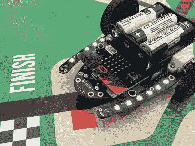
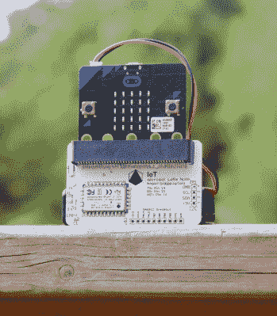

# 新的一天:哦，你可以用线索做的事情

> 原文：<https://hackaday.com/2020/02/24/new-part-day-ooh-the-things-you-can-do-with-a-clue/>

Adafruit 在镇上有一个新的开发板，叫做[线索](https://www.adafruit.com/clue)。这个小小的电路板可以用 Arduino 或 CircuitPython 编程，它绝对塞满了传感器和功能，包括蓝牙。它本质上是一个 BBC Micro:bit，带有更多传感器、一个屏幕和一个更强大的处理器。听起来有趣吗？让我们拿出放大镜来看看，好吗？

(编者注:Adafruit 用完了硬件的第一个 alpha run。虽然我们没有遇到任何错误，下一个版本可能会更少，但也将花费 40 美元而不是 30 美元。也就是说，他们将在 4 月份向 PyCon 的服务员发放 3000 个，所以你也可以通过这种方式得到一个。)

And Bit:Bot takes the checkered flag! Image via [Seeed Studio](https://www.seeedstudio.com/Bit-Bot-Robot-Kit-for-Micro-Bit-p-3015.html)

首先，也是最重要的，是形状因素——如果底部边缘看起来很熟悉，那是因为 CLUE 旨在与 micro:bit 机器人套件和[任何带有边缘连接器](https://blog.adafruit.com/2020/02/11/microbit-shaped-boards-and-or-boards-with-the-microbit-style-edge-connector-collection/)的东西一起工作，如 micro:bit 的 CRICKIT 或 Seeed Studios 的 Bit:Bot。对于 micro:bit 生态系统来说，这是一个大新闻，不仅仅是因为这条线索给场景带来了大量的传感器和屏幕，尽管分辨率为 240×240 的 1.3 英寸屏幕不容小觑。

主脑是一个北欧的 nRF52840，你可以把它和手机配对，流式传输你收集的数据。或者，用它让两个线索板互相交谈。这是对 micro:bit 的 nRF51822 的重大升级 CLUE 的速度快了 4 倍，闪存是 4 倍，RAM 是 16 倍。我们希望有人能找到一种方法，把它们做成带 Q10 键盘的短距离信息机。

If Bluetooth won’t do, you could add a LoRa node. Image via [Pi Supply](https://uk.pi-supply.com/products/iot-micro-bit-lora-node)

## 大量传感器

线索这个名字很贴切，因为他的董事会是关于发现的。有兴趣重现掉鸡蛋的实验吗？将您的线索放在气泡包装和棉花糖中，让 9 自由度加速度计/陀螺仪/磁力计为您提供所有数据。这个东西也有一吨的环境传感器，如湿度，温度，气压，甚至海拔高度，这将使它很容易原型你一直想建立的气象站。

如果你一直渴望进入便携式游戏编程，线索可能是你的板。想想你可以使用的所有不同的基于环境的游戏机制。还有接近、光线和手势传感器、扬声器和 MEMS 麦克风。USB 端口旁边的两个白色 led 可以进行颜色感应，你可以用它来为正在学习如何区分颜色的孩子制作一个很酷的游戏。

如果这还不够，还有一个 STEMMA/Qwiic 端口，它也可以通过适配器电缆连接 Grove 连接器传感器。目前，他们正在开发一个库，以便于访问所有的传感器。与此同时，[在 GitHub](https://github.com/adafruit/Adafruit_CircuitPython_CLUE/tree/master/examples) 上查看这些例子——更多的例子一直在增加。几周前，我们设法搞到了其中的一块板，并测试了代码示例，这确实是一块不错的小板。