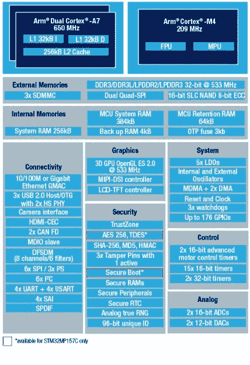

# 新零件日:运行 Linux 的 STM32

> 原文：<https://hackaday.com/2019/02/27/new-part-day-the-stm32-that-runs-linux/>

有很多 ARM 微控制器，ST 的器件是我们看到的大功率产品。STM32F4 和～F7 是强大的支持产品，STM32F0 和该系列的其他产品是非常好的低功耗微控制器。现在，STM32 家族又多了一个大哥。它运行 Linux。在同一个芯片上有两个 ARM Cortex-A7 内核和一个 M4 内核。如果你仍然不知道如何通过闪烁 led 来浪费计算周期，STM32MP1 就是你想要的芯片。

Block diagram of the STM32MP157 Image: ST

首先，Linux 支持。STM32MP157C 去年夏天被移植到 Linux 中，并且支持 Android。所以是的，这个芯片可以运行 Linux。该系列有一个可选的 3D GPU，一个 MIPI-DSI 控制器，支持 HDMI-CEC、USB 2.0 和 10/100M 或千兆以太网。这就给我们带来了一个不可避免的问题，你能否用这些部分构建一个树莓 Pi 克隆。也许吧，冠军，但如果你问这个问题，可能不是你来建造一个。看起来这种芯片是为手机、机顶盒和智能电视设计的。这并不排除单板计算机，但最大的问题是维护软件支持。

问题中的芯片家族都配备了运行在标称 650MHz 的双臂 Cortex-A7 处理器。还有一个运行在 209MHz 的 Cortex-M4，ST 文献表明工程师们已经在 A7 上运行 Linux，在 M4 上运行 RTOS。该芯片需要外部存储器，但支持 DDR3 / DDR3L / LPDDR2 / LPDDR3。

这种芯片现在才公布，你还不能在 Mouser 或 Digikey 上得到它，也没有关于定价的信息。然而，有两种开发板可用，[评估板](https://www.st.com/en/evaluation-tools/stm32mp157a-ev1.html?ecmp=tt10609_gl_link_feb2019)，具有 1 GB DDR3L、128 MB 闪存和 8 GB eMMC。有一个 5.5 英寸的显示屏，以及足够多的连接器，让你怦然心动。[Discovery board](https://www.st.com/en/evaluation-tools/stm32mp157c-dk2.html?ecmp=tt10609_gl_link_feb2019#samplebuy-scroll)更精简一些，配有 4 英寸 480×800 的 LCD、WiFi、蓝牙 LE，当然还配有用于 Arduino 和 Raspberry Pi 的 GPIO 扩展连接器。Discovery Board 目前尚未上市，但售价为 99 美元。