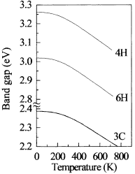
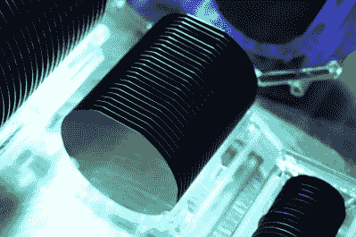
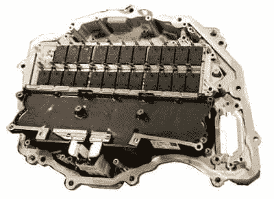

# 新型碳化硅半导体带来电动汽车能效提升

> 原文：<https://hackaday.com/2019/11/25/new-silicon-carbide-semiconductors-bring-ev-efficiency-gains/>

在 20 世纪的大部分时间里，电动汽车都在发展的地狱中煎熬，现在终于大规模上路了。汽车制造商正狂热地努力提高续航里程和充电时间，以使汽车更受消费者欢迎。

随着强大的销售基础和化石燃料未来不确定性的增加，改进正在快速发生。通常情况下，变化是渐进的，但有时，一种全新的技术有望带来性能上的巨大变化。碳化硅(SiC)半导体就是这样一种技术，并且已经开始彻底改变这个行业。

## 注意带隙

A graph showing the relationship between band gap and temperature for various phases of Silicon Carbide.

传统上，电动汽车的结构依赖于硅功率晶体管。长期以来一直是最受欢迎的半导体材料，新的技术进步使其面临竞争。不同的半导体材料具有不同的特性，这使得它们更适合各种应用，碳化硅对于高功率应用尤其有吸引力。这一切都归结于带隙。

半导体中的电子可以位于两个能带中的一个——价带或导带。为了从价带跳到导带，电子需要达到导带的能级，跳过没有电子存在的带隙。在硅中，带隙约为 1-1.5 电子伏特(eV)，而在碳化硅中，材料的带隙约为 2.3-3.3 eV。这种更高的带隙使得碳化硅部件的击穿电压更高，因为需要更强的电场来克服该带隙。许多现代电动汽车使用 400 V 电池，而保时捷为其 Taycan 配备了 800 V 系统。碳化硅天生的高击穿电压使其非常适合这些应用。

## 这一切都说明了

宽带隙半导体的优势也体现在其他设计因素上。由于更高的击穿电压和更低的导通电阻，在 1200 伏时，SiC 器件的管芯尺寸可以比相当的硅器件小 20 倍。[这种更小的尺寸有助于提高开关速度](https://unitedsic.com/fast-sic-fets-just-got-faster/)，进一步减少最终转化为热量的损耗。如果这还不够，碳化硅器件可以处理高达 200°C 的结温，超过传统硅器件的典型结温 150°C。

Breakthroughs in processes have enabled the production of silicon carbide wafers of suitable quality for high-power use.

然而，直到最近，碳化硅作为半导体技术还不可行，主要是因为生产问题。得益于制造技术的进步，[现在有可能使用单晶生长工艺](https://www.dupont.com/electronic-materials/blogs/featured-solutions/replacing-silicon-in-power.html)制造晶圆，并以可接受的产量进行经济高效的生产。

所有这些性能的提升使 SiC 技术成为电动汽车技术的革命。 [ST 微电子举了牵引逆变器](https://blog.st.com/silicon-carbide-cars-wide-bandgap-semiconductor/)的例子，这是一种从电池获取电能并驱动电动汽车电机的硬件。SiC 半导体能够在更小的封装中处理更高的电压，并且能够处理更多的热量，这使得器件的尺寸缩小了 70%,并且具有更低的冷却要求。此外，由于导通电阻和开关电阻较低，作为热量浪费的功率较少；使得车辆更高效并且在单次充电下行驶更远。

这项技术在充电方面也有应用。 [SiC 零件承诺提供更紧凑的充电器](https://www.mouser.com/blog/why-sic-devices-for-level-3-ev-charging-applications)，能够以更低的损耗提供快速充电。随着电动汽车继续激增，对快速充电器的需求将会飙升，因此任何空间和效率的提高都将带来回报。毕竟，任何没有在充电过程中损失的电力都不必通过已经紧张的电网输送。

## 展望市场

Tesla’s Model 3 features an inverter built with silicon carbide technology, increasing efficiency and reducing cooling requirements.

这些设备已经大规模投放市场。特斯拉的 Model 3 是首批使用该技术的车辆之一，[其主逆变器封装了来自 st 微电子的 24 个 SiC MOSFET 模块。](https://www.pntpower.com/tesla-model-3-powered-by-st-microelectronics-sic-mosfets/)由于大众市场车型的产量增加，[特斯拉很可能在 2018 年使用了 st 的绝大部分产量。](https://www.pntpower.com/is-teslas-production-creating-a-sic-mosfet-shortage/)从那时起，类似的硬件已经推广到 Model S 和 Model X 远程车型，[采用碳化硅逆变器和其他改进，帮助将车辆的最大行驶里程提高到 370 英里。](https://insideevs.com/news/346209/tesla-model-s-x-upgrade-more-range-efficiency/)

随着雷诺-日产-三菱联盟也签署了一项协议，使用来自圣.的零部件，其他汽车制造商也在争先恐后地赶时髦，[博世也在加紧在他们新的德累斯顿工厂生产零部件。](https://www.reuters.com/article/us-tech-bosch/bosch-to-make-silicon-carbide-chips-in-electric-vehicle-range-anxiety-play-idUSKBN1WM0YD)目前还不清楚这些零件最终会在哪里销售，但鉴于博世作为一级汽车供应商的悠久历史，他们很可能已经有了一个触手可及的重要客户群。

未来几年，大多数(如果不是全部的话)电动汽车最终将转向碳化硅技术。使用 SiC 硬件的车辆将在封装、能效、范围和性能方面具有优势，而使用传统硅硬件的车辆不太可能在中期内有效竞争。虽然硅部件仍将在数字和低压子系统中占有一席之地，但碳化硅极有可能在电动汽车的电力电子领域占据主导地位。