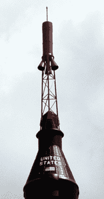
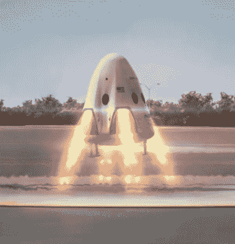

# 新的太空中止系统回到未来

> 原文：<https://hackaday.com/2019/07/15/new-space-abort-systems-go-back-to-the-future/>

纵观美国载人航天计划的历史，在中止系统方面有一个交替的模式。从 1961 年艾伦·谢泼德的第一次飞行开始，每一个水星太空舱都配备了一个发射逃逸系统(LES)塔，可以将飞船从故障火箭中分离出来。但是到 1965 年双子座计划的第一次运行飞行时，LES 塔已经被删除，取而代之的是弹射座椅。仅仅三年后，莱斯塔返回，进行阿波罗计划的首次载人飞行。

Mercury LES Tower

有了航天飞机，事情变得更加复杂。没有安全的方法将轨道飞行器与堆栈的其他部分分离，所以当哥伦比亚号在 1981 年进行首次试飞时，美国国家航空航天局再次回到弹射座椅，这次是从 SR-71 黑鸟上拉下来的。但是一旦飞行测试完成，弹射座椅被移除；留下*号【哥伦比亚】号*和所有后续的轨道飞行器没有任何形式的 LES。当时，美国国家航空航天局认为航天飞机非常可靠，不需要紧急逃生系统。

1986 年挑战者号和她的机组人员的损失证明了美国宇航局在判断上犯了一个严重的错误，但那时已经太晚了。在事故调查之后，航天飞机[进行了改变，但是在动力飞行中逃生仍然是不可能的。虽然 2003 年莱斯没能拯救“T4”号的机组人员，但在有根本缺陷的轨道飞行器“T7”上失去的另外七条生命在乔治·w·布什总统决定逐渐结束航天飞机项目中起了很大的作用。](https://hackaday.com/2017/10/02/books-you-should-read-feynmans-appendix-to-the-challenger-disaster-report/)

在后航天飞机时代，美国国家航空航天局已经明确表示，从发射到入轨保持中止能力是一项关键要求。他们自己的猎户座飞船有这种能力，他们对 SpaceX 和波音等商业合作伙伴也有同样的要求。虽然这三种飞行器都充满了高科技的魔力，但它们的中止系统与我们在 1960 年代使用的相差不远。

让我们来看看美国未来三个太空舱的发射逃逸系统，看看历史经验如何帮助指导这些最先进的航天器的设计。

## 猎户座的阿波罗遗产

美国宇航局自己的猎户座太空舱与之前的相似性无疑是最强的，它使用了一个 LES 塔，乍一看像是阿波罗任务遗留下来的经过改造的备件。实际上，自从 1972 年阿波罗计划结束以来，设计已经有了相当大的改进。

就像阿波罗和水星莱斯塔一样，猎户座使用固体燃料火箭发动机，采用拖拉机配置，也就是说，它将太空舱拉离火箭，而不是推动它。由于火箭发动机在前面，有角度的喷嘴被用来转移太空舱周围的废气。如你所料，这种离轴推力有一些余弦损失；但是考虑到猎户座 LES 发动机的总推力比将第一个水星太空舱送入太空的红石火箭[还要大，它仍然有足够的能量来完成这项工作。](https://hackaday.com/2017/07/18/hitching-a-ride-on-a-missile/)

当然，如果 LES 塔只是直线加速太空舱，最终火箭会追上它。因此，它不仅要将猎户座太空舱向前推，还要将它侧向移动，以避开迎面而来的火箭(或潜在的碎片云)的路径。

阿波罗莱斯塔实际上在顶端使用了一组鸭翼来帮助平衡太空舱，但在猎户座上，这都是通过矢量推力来完成的。在中止马达的驱动下，沿着原来的行进方向加速几秒钟后，姿态控制推进器点火，将太空舱翻转过来。这个翻滚动作减慢了猎户座的速度，此时 LES 塔被抛弃。现在自由飞行的猎户座太空舱将使用降落伞着陆，就像它在一次正常飞行结束时一样。

7 月 2 日，美国宇航局在卡纳维拉尔角空军基地的 46 号发射台对猎户座 LES 进行了全面测试。虽然它没有携带真正的猎户座太空舱或机组人员，但中止程序的执行完全像在一次作战任务中一样。LES 的成功部署被视为让宇航员重返月球的重要一步。

 [https://www.youtube.com/embed/4rfsDMGplZU?version=3&rel=1&showsearch=0&showinfo=1&iv_load_policy=1&fs=1&hl=en-US&autohide=2&wmode=transparent](https://www.youtube.com/embed/4rfsDMGplZU?version=3&rel=1&showsearch=0&showinfo=1&iv_load_policy=1&fs=1&hl=en-US&autohide=2&wmode=transparent)

## SpaceX 全力以赴

Crew Dragon propulsive landing concept

对于 Crew Dragon，SpaceX 已经决定不使用经典的 LES 塔。中止推进器不是放在太空舱前面的一个臂上，而是直接建在飞船的外壳里。abort 系统使用的 SuperDraco 发动机不是固体燃料，而是自燃液体推进剂[，即肼和四氧化二氮](https://hackaday.com/2019/07/01/nasas-green-fuel-seeks-safer-spaceflight-by-finally-moving-off-toxic-hydrazine/)。由于这两种化学物质一接触就点燃，SuperDraco 的可靠性和响应时间与“经典”中止系统中使用的固体火箭相当，但优势是它们可以随意减速和关闭。这意味着船员龙不需要单独的推进器来倾斜自己，它可以利用发动机之间的不同推力进行机动。

有些人可能会认为这是一种不必要的复杂方法，但公平地说，SpaceX 在设计这个系统时就有崇高的目标。最初，船员龙放弃降落伞，使用超级龙在名义任务结束时进行动力着陆。这将使机组人员(和敏感的科学货物)的着陆更加舒适，但美国宇航局认为与溅落在海洋中相比，这是一个不必要的风险，所以这个想法被放弃了。内部中止推进器也被视为可重复使用的福音，但由于 SpaceX 目前没有计划将重复使用的龙用于乘员任务，这似乎是一个有争议的问题。

2015 年 5 月 6 日，SpaceX 使用实体模型胶囊成功测试了他们的 LES。与猎户座一样，这是一个“Pad Abort”测试，其中当太空舱静止时 LES 接合。第二次测试预计在年底前进行，将在飞行器飞行时启动 LES。

 [https://www.youtube.com/embed/1_FXVjf46T8?version=3&rel=1&showsearch=0&showinfo=1&iv_load_policy=1&fs=1&hl=en-US&autohide=2&wmode=transparent](https://www.youtube.com/embed/1_FXVjf46T8?version=3&rel=1&showsearch=0&showinfo=1&iv_load_policy=1&fs=1&hl=en-US&autohide=2&wmode=transparent)

## 波音公司谨慎行事

对于 CST-100 Starliner，波音公司采取了一种混合方法。他们还决定跳过 LES 塔，但不是将中止引擎集成到太空舱本身，而是服务模块的一部分。这使得重复使用变得不可能，因为服务舱在重返大气层时会烧毁，但它确实避免了重大的集成挑战。鉴于四月的一次超级德拉科测试中[一条船员龙被完全消灭的事实，甚至可以说这也是一种更安全的方法。](https://www.space.com/spacex-crew-dragon-engine-test-anomaly.html)

CST-100 上的 LES 将根据飞行中触发中止的时间来启动不同组的推进器。在早期中止中，四个改进的 Rocketdyne RS-88 发动机将用于分离太空舱和火箭。在更高的高度，分离可以用飞行器更小的机动推进器来完成。这类似于去年联盟号 MS-10 戏剧性展示的[高空中止剖面图。所有的推进器都使用同样的储存在中央燃料箱中的自燃液体推进剂；在一次正常飞行中，轨道机动将利用在中止飞行中消耗掉的燃料来完成。](https://hackaday.com/2018/10/11/soyuz-rocket-emergency-landing-everyone-ok/)

到目前为止，波音公司只对 CST-100 的 LES 进行了静态测试，但 Pad 中止测试暂定于今年夏天的某个时候进行。

 [https://www.youtube.com/embed/RZg5CCAyiTA?version=3&rel=1&showsearch=0&showinfo=1&iv_load_policy=1&fs=1&hl=en-US&autohide=2&wmode=transparent](https://www.youtube.com/embed/RZg5CCAyiTA?version=3&rel=1&showsearch=0&showinfo=1&iv_load_policy=1&fs=1&hl=en-US&autohide=2&wmode=transparent)

## 时刻准备着

虽然它们在执行上有很大不同，但美国宇航局的猎户座，SpaceX 的 Crew Dragon 和波音公司的 CST-100 的 LES 基本上都是基于相同的原理，即使用小型火箭发动机将太空舱从飞行器的其余部分“升起并离开”。尽管使用一枚火箭逃离另一枚火箭具有讽刺意味，并且技术进步超过半个世纪，但这仍然是我们所知的尽快让船员远离潜在致命情况的最佳方式。

也就是说，所有这些系统共有的最明显的特点是，参与其设计、建造和测试的每个人都希望它们永远不会被用于实际的太空飞行。但是万一他们感觉到发射逃逸系统轰鸣着启动，这些飞船上的宇航员可以放心，大量的工程时间和努力已经投入到[中，给了他们回家的最好机会。](https://hackaday.com/2018/01/19/space-escape-flying-a-chair-to-lunar-orbit/)