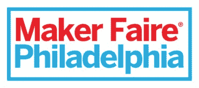
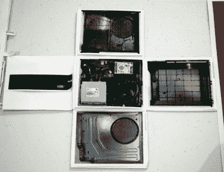
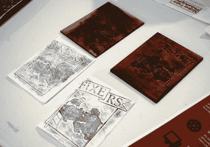
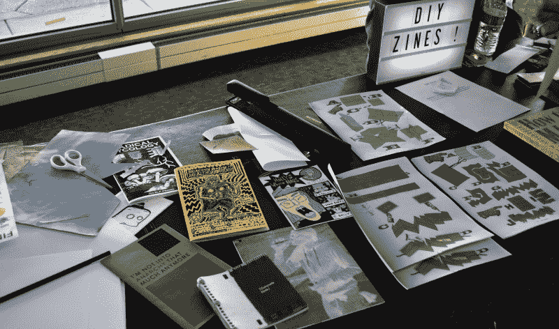
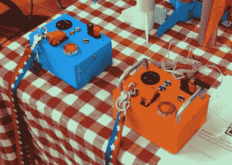
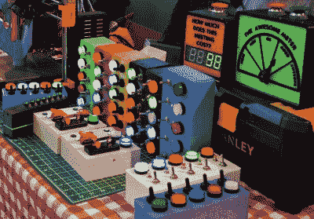
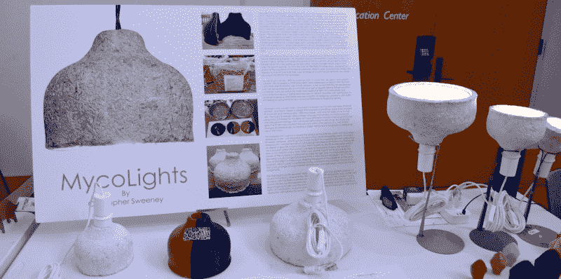
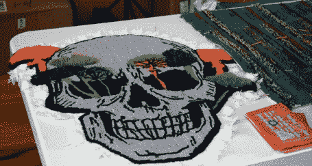
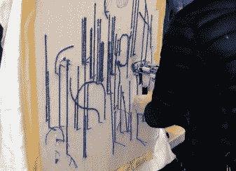
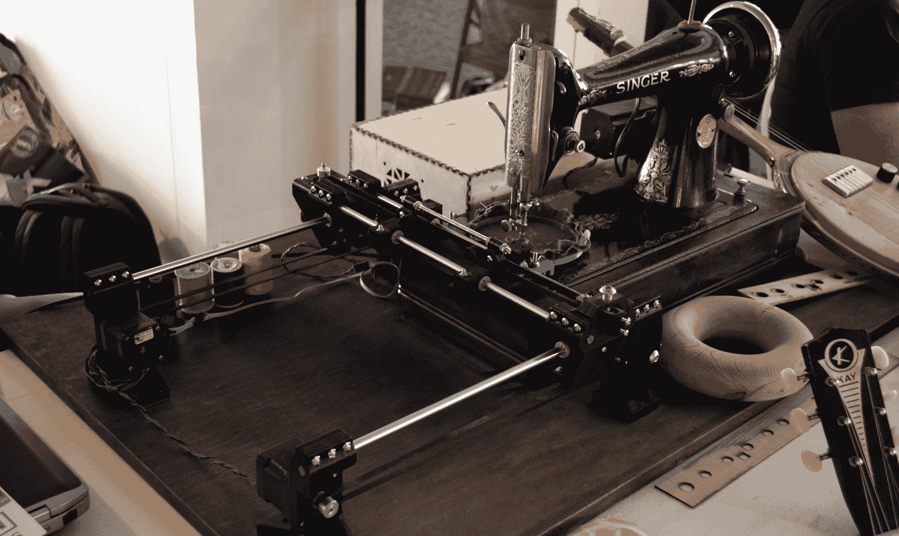

# 新场地给费城创客节一个新的开始

> 原文：<https://hackaday.com/2022/10/21/new-venue-gives-philly-maker-faire-a-fresh-start/>

当我们上次在 2019 年费城创客节(Philadelphia Maker Faire)入住时，人们不禁对组织者在纽约举办已停办的世界创客节(World Maker Faire)所需的预算和资源中取得的成就印象深刻。我们确信这个活动即将爆发式增长，明年会更大更好。

 但是当然，那并没有发生。新冠肺炎疫情意味着，到 2020 年博览会应该开始的时候，举办一场比家庭晚宴大得多的聚会的物流已经成为一个严重的障碍。费城对室内和室外活动实施了严格的规定，以试图遏制病毒的传播，即使在 2021 年放松了这些规定，在这种情况下尝试举办集会仍然没有意义。

值得庆幸的是，现在一切基本恢复正常，因此费城创客节今年获得了重生。组织者决定将活动转移到[独立海港博物馆](https://www.phillyseaport.org/)，供应商和参展商的桌子分布在博物馆的三层。这使得票价非常物有所值，特别是如果你有足够的时间前往码头，那么你可以探索有 130 年历史的巡洋舰“T4”号“奥林匹亚”号和“贝库纳”号，这是最后一艘幸存的二战巴拉奥级潜艇。

正如你所料，这次活动充满了迷人的项目和演示，以至于试图在这里列出它们是不可能的。但对于那些无法前往参观 2022 年费城创客节的人来说，让我们来看看一些突出的展品。

## 杂志万岁

实际上有两个不同的展览专门展示该杂志——一个很小的实体出版物，如果你认为它走了很多小众印刷出版物的路，这是可以原谅的。但事实证明，至少在费城地区，仍然有一些团体在制作他们自己的短期作品来记录他们所热衷的东西。

据参加了由[Juris Milestone]教授讲授的*制造者、黑客、修理者*课程的坦普尔大学学生称，当地修理团体正在制作数量惊人的杂志，这些团体要么希望记录他们已经修理的东西，要么只是想让人们知道更大的修理运动。他们展出了一些有趣的例子，包括一个非常聪明的 Xbox One 折叠“拆卸”,以及一些激光切割面板，这些面板在临时印刷机上用于为维修小组制作小册子。

    

我花了一些时间与学生和[Milestone]教授谈论黑客和创客运动，课程对社区的开明态度给我留下了非常深刻的印象。他们认识到制作可以有多种形式，从简单的爱好到必要的生存技能，不幸的好莱坞“黑客”刻板印象与我们如何使用这个术语无关。

该课程的文档解释说，黑客是“那些绕过现有障碍，找到一种新的、更有效的方式来完成任务的人”，术语*“包括广泛的个人，不仅仅是那些专门从事计算机科学的人。”*该课程听起来像是黑客社区不得不忍受的一种受欢迎的改变，并有望代表一种对我们真正了解的主流理解。

在楼上的 DIY 杂志桌旁，[【卡拉·汗】](http://www.popuppolaroid.com/)对杂志的内容不感兴趣，更感兴趣的是它们是如何制作的。这位艺术家正在亲自演示如何将一张纸折叠成小册子，以便快速制作，并展出了当地的杂志集。

## 闪烁的灯光

众所周知，黑客会像飞蛾扑火一样被多彩的闪光所吸引，所以当这张桌子拦住我的去路时，我一点也不惊讶。从[电子小动作玩具](https://matthewmalham.com/3d-printed-toys)到[功能火箭发射控制器](https://matthewmalham.com/diy-model-rocket-launcher)的各种发光小工具都是【马修·马尔罕】的产品，路人可以随心所欲地按动按钮和开关。

    

## 用蘑菇制作

使用 3D 打印模具，[Christopher Sweeney]已经能够哄蘑菇菌丝体和大麻创造出[可回收的照明设备，他称之为 my clients](https://www.etsy.com/shop/MycoLights)。

[Christopher]说菌丝在由两部分组成的 3D 打印模具中花了大约一天的时间来获得基本形状，然后被取出并给予更多的时间来生长，因此最终的密度更高。为了停止生长过程，夹具被放入烤箱烘烤几个小时。结果是一种强烈的阴影，不受温度的影响，你期待的家庭照明应用。如果你厌倦了它，你可以把它扔到堆肥堆里。

## 缝纫科学

我知道簇绒枪长什么样的唯一原因是因为克里斯蒂娜·帕诺斯在今年早些时候写了一篇关于这些可怕的东西的帖子。[后来我们在播客](https://hackaday.com/2022/03/11/hackaday-podcast-159-zombie-killer-or-rug-maker-3d-printed-rims-1950s-drum-machines-and-batteries-on-wheels/)中谈到了它们，我似乎记得说过它们看起来像恐怖电影中的一些拼凑的武器。

无论如何，虽然 Hackaday 教会了我这些东西看起来像什么，做了什么，但直到我走过 2022 年费城创客节，我才真正看到一个被使用的例子，以及它们能够做什么的例子[感谢来自[Tuft the World]](https://tuftinggun.com/) 的人们。

    

仍然不知道为什么他们不能掩盖一些移动的部分，但我承认最终的结果可能值得失去一个指尖。

在缝纫领域的另一端，我在查看 hive 76 makers space 的桌子时也遇到了这个有趣的标本。这里我们看到一台老式的 Singer 机器，它与一个能够在机器运行时移动工件的 CNC 平台合并在一起。

最终的结果是一个蒸汽朋克风格的 DIY 电脑刺绣机，(可能)不会脱下你的一个指尖。有趣的是，有人告诉我这台机器背后的灵感是一个旧的 Hackaday 帖子。我浏览了一下档案，看起来这很可能是罪魁祸首。

## 回归商业

在我看来，2022 年费城创客节取得了难以置信的成功。我交谈过的每个人都玩得很开心，普遍的共识似乎是独立海港博物馆为最终的教育家庭活动提供了一个完美的背景。如果说我有什么遗憾的话，那就是我没能早点到那里去好好探索博物馆本身。

如果你在费城的车程范围内，我强烈推荐你去参观 2023 年的嘉年华。谁知道呢，也许我们会偶遇。