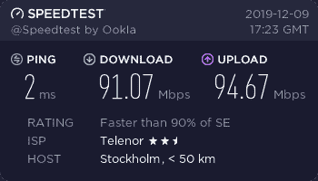

# 任天堂 Switch 兼做网络交换机

> 原文：<https://hackaday.com/2019/12/16/nintendo-switch-doubles-as-network-switch/>

从“冗余部门”直接向你走来的是这个聪明的黑客，它把一个交换机变成了一个交换机。更具体地说，是一种网络交换机。从[辛西娅·雷夫斯特伦]在设置好一切后进行的速度测试来看，也不算太差。我们不会建议你放弃现有的网络设备，转而使用一个重新设计的游戏系统，但也许在紧要关头…

不管你怎么想，这里没有硬件修改。这是一个功能齐全的任天堂 Switch，刚刚插入了两个 USB 到以太网适配器。秘密成分是添加了一些企鹅的力量，由于一个名为 switchroot 的项目，任天堂最新最棒的[开始运行。](https://hackaday.com/2019/07/26/installing-android-on-your-nintendo-switch-because-why-not/)

 随着 Linux 在系统上运行，【辛西娅】所要做的就是确保 USB 到以太网适配器得到支持，并摆弄`brctl`和`ip`命令来配置接口之间的桥，以使数据包移动。将交换机放在主网络和测试计算机之间显示，它的吞吐量刚刚超过 90 Mbps，这大约是 USB 连接的网络接口所能期望的全部。

从这里开始，让系统像无线路由器一样工作并向客户端提供 DHCP 和 NAT 之类的服务并不难。但是既然任天堂不认为称它为路由器是合适的，那将会提供最小的迷因价值。总有下一代。

看到任天堂 Switch 作为以太网交换机运行得出奇的好，更令人惊讶的是，它还在努力与实际上是为它设计的配件配合使用。尽管公平地说，向 USB-C 的迁移比我们大多数人所希望的要困难一些。