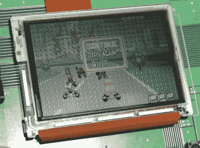

# 任天堂的 GBA 开发板可以通过现代 DIY

> 原文：<https://hackaday.com/2020/06/04/nintendos-gba-dev-board-could-pass-for-modern-diy/>

当 Game Boy Advance 在 2001 年出现时，它是一件相当大的事情。32 位掌上电脑代表了标志性的 Game Boy 系列有史以来最大的一次升级，不仅在原始处理能力方面，而且在整体设计方面。它将在未来几年内引领便携式游戏的发展方向，任天堂渴望得到开发者的支持。

这可以解释为什么最近由[Hard4Games] 展示的官方 GBA 开发套件[看起来像是在黑客空间中构建的东西。控制台开发系统看起来更像 20 世纪 90 年代的四四方方的计算机，而不是最终占据电视机下方的光滑注塑单元，这很常见，但它们通常不会以裸露的 PCB 的形式出现。任天堂似乎急于向开发者推出他们最新掌机的早期版本，以至于他们甚至没有时间为它冲压一个金属外壳。](https://www.youtube.com/watch?v=ezffQA6Ir38)

The development board doesn’t like later GBA games.

最终 GBA 的所有主要部分都在这里，正如休息后的视频所展示的那样，该板甚至可以玩商业发布的游戏。虽然[Hard4Games]确实发现一些掌机后期的游戏有不寻常的图形瑕疵；暗示可能有一些低级别的差异不会显现出来，除非开发人员真的深入挖掘以挤出他们所能获得的所有性能。

该委员会也缺乏对游戏机和游戏机彩色游戏的支持，尽管这并不完全令人惊讶。当一个旧游戏被插入 GBA 时，盒式磁带会物理地按下一个开关，启用一个特殊的基于 8080 的协处理器，该协处理器的存在只是为了向后兼容。将该硬件添加到开发板会使其更加昂贵，并且不会增加任何实际好处。也就是说，[Hard4Games]确实指出了电路板上似乎有一个未被占用的区域，在那里可以安装向后兼容开关。

黑客们总是迷恋 Game Boy ，所以看到官方开发工具包最终进入这个传奇的掌上电脑系列看起来更像是他们自己可以建造的东西是很合适的。如果有人想以这种方式构建自己的“解构”GBA，[你知道在哪里可以找到我们](https://hackaday.com/submit-a-tip/)。

 [https://www.youtube.com/embed/ezffQA6Ir38?version=3&rel=1&showsearch=0&showinfo=1&iv_load_policy=1&fs=1&hl=en-US&autohide=2&wmode=transparent](https://www.youtube.com/embed/ezffQA6Ir38?version=3&rel=1&showsearch=0&showinfo=1&iv_load_policy=1&fs=1&hl=en-US&autohide=2&wmode=transparent)

【感谢 NeoTechni 的提示。]