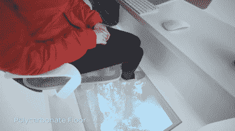

# 日产的 Office Pod 概念是一个车轮上的生产力天堂

> 原文：<https://hackaday.com/2021/02/28/nissans-office-pod-concept-is-a-productivity-paradise-on-wheels/>

所有这些在家工作都很棒，但我们不得不承认，我们想念收拾办公室，偶尔去当地的咖啡馆，在嘈杂的背景下花几个小时写作。关于这种体验，我们不会错过的一件事是，你永远无法保证有一个地方可以坐下来舒展身体。除非你相信一个友好的陌生人会在你上厕所的时候帮你照看东西，否则你就得冒着丢掉桌子的风险把东西带走。

如果我们能买得起日产的移动办公舱概念车就好了。我们一直想假装我们在做监视，可能会把这个东西用图形包起来，做成一个假花店之类的。这肯定会让停车和借用某人的开放 Wi-Fi 网络变得更容易——甚至可能是在我们到达免下车餐馆后从咖啡馆的停车场。

 正如你将在下面的加长视频中看到的，日产似乎考虑到了除洗手间设施之外的一切。发动机上方的驾驶室设计和全地形轮胎将使它更容易驶进大自然，真正远离一切。一旦你找到了最佳位置，你可以打开电梯门呼吸新鲜空气，或者拉出电动一体式隔间(包括一把内置赫曼米勒科斯姆椅)晒晒太阳。(显然 Aeron 是旧的，现在坏了；我们不同意)。出于某种原因，这个小隔间是边缘照明的，这种方式不利于你在办公桌前工作。根据视频，它是基于房车 NV350，[的，它看起来更舒适，但当配备作为替代移动概念](https://www.motor1.com/news/486215/nissan-nv350-caravan-mobility-concept/)时就不那么酷了。

办公舱有一些不错的便利设施，比如 DC 交流转换器，这样你就可以使用 Keurig 或 Nespresso，手套箱里甚至还有紫外线消毒灯。驾驶室后面较大的窗户可以安装电子遮光板，这样你就不会被太阳晒到了。这里的事情变得有点荒谬:地板是由透明的聚碳酸酯制成的，以防你想纵向停在一条小溪上，看着幸存的鱼从你脚下经过。如果你真的想休息一下，可以爬到屋顶甲板上，在躺椅上伸展身体。

如果我们住在美国以外的任何地方，[我们可能会放弃花店的图形包装，而是把它打扮成电视探测车的样子](https://hackaday.com/2021/01/18/tv-detector-vans-once-prowled-the-streets-of-england/)。

 [https://www.youtube.com/embed/vngwMVP90Vk?version=3&rel=1&showsearch=0&showinfo=1&iv_load_policy=1&fs=1&hl=en-US&autohide=2&wmode=transparent](https://www.youtube.com/embed/vngwMVP90Vk?version=3&rel=1&showsearch=0&showinfo=1&iv_load_policy=1&fs=1&hl=en-US&autohide=2&wmode=transparent)

