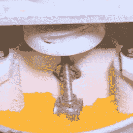

# 这种直接挤压 3D 打印机不需要灯丝

> 原文：<https://hackaday.com/2019/07/08/no-filament-needed-in-this-direct-extrusion-3d-printer/>

磨碎的塑料块从一端进去，完成的 3D 打印从另一端出来。这就是[HomoFaciens]最新产品背后的想法:[一台直接挤压 3D 打印机](https://homofaciens.de/technics-machines-3D-printer-Granule-Extruder_en.htm)。就像他所有的作品一样，它是由我们大多数人会扔掉的碎料和碎片制成的。

Pellet agitator is part of the extruder. All of this travels along with the print head.

拿着挤压螺杆。就像著名的自制旋转编码器一样，乍一看，它似乎不可能工作。早期的版本只是铜线缠绕在特氟隆管内的螺纹杆上；在步进电机的驱动下，螺杆很好地将磨碎的 PLA 从料斗中推入热端，热端本身只是一个简单的铝块，上面钻有孔。这很有效，尽管只是用基本上粉末状的 PLA。后来的挤压机使用了一个普通的镀锌木螺钉，焊接在螺杆的末端，与更粗的塑料块一起工作。桨叶搅动料斗中的颗粒，使其均匀流入挤出机，下面的视频显示了令人印象深刻的结果。我们也学到了一些技巧，比如使用发动机衬垫纸和排气密封剂来隔离热端。滑动联轴器，旨在稍微缩回挤出机螺杆以减少拉丝，似乎很聪明，但需要更多的工作才能使其实用。

它远非完美，但考虑到投入，它是相当惊人的，而且再利用所有那些失败的印刷品有一些吸引人的地方。这让我们想起了我们最近推出的垃圾打印机，这是把它贴在灯丝人身上的另一种方式。

 [https://www.youtube.com/embed/oRNgIu3K7vg?version=3&rel=1&showsearch=0&showinfo=1&iv_load_policy=1&fs=1&hl=en-US&autohide=2&wmode=transparent](https://www.youtube.com/embed/oRNgIu3K7vg?version=3&rel=1&showsearch=0&showinfo=1&iv_load_policy=1&fs=1&hl=en-US&autohide=2&wmode=transparent)

