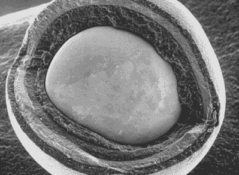
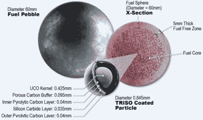

# 非熔化核“能量球”可能会赢得一些人心

> 原文：<https://hackaday.com/2020/07/30/no-melt-nuclear-power-balls-might-win-a-few-hearts-and-minds/>

一个核电站又大又复杂，最大的原因之一就是安全。分裂放射性原子本来就很危险，但随之而来的连锁反应所释放的能量才是最重要的。保持最佳状态是一种微妙的平衡，需要持续关注核心温度，否则反应堆可能会熔毁。

今天，核裂变很大程度上是由燃料棒产生的，燃料棒是装满铀丸的细锆管。裂变率由控制棒控制，控制棒由各种元素组成，如硼和镉，它们可以吸收大量多余的中子。控制棒将激烈的裂变归结为合理的慢炖，并可以回收，直到它们要么机械磨损，要么被中子饱和。

核电站往往有很大的占地面积，因为所有的安全措施都是为了防止熔毁而设计的。如果有一种燃料可以承受足够的热量，使熔毁在物理上不可能，那么反应堆就不需要数百万美元的安全壳设备来缓冲。除去这些多余的、占用空间的安全措施，核过程可以缩小很多。

Cutaway of a single triso ball, magnified under a scanning electron microscope. Image via [US Department of Energy](https://www.energy.gov/ne/articles/triso-particles-most-robust-nuclear-fuel-earth)

## 如果崩溃不是一件事呢？

答案似乎很简单，不是吗？如果我们可以制造一种燃料，它可以自然地承受比它需要的更多的热量，那么，我们就可以取消控制棒、巨大的水浴和混凝土冷却塔。

这种燃料已经存在，它的时代似乎已经到来。triso——tristructural isotropic 的缩写——是由浓缩铀和氧气制成的罂粟籽大小的颗粒。它最初是在英国为实验性的龙反应堆开发的。

每个 triso 芯块都包裹着由石墨和碳化硅制成的多层糖果壳，其作用与控制棒相同:安全地遏制裂变。由于这种多层外壳，triso 可以承受极高的热量——比它在标准反应堆内部面临的热量要多得多。Triso 已经过测试，可以承受 3200 F / 1760 C 的高温，这比目前运行的典型反应堆温度高三倍。美国能源部称 triso 是地球上最坚固的核燃料。

Triso 是通过用化学物质将铀矿石分解成微小的珠子而制成的。珠子被放入熔炉中，用气体喷射，气体在高温下分解，并在珠子上覆盖一层保护性的沉积物。

## 核块和能量球

那么为什么这些年来我们不用 triso 代替燃料棒呢？有几个原因。在自然状态下，triso 的能量密度不足以满足今天的大型轻水反应堆。

A fuel pebble breakdown via [Breaking Defense](https://breakingdefense.com/2020/04/new-triso-nuclear-mini-reactors-will-be-safe-program-manager/)

Triso 的制造成本也很高，所以直到最近 20 年左右，当能源部开始资助建造小型高温反应堆的公司时，才出现了大量的研究。

美国目前有两家公司同时生产 triso 和 triso 兼容的核反应堆。BWXT 正在制造 triso 燃料罐，看起来很像一口大小的燃料棒。

一家名为 X-Energy 的公司正在制造一种他们称之为“能量球”的秘密混合物。它是成千上万的 triso 粒子装入一个台球大小的球体中，旨在与该公司的卵石床反应堆一起工作，产生的功率是标准反应堆的八分之一。每个动力球在耗尽之前可以在 Xe-100 球床反应堆中运行六次，寿命大约为三年。

并非只有能源部将 triso 视为核燃料的未来。国防部正在让 BWXT 和 X-Energy 相互竞争，以开发一种用于军事用途的移动反应堆，美国宇航局正在重新考虑核动力火箭的想法。