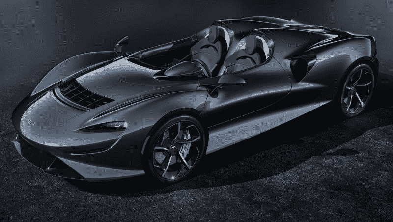
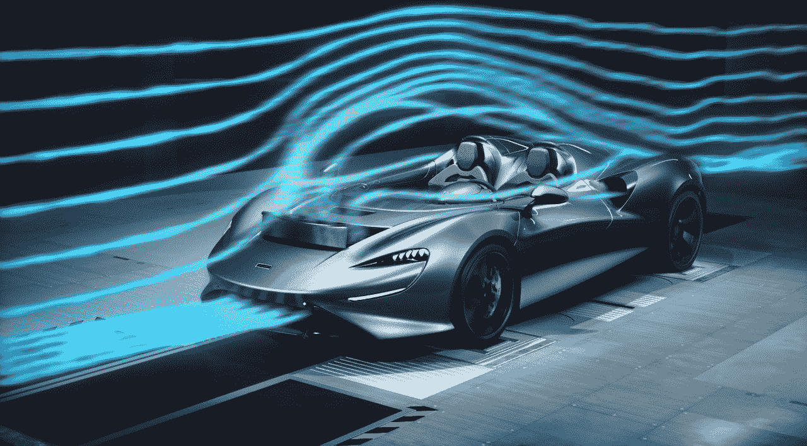
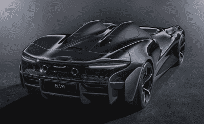

# 没有挡风玻璃？麦克拉伦说，没问题

> 原文：<https://hackaday.com/2020/04/09/no-windshield-no-problem-says-mclaren/>

所有最好的跑车在静止时看起来都在运动，而迈凯轮最新限量版玩具上的线条重新定义了静止时的速度。也许是冷笑的车头灯，或者是流线型的、反 1966 年的蝙蝠战车造型。不管它是什么，804 马力的双座项目刘晴空看起来像是从生产线上跳到了未来。

但是，这种未来没有我们最不希望看到的从任何车辆上移除的东西，尤其是一辆价值 170 万美元的超级跑车——挡风玻璃。既然耳机插孔已经被认为是可有可无的，似乎没有什么是神圣的。刘晴空已经是一辆没有窗户的永久敞篷车了。

[虽然迈凯轮没有点燃这堆怪异的无窗之火，但刘晴空却是为了点燃未来主义的火焰](https://www.livemint.com/auto-news/why-supercars-are-doing-away-with-windshields-11584180242936.html)。她加入了法拉利、梅赛德斯-奔驰和阿斯顿·马丁少数无挡风玻璃车型的行列。在另一个人的车里，你需要一个时速超过 30 英里的头盔，除非你喜欢空气冲击和头发被风吹乱的雷鸣般的声音。这是一个年轻的想法，还有一些问题需要解决。

刘晴空带给道路和赛道的是一个不需要答案的问题的解决方案。迈凯轮称之为主动空气管理系统(AAMS)。基本上，汽车引导空气向上通过驾驶室，创造一个“平静的气泡”。你可以在下面嵌入的风洞演示中看到它变得栩栩如生。留下来观看一个模型版本的顶级装备之旅。

它是这样工作的:当车速超过每小时 30 英里时，车头上的导流板就会向上翻转。进入低矮格栅的空气在导流板内向上倾斜，当它离开时，这种弯曲的空气与向上推动并越过导流板的空气混合，在驾驶室周围形成一个力场。结果呢？在一个空气袋里有一个无缝的涂抹风景的海洋，足够安静地交谈，也足够轻松地点燃 100 美元的雪茄。确实一帆风顺——至少在你前面的车踢到鹅卵石之前是这样。

Looks good coming or going. Image via [Car and Driver](https://www.caranddriver.com/mclaren/elva)

## 一些需要解决的问题

你说得对，这是一个荒谬的想法。当被问及虫子进入刘晴空稀薄空气的后果时，该项目的总工程师说，“这取决于虫子的质量”。

当被问及 AAMS 人将如何处理岩石时，代表们只有不知所云的喃喃低语

大自然不是这里唯一的问题。AAMS 引起阻力和平衡问题，所以刘晴空需要一个主动的，算法控制的尾翼来补偿。不过，你永远也猜不到这些线条——尽管(或者可能是因为)采取了这种纠正措施，后端看起来还是很棒。

对于普通的拥有一辆车的消费者来说，这整个概念看起来像是对时间和金钱的疯狂而愚蠢的浪费。但是让我们假设你和亿万富翁是一伙的，并且碰巧想买一辆新的跑车。别忘了，不是日常司机——你是亿万富翁，你有吉普车带你去股东会议。这是我们正在谈论的一种新玩具。难道你不想要一个从乡村俱乐部所有的滚滚财源中脱颖而出的吗？

你最好快点，因为迈凯轮只生产了 399 辆。如果你在美国，试着去别的地方送货，因为所有去那里的精灵都有挡风玻璃。

 [https://www.youtube.com/embed/fSQxN6rJ1qg?version=3&rel=1&showsearch=0&showinfo=1&iv_load_policy=1&fs=1&hl=en-US&autohide=2&wmode=transparent](https://www.youtube.com/embed/fSQxN6rJ1qg?version=3&rel=1&showsearch=0&showinfo=1&iv_load_policy=1&fs=1&hl=en-US&autohide=2&wmode=transparent)

 [https://www.youtube.com/embed/g3dkCldqVy8?version=3&rel=1&showsearch=0&showinfo=1&iv_load_policy=1&fs=1&hl=en-US&autohide=2&wmode=transparent](https://www.youtube.com/embed/g3dkCldqVy8?version=3&rel=1&showsearch=0&showinfo=1&iv_load_policy=1&fs=1&hl=en-US&autohide=2&wmode=transparent)

通过[汽车和驾驶员](https://www.caranddriver.com/mclaren/elva)的主图像

通过[迈凯轮](https://cars.mclaren.com/gb-en/ultimate-series/mclaren-elva)的缩略图