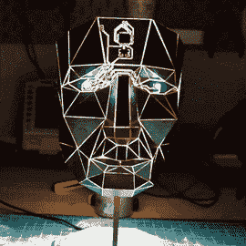
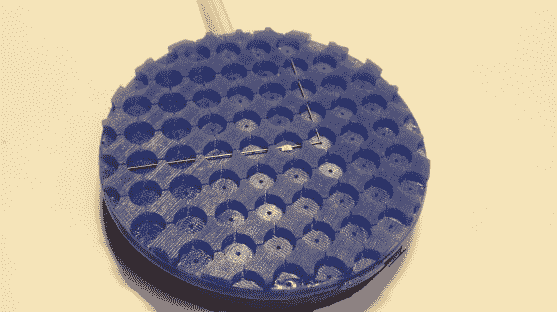

# 难怪这些项目赢得了电路雕塑大赛

> 原文：<https://hackaday.com/2020/11/20/no-wonder-these-projects-won-the-circuit-sculpture-contest/>

Hackaday Circuit 雕塑大赛有五名获胜者，他们中的每一个都不令人惊讶，即使是在竞争激烈的比赛中。

从上面这张华丽的照片开始，[我们有 [艾瑞克·布兰德尔的]瓦尔迪安](https://hackaday.io/project/174560-waldian)被评为最美。想象一下这个挂在你客厅的墙上，然后走过去听视频演示，因为它的光驱动合成器编钟就像遥远的(或者也许不那么遥远的)教堂钟声。这不是对[Eirik]的电路雕塑的一次性探索，[我们在 2018 年展示了他更广泛的作品](https://hackaday.com/2018/11/29/wonderful-sculptural-circuits-hide-interactive-synthesizers/)，所有这些都值得更深入地研究。

    

[发光面具](https://hackaday.io/project/174910-pcb-papercraft)其实是 PCB 做的。接缝用苏打粉支持的强力胶固定。这背后的劳动是激烈的。正如我们在 9 月提到的[，这个项目进行了大约两年，主要是因为【斯蒂芬·霍斯】需要做大量的切割和打磨工作来拼接这么多的作品。这部电影为他赢得了最艺术奖。](https://hackaday.com/2020/09/21/circuit-board-origami-puts-you-face-to-face-with-low-poly-electronics/)

【jiří·普劳斯】凭借[他的发光 RGB LED 球](https://hackaday.io/project/175794-freeform-led-sphere)摘得最佳视频桂冠。当它第一次在 12 月落下[时，我们为之神魂颠倒。[Jiří]展示了耐心和独创性的结合，他使用 3D 打印的模具来固定每个 LED，同时将黄铜棒焊接到位，作为电气和机械支撑。](https://hackaday.com/2019/12/23/194-led-ball-is-free-form-soldering-on-another-level/)

    

说到模具，挑战之一是展示制作电路雕塑的最佳夹具。软焊接夹具提供了工作时在黄铜棒上保持清晰直角所需的通道，以及在交叉点处放置元件进行焊接的空隙。借鉴了像[莫希特·博希特]和[jiří·普劳斯]这样的人的许多电路雕刻成功的建议，他在寻找一种方法，可以轻松地将所有东西放置在不会被烙铁烫伤的表面上。答案是用 3D 打印模具制造的硅胶夹具。

最后我们有[赢得最实用奖的二进制计算器项目](https://hackaday.io/project/175783-binary-calculator)。虽然它确实可以作为二进制计算器使用，但它的魅力不容忽视。在它的众多属性中，有一套为该项目量身定制的樱桃木键帽和一个钟罩展示架，计算器可以放在那里，不使用时可以用作二进制时钟。你可能记得上周看过我们这个项目的专题[。](https://hackaday.com/2020/11/10/binary-calculator-for-all-10-typbinary-calculator-for-all-0b10-typeses/)

作为奖品，二进制计算器、orb 和墙壁雕塑创作者将分别从 Digi-Key 获得 200 美元的奖品，Digi-Key 赞助了比赛，并将在 2021 年的挂历中展示参赛作品。焊接夹具和 PCB 掩模的创造者将获得一张价值 100 美元的 Tindie 礼品卡。