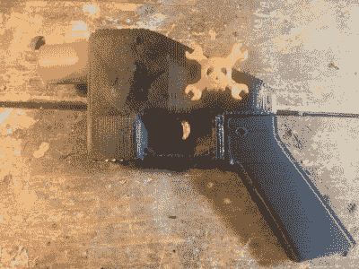
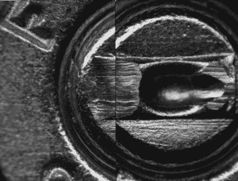
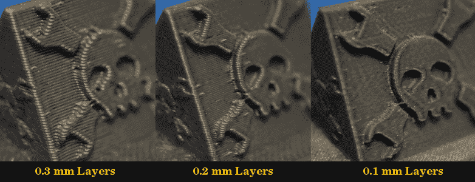
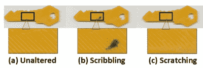
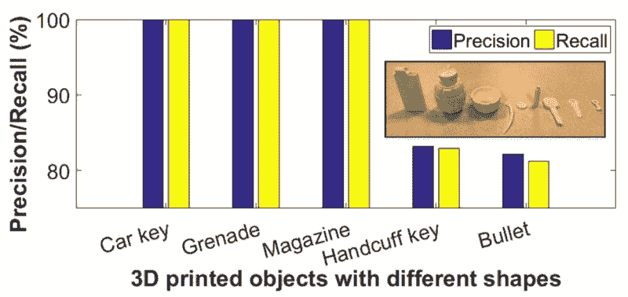

# 不，你的 3D 打印机没有指纹

> 原文：<https://hackaday.com/2019/03/12/no-your-3d-printer-doesnt-have-a-fingerprint/>

黑客和制造商将桌面 3D 打印机视为接近梦想成真的东西，这种设备能够以数百美元的价格实现自动化小规模制造。但说我们大多数人是理想主义者，也不是没有道理；我们认为 3D 打印的兴起是一个积极的发展，因为我们对这项技术抱有积极的态度。但是对于那些使用 3D 打印机生产更可疑的物体的人来说呢？

我们已经在野外看到了 3D 打印的信用卡套票，如果你有一把钥匙的足够清晰的照片，它已经被证明你可以打印一个功能副本。按照这种逻辑，有理由得出这样的结论:3D 打印物体的法医鉴定有朝一日可能成为执法的一个有价值的工具。如果一个打印的信用卡套票被当局找回，能够告诉它是如何和何时被打印的可以提供关于谁把它放在那里的有价值的线索。

这种精确的思路就是纸张" [PrinTracker:使用商品扫描仪的指纹 3D 打印机](http://www.buffalo.edu/ubnow/campus.host.html/content/shared/university/news/ub-reporter-articles/stories/2018/10/3d-printer-fingerprints.detail.html) " ( [PDF 链接](https://cse.buffalo.edu/~wenyaoxu/papers/conference/xu-ccs2018.pdf))的由来。这项由布法罗大学领导的研究旨在开发一种系统，允许调查人员扫描从犯罪现场回收的 3D 打印物体，并识别哪台打印机用于生产它。该文件声称，该物体中的微观不一致性非常明显，足以与人类指纹相类似。

但是像你们中的许多人一样，当这个提议最近出现在 Hackaday 上时，我对它有相当大的怀疑。我们这些经常使用 3D 打印机的人知道要获得一致的打印效果需要多少变量，以及即使是最小的变化也会对最终产品产生巨大影响。用所有这些参数进行目视检查可以做出任何有用的识别，这种想法非常难以置信。

根据我自己的疑问，以及读者评论中提出的一些优秀观点，我认为应该对 PrinTracker 概念进行更深入的研究。这个识别系统到底是如何工作的？它在多大程度上适应了 3D 打印的高度动态性？但也许最重要的是，在刑事调查中，这些技术真的可信吗？

## 房间里的大象是转移注意力的东西

我们当然可以讨论罪犯使用 3D 打印物体有多普遍，但我们不能否认这是可能的。但有趣的是，当我们在媒体上听到 3D 打印机的邪恶用途时，CC skimmers 和 3D 打印的钥匙很少是给出的例子。似乎所有人都想谈论的是印刷无法追踪的“幽灵枪”。

Hackaday printed a gun in 2013, and it sucked

是的，在一台 200 美元的 3D 打印机上制造一把简陋的枪支是可能的，但是一件更可靠的武器可以用五金店里 20 美元的零件制造出来。在另一个极端，一个数控轧机可以用来生产一把枪，不仅难以追踪，但合理的实用性。然而，我们并不经常看到要求对哈斯或布里奇波特销售的产品进行更多监管的呼声。3D 打印机可以说是个人生产枪支的最差方式，但由于其低成本和高可用性，有些人会让你相信 Monoprice Mini 只不过是一个个人武器工厂。

有一点非常清楚，3D 打印不会有任何发展。如果今天我们已经有了一些 3D 打印机被用于犯罪行为的经过验证的例子，那么认为随着技术的进步，这不会在未来发生就太天真了。但就本文而言，我不考虑枪械，因为在可预见的未来，它们不是可行的 3D 打印物品。这种 3D 打印的枪在六年前是蹩脚的，如果今天打印出来，它仍然是蹩脚的，所有迹象都表明它在另一个六年里也是蹩脚的。所以，把你的注意力集中在当今用 3D 打印机犯下的罪行上，信用卡套现者是现实世界例子中的黄金标准。

## 将 3D 打印与 3D 打印机匹配:举证责任

PrinTracker 是这篇研究论文的营销代言人，它概述了一种从法医角度识别哪种类型的 3D 打印机用于产生给定打印的方法。乍一看，PrinTracker 方法听起来似乎很合理:通过仔细检查打印样本，可以观察到打印机硬件和软件配置的可见表现，如挤压速率、喷嘴直径、温度稳定性和加速度，并进行分类。有了足够大的这些观察数据的数据库，可以通过将印刷物体的表面不规则性与先前识别的印刷机的表面不规则性进行比较来确定印刷物体的谱系。原则上，这类似于发射的子弹或弹出的弹壳如何与给定的枪支匹配。

Examining the “fingerprint” of a gun

但是，当你更深入地研究这份报告时，很快就会发现，有一些严重的问题会阻碍这项技术在现实世界中的应用。首先，作者指出，你需要为硬件和软件的每一种可能的排列建立和维护一个“指纹”数据库。同样，在犯罪现场发现的人的指纹需要与已经记录在案的指纹进行匹配，PrinTracker 只有在已经有一个被调查的指纹可以匹配的编目样本的情况下才能工作。

试图建立这样一个数据库，即使只是商业上可用的打印机，也将是一项巨大的事业，而且这还没有考虑到定制设计的打印机或那些由套件构建的打印机，这些套件可能会表现出与预建模型不同的行为。有太多的机器，被太多的软件包控制着，希望把它们全部编目。

为此，该论文建议，3D 打印机所有者有朝一日不仅需要注册他们的打印机，还需要提供定期更新的打印对象样本，以添加到数据库中。如果没有这样一个奥威尔式的系统，这篇论文的结论是 PrinTracker 无法确定哪个特定的打印机实际上生产了一个对象，最多只能确定所使用的品牌和型号。

鉴于这些事实，PrinTracker 得出的结论充其量只能算是间接的。不仅系统很有可能在数据库中找不到现有的匹配，而且即使找到了，它也不能肯定地说被检查的打印是由特定的打印机进行的。回到弹道学的例子，它不能识别特定的枪，它只能验证它是用于犯罪的同一型号的枪。这可能是一个确凿的数据点，但不足以定罪嫌疑人。

## 异常狭窄的范围

尽管如此，每个旅程都必须从第一步开始。PrinTracker 可能不是一个完美的解决方案，但它确实值得研究。因此，如果我们忽略实现系统的逻辑问题，这种方法本身经得起推敲吗？不幸的是，这也不是很清楚。

据报道，测试仅限于五种型号的 FDM 打印机。但是，即使只检查了这么少的打印机，人们也会认为软件配置的变化应该足以使识别更加困难。毕竟，操纵各种参数以产生最终打印质量的显著变化是这些机器的微调方式。然而，根据这篇论文，该系统只对打印设置进行了最细微的调整:

> PrinTracker 可在 120–100 毫米/秒的喷嘴速度和 0.06–0.15 毫米的不同材料层厚度范围内抵抗打印参数的变化。超出范围的配置可能会造成欺骗我们的解决方案的风险，但产品将遭受严重的变形和质量差，这损害了可用性。

因为打印速度超出测试的 20 毫米/秒范围或层高度高于 0.15 毫米而不予考虑，因为它们会导致“严重变形”，至少可以说是不真诚的，这种说法对任何拥有 3D 打印机的人来说都绝对没有任何分量。对于快速原型制作，可以使用 0.3 毫米厚的层，并以高速运行，但对于高细节的工作，切换到“低而慢”的方法。事实是，速度和层高度的剧烈变化是完全正常的。

当然，软件只是等式的一半。对打印机的硬件进行修改时会怎样？根据这篇论文，当 hotends 在不同的打印机之间交换时，PrinTracker 无法识别任何打印的测试对象。这正是你所期望的，因为它会完全否定最初的观察。

但是，这篇论文并没有承认这一缺陷，而是将其作为系统不会被愚弄而产生假阳性的证据:

> 在使用 PrinTracker 测试扫描的图像时，我们观察到这些图像的整个集合被拒绝并被归类为外来设备。原因是指纹不仅产生于制造差异，而且产生于机械部件的复杂综合效应。因此，PrinTracker 将保持不受影响。

这两种解释似乎都是证实偏差的明显例子。修改打印机的软件和硬件是常见的，甚至是意料之中的。但在这里，改装打印机被视为无关紧要的离群值。如果逃避检测所需要的只是一个新的 hotend，或者改变打印设置，那么这个系统有什么用呢？

## 积极对策

我们还必须考虑这样一种可能性，即罪犯会试图掩盖其打印机的身份，就像枪上的序列号可能被锉掉一样。这篇论文也提到了这个问题，但是这里的测试方法似乎不够严格，不足以做出任何明确的决定。

例如，他们描述了一种“潦草攻击”；其中罪犯会在印刷品的表面涂上某种东西，使其更难进行视觉检查。在这篇论文中，这是通过在印刷品的表面上轻拍一个标记来模拟的。但是测试过程出现了意想不到的转折:

> 我们发现酒精可以毫不费力地清除钥匙表面的墨迹。我们测试了清洁表面纹理的扫描图像，结果显示准确率为 100%，这意味着 PrinTracker 对涂鸦攻击有很高的容忍度。

令人难以置信的是，他们没有实际测试 PrinTracker 是否能够识别以这种方式模糊的印刷品，而是在扫描之前简单地去除了墨水，并声称测试成功；完全忽略了提出的实际问题。

 即使我们同意这个有点可疑的结论，即任何涂在印刷品上的墨水或颜料都可以在扫描前被清除，但这并没有考虑到表面的物理变化。如果攻击者用打磨机打磨他们打印的物体，抹去所有表面细节会怎样？

这在论文中被认为是一种“抓挠式攻击”，但是这个合理的问题似乎在很大程度上被忽略了。在这个测试中，在测试之前，只有物体表面区域的一小部分用锉刀磨平。为什么一个积极躲避侦查的罪犯只会模糊表面细节的一小部分？该测试中的磨损程度看起来更接近正常的磨损，可能是应该在系统的基准性能中考虑的因素。

## 火上浇油

显然，论文中描述的测试不够严格，无法考虑影响 3D 打印物体外观的大量变量；无意或其他。但这也是同类研究中的第一个，所以可能会有一点余地。它并不完美，但至少提出了一个有趣的问题。

不幸的是，本可以成为一个有用对话的开端，却被我们一次又一次看到的反对 3D 打印的同样可疑的主张所困扰。这篇论文没有把重点放在[似是而非的场景上，比如印刷的信用卡套现机](http://hackaday.com/2018/01/02/when-a-skimmer-isnt-a-skimmer/)或者复制的钥匙，而是引用了只能被称为幻想产品的物品:

> 袭击发生后，他离开犯罪现场，没有留下任何个人痕迹，如体毛或指纹。而是无意或有意地将工具遗弃在犯罪现场(如信用卡套、**弹壳**或弹匣)或因某些情况无法找回破碎的物体(如**手榴弹碎片**或锁芯中断裂的钥匙)。

作为官方测试程序的一部分，他们对这些示例进行了加倍，如图 20 所示:

这篇论文暗示，无论是通过欺骗的意图还是可悲的无知，功能性 3D 打印手榴弹和弹药的存在。这些想法属于科幻小说的范畴，将它们包含在学术论文中是完全不合适的。打印出看起来像手榴弹或子弹的物体，但没有说明它们完全没有活性，这分散了论文的真正观点，并进一步削弱了该文件得出的已经有问题的结论的合法性。

## 错过的机会

对于任何有 3D 打印经验的人来说,“PrinTracker:使用商品扫描仪对 3D 打印机进行指纹识别”有几个突出的问题。没有足够的打印机被测试，关键的变量要么被忽略，要么被低估，参考对象的选择成为对技术不公平的比喻。这真的很遗憾，因为有机会在这里进行一些有价值的研究。

对视觉指纹识别的真实检查，考虑了一系列现实的软件和硬件变量，并避免了无效的安全剧场，仍然是同类研究中的第一个。或者，该团队可以从另一个角度来看待这个问题，并研究当前或不久的将来的“水印”印刷方法，如 3D 隐写术。这已经是我们在更具思想性的 3D 打印媒体描述中看到的东西了，对这些方法的实用性的研究可能会引起相当大的兴趣。

相反，我们只剩下一些可能的线索。虽然这不是目的，但这篇论文似乎注定要传播更多关于 3D 打印枪支或其他犯罪工具的恐惧、不确定性和怀疑。不久之后，我们将需要解决那些想要将添加剂制造与社会对立起来的坏人，但这将需要比 PrinTracker 更全面的东西来完成。