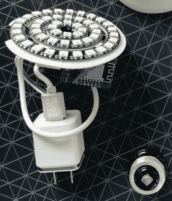

# 对智能灯泡不满意？自己做

> 原文：<https://hackaday.com/2019/05/19/not-happy-with-smart-bulbs-make-your-own/>

所谓“智能灯泡”的*想法*听起来不错；如果你外出过夜，谁不想确认门廊的灯是否亮着，或者早上出门时检查一下浴室的灯是否开着？但实际上，这可能是一场噩梦。每个品牌都想推行自己的协议。更糟糕的是，如果不注册三种不同的服务，你似乎什么也做不了，每种服务都有自己的应用程序，需要安装在你的手机上。这是一个令人沮丧的，往往是昂贵的泥潭。

 【多姆·格雷戈里】喜欢飞利浦提供的色调灯泡，但不想购买他们所需的手机应用和硬件集线器的整个生态系统。所以他决定[创造自己的开源版本，做他想做的一切](https://github.com/domgregori/huBulb)，没有任何商业产品看似不可避免的包袱。最终结果是一个专业外观的 ESP8266 控制的 RGB 灯泡，通过 MQTT 连接到家庭助理。

看着他的材料清单，很惊奇地发现完成这样一个项目只需要这么少的时间。在 Wemos D1 迷你板之外，[Dom]只需要几个同心的 WS2812 环，和一个足够小的 USB 充电器，以适合他的 3D 打印外壳的底座。

我们尤其喜欢他处理灯泡插座的方式，因为那是会让我们挠头的部分。他没有试图从现有的灯泡中抢救出底座，或者想出自己的印刷件来插在插座上，而是使用了一种便宜且容易获得的灯座适配器。这个解决方案可能有点笨重，但我们喜欢他在这个项目中巧妙地避免了处理任何交流电压。

在过去的几年里，我们已经看到越来越多的智能灯泡相关内容。[从曾经流行的拆除新进入市场的设备](https://hackaday.com/2017/02/06/reverse-engineering-ikeas-new-smart-bulbs/)到清醒地认识到[你的灯泡可能会为攻击者提供访问你的网络所需的关键设备](https://hackaday.com/2019/01/29/dont-toss-that-bulb-it-knows-your-password/)，看到这些曾经简单的硬件转变成更加复杂的东西是令人着迷的。