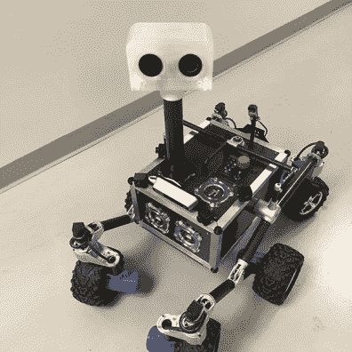
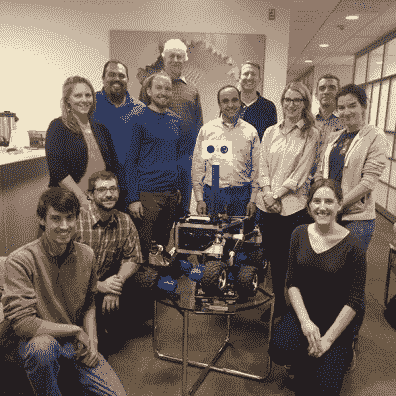

# 六个轮子在转动:火星漫游者去上学

> 原文：<https://hackaday.com/2018/08/03/now-enrolling-mars-rovers-going-to-school/>

很少有什么能像去太空一样让人兴奋。它抓住了年轻人和老年人的想象力。教师喜欢利用最新的太空新闻来提高学生的兴趣，太空机构也很乐意提供资源帮助。美国宇航局发布的一长串教育资源中的最新一个是在喷气推进实验室设计的开源漫游车。

JPL 是火星漫游者、勇气号、机遇号和好奇心的诞生地。几十年来，他们一直在研究机器人探险者，所以他们有很多漫游者也就不足为奇了。开源漫游车的直接前身是 [ROV-E](https://mars.nasa.gov/resources/8076/the-rov-e-rover/) ，其建造过程严格遵循工程太空飞行硬件的程序。这给了[一个早期职业工程师团队](https://mars.nasa.gov/resources/8053/the-engineers-and-mentors-who-built-rov-e/)在建造太空设备之前的过程中的经验。除了学习团队中的各种角色，他们还学习了与 JPL 资源合作，如向机械车间提交订单以制造 ROV-E 零件。

  ROV-E  ROV-E Team

一旦完成，ROV-E 成为 JPL 公共活动的固定设备，并偶尔访问附近的学校，作为教育推广计划的一部分。学校的老师不可避免地会问“孩子们喜欢 ROV-E！我们能制造自己的漫游者吗？”由于大多数学校没有五轴数控机床或热压罐来固化碳纤维复合材料，答案曾经是“没有”

直到现在。

为了将这个“不”变成“是”，去年夏天，一个 JPL 实习生小组受命将 ROV-E 转化为一个可以由一群高中生建造的漫游车。由任何人都可以买到的零件组装而成，只使用人们期望在学校商店里找到的工具。2500 美元的项目预算只是 ROV-E 航天级价格的一小部分。虽然对个人来说仍然偏高，但与学校团体活动如军乐队或运动队的费用相比还是合理的。在 JPL 实习生交付了最初的原型之后，指令被进一步细化，并与 JPL 以外的人一起进行了几次 beta 测试，以获得更多的反馈。(披露:[郑健国]是 beta 测试团队的一员。)现在，所有曾经询问他们是否可以建造自己的漫游者的老师都可以使用它。

为了他们的金钱和努力，学校最终将得到一辆展示所有 JPL 火星探测器使用的六轮摇臂式悬挂系统的探测器。灵活的[结构构件](https://www.servocity.com/actobotics)允许学生们轻松地尝试改变悬挂布局，并亲眼目睹他们的改变如何影响漫游者穿越地形的能力。[电机控制器](http://www.basicmicro.com/Roboclaw-2x7A-Motor-Controller_p_13.html)为学生构建复杂的机器人软件留下了充足的空间，通过[共享串行总线](https://hackaday.com/2018/07/05/wrangling-rc-servos-becoming-a-hassle-try-serial-bus-servos/)提供速度和位置的闭环控制。Raspberry Pi 3 被推荐为漫游者的大脑，因为它拥有庞大的软件工具生态系统和构建该软件的库。

虽然是为教育而设计的，但它并不局限于学校，所以我们任何人都可以自由地建立自己的学校。本着开源的精神，我们欢迎[按照指令](https://github.com/nasa-jpl/open-source-rover)按原样建造漫游者或设计我们自己设计的改进。有一个为社区讨论和支持而设立的[网络论坛](http://s15.zetaboards.com/JPL_OpenSource_Rover)，不要忘记将我们所有的漫游者添加到 Hackaday.io 的[行列中！我们喜欢各种各样的漫游者——从简单的 PVC 管到令人兴奋的乐高作品。](https://hackaday.io/projects?tag=rover&sort=date)