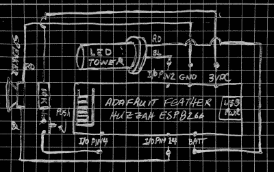

# ESP8266 供电的 NTP 莫尔斯电码时钟

> 原文：<https://hackaday.com/2018/12/08/ntp-morse-code-clock-powered-by-esp8266/>

我们在 Hackaday 上展示了许多独特的时钟，它们几乎利用了所有可以想象的方式来传达当前时间。但在所有这些令人惊叹的钟表中，莫尔斯电码钟有着与众不同的荣誉，它同时是最容易制造的，也是(可以说)最难读取的。因此，我们不常见到他们也就不足为奇了。这使得这一领域的最新进展更加有趣。

【WhisleyTangoHotel】采用了莫尔斯钟的基本概念，最简单的可以用微控制器和单个 LED 完成，[将其扩展为(相对)实用的设备](http://www.whiskeytangohotel.com/2018/12/internet-time-morse-code-clock.html)。通过音频和视频信号，并支持从 NTP 获取时间，这无疑是我们见过的最完美的莫尔斯电码时钟。使用它仍然需要你很好地掌握塞缪尔·莫尔斯现在将近 200 岁的编码方案，当然，但从好的方面来看，这个时钟一定会帮助你保持敏锐的 CW 技能。

对于那些在家跟随的人，[WhisleyTangoHotel]提供了一个手绘的图表，显示他的莫尔斯时计中的所有东西是如何连接在一起的，但硬件方面没有什么可能让黑客读者感到惊讶。一个瞬时按钮代表设备的唯一用户输入，输出由微控制器上各自引脚上的 led“塔”和扬声器处理。这里使用了 Adafruit Feather HUZZAH，但是任何 ESP8266 都可以代替它。

当然，与普通 MCU 相比，使用 ESP8266 板的优势在于 Wi-Fi 连接。这允许时钟连接到 NTP 服务器，并在将当前时间传递给用户之前获取当前时间。有些人可能认为这有点过了，但这确实是一个重要的特性；ESP 上缺少适当的 RTC 意味着如果不定期同步，时钟将严重漂移。假设你有一个可靠的互联网连接，这可以节省你添加外部 RTC 的额外成本和复杂性。

[WhisleyTangoHotel]通过提供他的 ESP8266 Arduino 源代码结束了他的博客文章，该源代码不仅提供了一个在 ESP 上处理 NTP 和时区的有趣示例，还提供了如何处理字符串解析和用 Morse 代码表示其主要字符的有趣示例。

足够有趣的是，在过去[我们已经看到一个单 LED 时钟*没有*使用莫尔斯码](https://hackaday.com/2016/07/29/a-one-led-clock/)来闪烁时间，如果你不是塞缪尔·莫尔斯粉丝俱乐部的成员，这可能是一个可行的选择作为这个设备的替代固件。

 [https://www.youtube.com/embed/rL9xGbOY_Vc?version=3&rel=1&showsearch=0&showinfo=1&iv_load_policy=1&fs=1&hl=en-US&autohide=2&wmode=transparent](https://www.youtube.com/embed/rL9xGbOY_Vc?version=3&rel=1&showsearch=0&showinfo=1&iv_load_policy=1&fs=1&hl=en-US&autohide=2&wmode=transparent)

