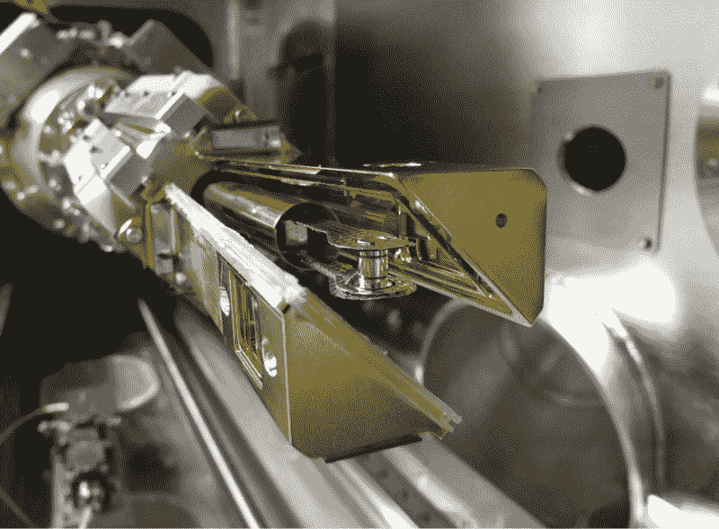
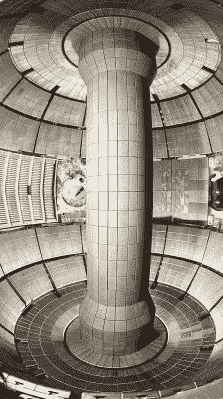
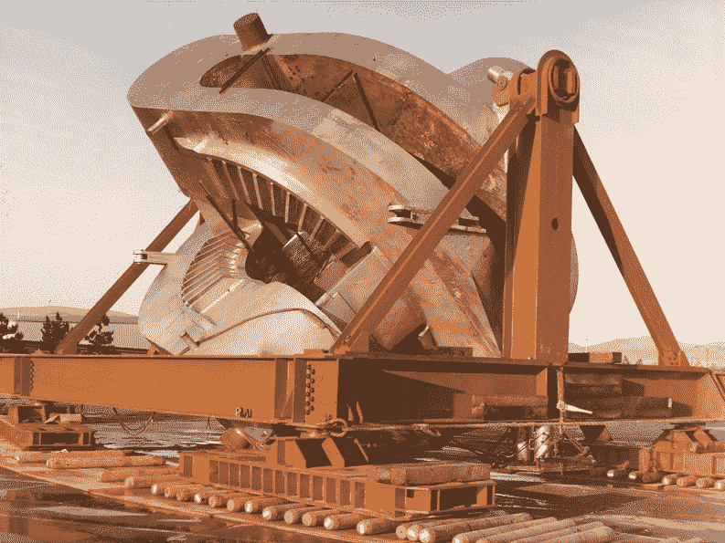
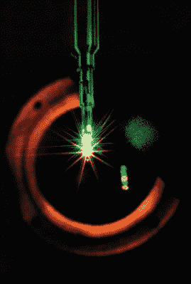

# 没有常规托卡马克或星状器的核聚变动力

> 原文：<https://hackaday.com/2020/02/12/nuclear-fusion-reactors-that-arent-tokomaks-or-stellarators/>

说到核聚变，今天最著名的反应堆无疑是托卡马克，因为它具有相对简单的等离子体密封概念。这并不是说，没有其他方法可以实现核聚变，在不久的将来，这种方法可以用于商业发电厂。

正如我们之前报道的那样，另一种广为人知的聚变反应堆是 stellarator，它很像托卡马克，自 20 世纪 50 年代就已经出现了。那个时代还有其他类型的反应堆，比如 Z-pinch，但它们似乎都已默默无闻。这并不是说 Z 箍缩反应堆的研究已经停止，也不是说其他反应堆概念——有些涉及大规模激光器——从那以后就没有被研究过，甚至没有建造过。

在这篇文章中，我们将看看一系列核聚变反应堆类型，它们肯定值得更多的关注。

## 惯性约束聚变

Target assembly at the NIF in 2010, with the target pellet mounted in the cryogenic positioning device.

惯性约束聚变(ICF)依赖于能量快速转移到燃料目标——通常是燃料芯块。这使得子弹的外层迅速膨胀，导致冲击波向内传播，进入目标。如果操作得当，这将导致燃料(通常是氘和氚)被压缩到足够的水平，以启动从中心向外传播的聚变反应。

ICF 的应用范围从聚变武器研究到发电。法国的[激光加速器](https://en.wikipedia.org/wiki/Laser_M%C3%A9gajoule) (LMJ)是前者的一个例子，而美国的[国家点火装置](https://en.wikipedia.org/wiki/National_Ignition_Facility) (NIF)是后者世界上最突出的例子，尽管它也被用于材料科学和武器研究。

LMJ 和 NIF 都使用激光将能量转移到燃料芯块，在 NIF 的情况下[涉及](https://lasers.llnl.gov/about/how-nif-works) [192 个主激光放大器](https://lasers.llnl.gov/about/how-nif-works/beamline/injection-laser-system)光束线，这些光束线将最初的低功率(十亿分之一焦耳)激光脉冲放大到大约 400 万焦耳的目标，每个光束在击中目标之前传播 1.5 公里。

 [https://www.youtube.com/embed/yixhyPN0r3g?version=3&rel=1&showsearch=0&showinfo=1&iv_load_policy=1&fs=1&hl=en-US&autohide=2&wmode=transparent](https://www.youtube.com/embed/yixhyPN0r3g?version=3&rel=1&showsearch=0&showinfo=1&iv_load_policy=1&fs=1&hl=en-US&autohide=2&wmode=transparent)

此时此刻，有许多 ICF 设施在世界各地运行，尽管一些较新的设施，如欧盟的[HiPER](https://en.wikipedia.org/wiki/HiPER)ICF 项目从未启动。人们对 ICF 的兴趣似乎在减弱，因为它作为一种能源的经济可行性仍然值得怀疑。这主要是由于燃料芯块和周围基础设施的成本。除非能找到大幅降低这些成本的方法，否则 ICF 反应堆似乎不太可能用于材料科学和武器研究之外的任何领域。

## 磁约束聚变

虽然托卡马克和星状器也是磁约束聚变(MCF)反应堆的设计，但它们不是 MCF 反应堆的唯一类型。Z 箍缩反应器设计是另一种类型的 MCF 反应器，使用穿过等离子体的洛伦兹力，而不是用(超导)磁体包围等离子体。后一种方法的主要优点是它允许连续操作，这是聚变反应堆设计中相当独特的特性，聚变反应堆最常用的是基于脉冲的设计。

虽然 ITER 被认为是一个 bog 标准的托卡马克设计，随着中国的 HL-2M 和即将到来的 CFETR 托卡马克，更奇特的配置也正在研究中。其中最突出的是[弧形](https://en.wikipedia.org/wiki/ARC_fusion_reactor)设计。首字母缩写代表“经济、耐用、紧凑”，可以看出它的重点在哪里。虽然 ITER 和 CFETR 是内部体积很大的大型托卡马克，但 ARC 的目标是使用[re bco](https://en.wikipedia.org/wiki/Rare-earth_barium_copper_oxide)——稀土钡铜氧化物——高温超导磁体。

The inside of the National Spherical Torus Experiment’s vacuum chamber.

理论上，这应该允许 ARC 产生比当前托卡马克更强的磁场，使等离子体上的磁力加倍，同时允许它更加紧凑，并满足与低温超导磁体相同水平的低温要求。还建议使用 ReBCO 将允许足够的灵活性，允许托卡马克在不使用时“折叠打开”,以便于维护。然而，在这一点上，ARC 是由麻省理工学院和 T2 PSFC 设计的纯理论设计。将来有可能建造一个示范反应堆(SPARC)。

球形托卡马克 (STs)是当前研究的另一个有趣课题。这里的原理很简单:不是强迫等离子体变成托卡马克典型的环形(“甜甜圈”)形状，而是允许它尽可能地呈现球形，在中心只有一个最小的“孔”用于中心磁体。这应该会使反应堆更便宜，更容易管理。目前活跃的 ST 是由普林斯顿等离子体物理实验室与橡树岭国家实验室、哥伦比亚大学和华盛顿大学合作建造的[国家球形环实验](https://en.wikipedia.org/wiki/National_Spherical_Torus_Experiment)(NSTX)。

在 2012 年至 2015 年的升级后，NSTX 大学更名为“NSTX 大学”，意为“升级”。由于极向线圈的问题，该版本在 2016 年停止，这需要拆除反应堆的重要部分来诊断和解决问题。直到 2020 年底，NSTX 大学才计划重新启用。运气好的话，我们很快就会看到更多这种反应堆。

一些参与 sts 的科学家提出的一个有趣的提议是，用一种受 Z 箍缩反应堆启发的设计来取代中心磁体柱，使用洛伦兹力来提供中心的磁场，而不是物理柱。这将允许 ST 形成一个几乎完美的等离子体球体。

One of the two yin-yang mirrors arrives at LLNL.

最后，洛克希德·马丁公司的[紧凑型聚变反应堆](https://en.wikipedia.org/wiki/Lockheed_Martin_Compact_Fusion_Reactor) (CFR)自 2014 年宣布以来受到了很多关注，方便地省略了设计方面仍有大量工作要做。这个 MCF 的设计很有趣，因为它似乎恢复了[磁镜](https://en.wikipedia.org/wiki/Magnetic_mirror)的概念，这是一种融合设计，许多人认为在[镜融合测试设施](https://en.wikipedia.org/wiki/Magnetic_mirror)于 20 世纪 80 年代关闭后，它已经被留在了历史中。时间会证明磁镜反应堆的消亡是否真的被夸大了。

值得一提的是[场反配置](https://en.wikipedia.org/wiki/Field-reversed_configuration) (FRC)。虽然在发电研究中并不突出，但 FRC 具有有趣的特性，即通过将等离子体捕获在封闭的磁场线上，它可以操纵等离子体在一个方向上加速，这将使其适用于航天器推进。这是正在考虑的各种可能的新推进设计之一。

## 为所有其他的设计干杯

Implosion of a fusion microcapsule on the NOVA laser system.

虽然这篇文章的目标不是提供一个当前聚变发电反应堆的详尽列表，但它至少应该给出一个目前该领域大玩家的可靠概述。还有数不清的小公司，通常是初创公司用一些资金来测试一个新的想法或概念。其中一些设计可能被证明是很好的中子源，而一个偶然的概念可能会使它通过原型阶段，并显示出足够的前景来考虑更多的东西。

核聚变研究最令人兴奋的事情也许是没有什么是一成不变的。很像托卡马克中的等离子体，它不断改变形状和方向。人们一度认为稳定的 Z 箍缩反应堆设计是可行的，但结果却是土崩瓦解。然后是磁镜、星状器、托卡马克(球形或环形)和 ICF 配置。没有人知道这些方法中的哪一种会成为最终商业化的设计的金奖券。

这种认识，加上破解这个秘密会带来巨大回报的承诺，导致了现代的淘金热。谁会设计出第一个商业规模的核聚变反应堆？第一个小型廉价的聚变反应堆？首款能让智能手机运行十年的聚变电池？第一艘核聚变驱动的宇宙飞船？

随着 ITER 和 CFETR 托卡马克的设计似乎达到了顶点，我们可能会在未来十年或二十年内结束另一个 ZETA 时刻，等离子体物理学会在车轮上扔出一个意想不到的扳手，或者到 21 世纪 30 年代，我们将有 2 GW 的商业聚变反应堆产生廉价的清洁能源。没有人确切知道。这既令人兴奋又令人害怕，正是这种情况吸引了那些想要冒险的人。

为保持核聚变研究这颗明亮的星星燃烧而干杯。

* * *

[专题图片:2012 年国家点火设施的前置放大器。(抄送 3.0，达米安·杰米森/LLNL)]