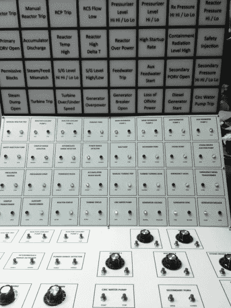

# 核反应堆模拟器是一生的工程

> 原文：<https://hackaday.com/2019/06/27/nuclear-reactor-simulator-is-the-project-of-a-lifetime/>

你一直在看*切尔诺贝利*？其他人也一样。现在，似乎整个互联网都是由扶手椅上的剂量学家组成，他们在睡梦中数着伦琴，但[马克·赖特]不需要一个高预算的电视节目来告诉他与 20 世纪 80 年代的技术争论原子的挑战。他真的做到了。他对 30 多年前在西屋压水反应堆工作的记忆如此清晰，以至于[他一直在建造一个运行在树莓 Pi](https://nuclearpi.blog/2017/04/12/nuclear-pi/) 上的核反应堆“模拟器”，看起来几乎和坐在真实事物的控制室里一样紧张。

模拟器软件用 Python 编写，负责在屏幕上显示反应堆和辅助系统的简化概览。在这里，操作“核电站”所需的所有信息一目了然，从单个泵的使用到控制棒的位置。

 要玩这个游戏，如果可以这么说的话，你必须让虚拟反应堆尽可能长时间地保持最佳性能。听起来很容易？您还必须避免犯程序性错误，并处理随机故障情况。你的工厂是不是失去了外部能源？涡轮刚刚下线？你最好知道什么时候该按哪个按钮。

但是软件只是等式的一部分。就像飞行模拟器爱好者为他们的数字飞机建造物理驾驶舱一样，[马克]为他的核武器建造了一个令人难以置信的控制面板。它包括一个绝对令人眼花缭乱的信号器，指示灯，按钮和旋钮阵列。一切都通过 AB Electronics UK 的四个 32 通道 I/O 扩展器连接到 Pi，但即使有多达 128 个通道可用，他仍然必须使用一些 7404 门 IC 来使一切都适合。

在过去的几年里，控制面板已经经历了几次硬件的修改，因为他发现了什么可行，什么不可行。[Mark]曾一度使用 6.3V 白炽灯泡。不伟大，也不可怕。但是他后来把整个电路板换成了 12V，用一排继电器给相应的报警器供电。我们很想看看，听听，这东西是怎么运作的。

但也许这个项目最令人印象深刻的是[马克]在这个项目上工作了多长时间。他在 1984 年 3 月出版的《80 微 T3》中描述了模拟器的最初版本，这是一本为 80 车主发行的杂志。在切尔诺贝利 4 号反应堆爆炸向公众展示核能的复杂性整整两年前，他正在用一串圣诞灯和 1.78 MHz 处理器修补自己的虚拟版本。

把最终的模拟器作为单机项目来看，已经足够令人印象深刻了。但是看到一个有着如此悠久和传奇历史的项目确实是一件特别的事情。虽然个体修补者可能永远无法建造自己的反应堆，但马克已经证明，至少拥有一个家庭核反应堆的 T2 体验并非不可能。