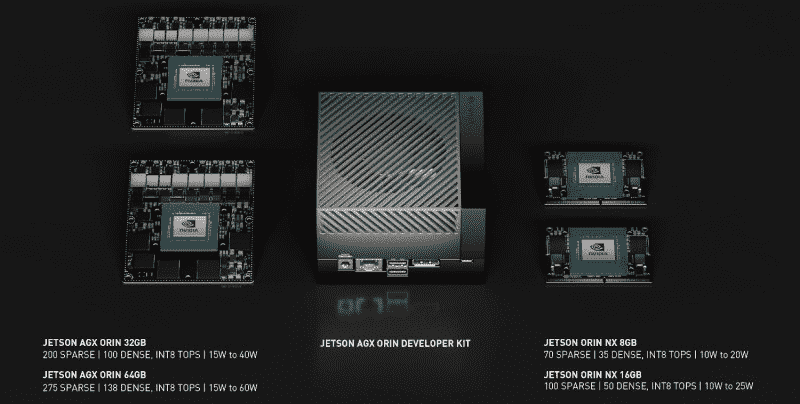

# NVIDIA 发布首款 Jetson AGX Orin 模块

> 原文：<https://hackaday.com/2022/08/03/nvidia-unleashes-the-first-jetson-agx-orin-module/>

早在 3 月份，NVIDIA 推出了 Jetson Orin，这是他们的下一代 ARM 单板计算机，旨在用于边缘计算应用。新平台承诺在小到足以安装在机器人或物联网设备中的电路板上提供“服务器级人工智能性能”，即使最底层的 Orin 模块也能提供大约两倍于以前 Jetson Xavier 模块的性能。不幸的是，有一点棘手——当时，Orin 只能以开发工具包的形式提供。

但是今天，NVIDIA 宣布立即推出 Jetson AGX Orin 32GB 生产模块,售价 999 美元。这本质上是 Orin 系列的中档产品，这使得首先发布它成为一个足够合理的选择。需要 64GB 版本的顶级性能的用户必须等到 11 月，但较小的 NX 或 SO-DIMM 模块仍然没有明确的发布日期。

这对我们这样的人来说有点失望，因为两个 SO-DIMM 模块可能是对黑客和制造商最有吸引力的。售价分别为 399 美元和 599 美元，它们的定价让个人实验者更容易接受，而它们更小的尺寸和更熟悉的界面应该让它们更容易实现 DIY 构建。虽然对于那些希望涉足 CUDA 领域的人来说，Jetson Nano 仍然是一个无与伦比的便宜货，但我们肯定会看到人们为更复杂的项目投资更强大的 NX Orin 板。

虽然 AGX Orin 模块对于一般的修补者来说可能有点难，但它们的可用性仍然是令人兴奋的。由于 Jetson 系列主板共享的通用 JetPack SDK 框架，为这些高端模块开发的应用将在很大程度上保持整个产品线的兼容性。当然，更便宜和更老的 Jetson 板会运行得更慢，但就机器学习和人工智能应用而言，它们仍会围绕树莓 Pi 之类的东西运行。