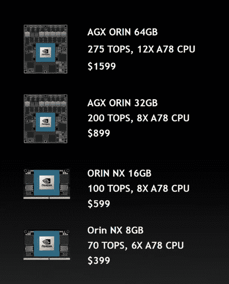

# 英伟达推出 Jetson AGX Orin 开发套件

> 原文：<https://hackaday.com/2022/03/22/nvidia-unveils-jetson-agx-orin-developer-kit/>

当您想到由 NVIDIA 硬件支持的高性能计算时，您可能会想到利用该公司显卡功能的应用程序。在很多情况下，你是对的。但是很自然地，在某些情况下，传统的 x86 计算机和附加 GPU 的结合根本无法解决问题；尝试将现代游戏电脑打包到四轴飞行器上，并让我们知道它是如何进行的。

对于这些所谓的“边缘计算”情况，NVIDIA 提供了 Jetson 系列的 ARM 单板计算机，其中包括一个按比例缩小的 GPU，与 Raspberry Pi 等产品相比，它大大提高了机器学习应用的性能。今天，在他们的年度 GPU 技术大会(GTC)上， [NVIDIA 宣布立即推出 Jetson AGX Orin 开发者套件](https://www.nvidia.com/en-us/autonomous-machines/embedded-systems/jetson-orin/)，该公司承诺，该套件可以在一个小到足以用于物联网或机器人的包中提供“服务器级人工智能性能”。

与早期的 Jetsons 一样，手掌大小的开发套件充当了一种分线板，用于插入小得多的模块。这使开发人员能够以桌面友好的形式访问 Jetson 模块提供的全套连接和 I/O 选项，从而使软件方面的原型开发更加容易。一旦代码按预期运行，您可以简单地将 Jetson 模块从开发工具包中弹出，并将其安装到您的最终硬件中。

NVIDIA 根据您的计算需求和预算，提供一系列配置的 Orin 模块。高端产品是 AGX Orin 64 GB，售价 1599 美元；它提供了一个 12 核 ARM Cortex-A78AE 处理器，32 GB 的 DDR5 RAM，64 GB 的板载闪存，以及一个具有 2048 个 CUDA 内核和 64 个 Tensor 内核的 Ampere GPU，所有这些使它能够每秒执行令人难以置信的 275 万亿次运算(TOPS)。

另一端是 Orin NX 8 GB，这是一种 SO-DIMM 模块，售价 399 美元，可提供 70 个 top。值得注意的是，即使是这种低端版本的 Orin，每秒钟的运算能力也是 2018 年 Jetson AGX Xavier 的两倍以上，后者迄今为止是产品线中最强大的产品。

Jetson AGX Orin 开发工具包的售价为 1，999 美元，包括 AGX Orin 64 GB 模块。有趣的是，NVIDIA 表示，板载软件能够模拟任何较低层的模块，因此如果您的最终硬件将使用更便宜的模块，您不必更换内部模块。当然，与此相反的是，即使是那些只计划使用更经济实惠的设备的人，也不得不支付昂贵的开发套件，或者尝试自己开发分线板。

虽然 50 美元的 Jetson Nano 更有可能出现在普通黑客读者的工作台上，但我们不得不承认这些新的 Orin 模块的规格非常令人兴奋。再说一次，我们已经报道了几个[项目，这些项目使用了以前最顶级的 Jetson Xavier](https://hackaday.com/2021/09/11/dont-sleep-on-the-lawn-theres-an-ai-powered-flamethrower-wielding-robot-about/) ，所以我们不怀疑你们中的一个已经伸手到他们的钱包里拿起这个最新进入 NVIDIA 小型发电站系列的项目。