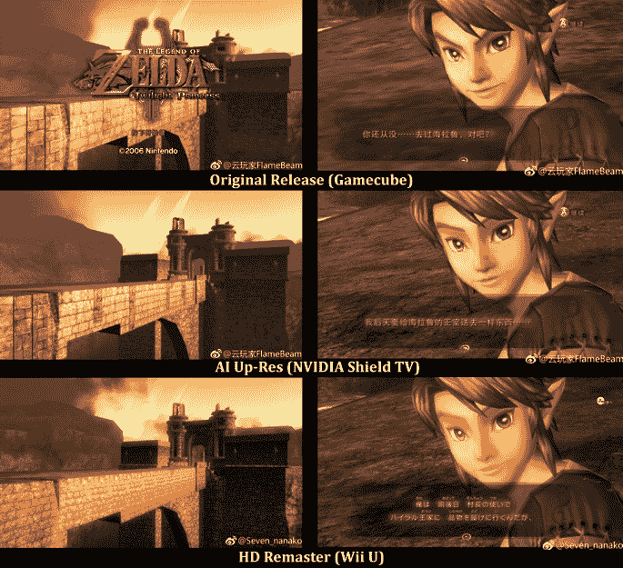

# 英伟达的人工智能认为它知道游戏应该是什么样子

> 原文：<https://hackaday.com/2019/02/04/nvidias-a-i-thinks-it-knows-what-games-are-supposed-look-like/>

电子游戏一直存在于高雅艺术和尖端技术之间的一个怪异的地方。它们面向消费者的本质一直迫使它们既引人注目又价格合理，同时又保持足够的品味，可以放在零售货架上(实体和数字)。实时运行是必要的，所以游戏创作者不可能预先渲染故事片中难以置信的复杂视觉效果。这些软件经常在开发未来的硬件和支持他们真正的用户群所在的过去之间游走。形成的每个像素和组装的每个多边形都是以今天的硅片所能提供的有限浮点运算为代价的。必须做出妥协。

通常游戏中最先妥协的领域之一是环境模型纹理。保持一个可行的帧速率对游戏的可玩性至关重要，背景元素最终可能会被推到“背景”中。如果给艺术家更多的时间或更多的计算资源来优化他们的创作，这些环境的最终外观会更加模糊。但是，如果您可以更新那个十年前的游戏，以利用今天的处理能力和屏幕分辨率，会怎么样呢？

NVIDIA 目前正在使用人工智能来修改许多经典视频游戏中的纹理，使它们符合今天显示器的规格。他们的神经网络能够在没有任何人工干预的情况下从根本上改变游戏的外观。这是好事吗？

> *“所以你拿这个神经网络，你给它一大堆例子，你告诉它什么是输入，什么是**确切的**预期输出；你给它一个机会，在一台超级计算机上尝试，尝试，再尝试万亿次。最终，它开始训练，并做出了惊人的事情。”*
> 
> *–**英伟达 CEO 黄仁勋***

## 人工智能，修正主义历史

随着晶体管向 10 纳米迈进，我们都不再能够指望摩尔定律，NVIDIA 比大多数人更清楚这一点。除了宣布他们的 RTX 系列图形处理器，该公司表示，他们将利用神经网络技术来提高他们的卡的整体性能。通过向这个神经网络输入数以千计的游戏截图，这些截图的分辨率高于 GPU 可以本地渲染的分辨率，他们的 AI 模型能够学习如何在不改变板载处理能力的情况下显示更高质量的图像。[他们的新闻稿称这个过程为“AI Up-Res”](https://www.nvidia.com/en-us/geforce/news/graphics-reinvented-new-technologies-in-rtx-graphics-cards/)。

AI Up-Res 本质上是一种不干涉的方法来增加游戏中模型纹理的整体分辨率…这正是问题所在。提高游戏分辨率的传统方法是将游戏移植到更新、更强大的平台上，并让数字艺术家创建新的纹理。无论哪个开发团队执行更新过程，都有一个来回的批准过程，在这个过程中，熟悉游戏的人就其艺术方向做出决定。此外，这些类型的项目还可以作为未来开发人员的试验场，这些开发人员可以引领未来的创意项目。

这一过程的一个很好的例子是塞尔达传说:暮光之城公主，它在最近几年已经发布了多个版本。最初的游戏是为任天堂 GameCube 开发的，当时的分辨率为 480i，当时高清电视还没有被大众市场接受。10 年后，任天堂委托 Tantalus Media 为 Wii U 游戏机开发了一个可以在 1080p 分辨率下运行的游戏端口。

在这个重新制作过程中的每一步都是由原游戏的导演青岛英治签署的，并且需要不断的沟通以确保游戏中每一个纹理背后的艺术意图得以保留。任天堂最近还在中国的 NVIDIA 的 Shield TV 平台上推出了 2006 年的原版游戏，该平台采用了 AI Up-Res 技术。所以在这里我们可以看到人工智能如何对抗人类团队。

塞尔达为这项新技术提供了一个很好的试验场，因为那里有塞尔达传说的粉丝，他们比他们的大家庭成员更关心林克。这些同样的人带着大量的怀旧情绪，只有不加改变地重播这些经典游戏才能满足这种怀旧情绪。那么人工智能是如何堆叠起来的呢？每种方法的结果可以在下面的截图和视频中看到。

Comparison of textures from The Legend of Zelda: Twilight Princess releases by Weibo users.

## 连接的控制台与心脏断开连接

这一切都发生在整个视频游戏行业都在考虑转向云计算模式的时候。这个概念可能会打开所有设备之间真正平等的大门，但它对持续连接的要求使每个游戏都只能在线体验。如果说我们从《魔兽世界》或《堡垒之夜》等纯在线游戏的生命周期中学到了什么，那就是玩家看到的一切都会发生变化。之前提到的那两个游戏的 1.0 版本与它们后来的发展很不相似。无论好坏，纯在线游戏都在不断地被修改，并且不允许玩家以他们记忆中的状态重新访问它们。人们不难想象未来会充满“贝伦斯坦对贝伦斯坦熊”式的阴谋。

但我们在这里谈论的是重温经典。我们当然不喜欢人工智能纹理。由神经网络生成的“改进”纹理比它们替换的原始纹理更大，但并没有在这些额外的像素中添加任何新的或艺术的东西。[随机梯度下降](http://ufldl.stanford.edu/tutorial/supervised/OptimizationStochasticGradientDescent/)不是一种可以衡量美的方法，它将纯粹的主观追求强加于一种不恰当的客观实践中。NVIDIA 不是唯一这样做的人，因为类似的[过程已经在《毁灭战士》(1993)](https://www.pcgamer.com/uk/this-doom-mod-uses-neural-network-image-upscaling-to-improve-on-a-classic/) 的开源能力中使用，但如果没有人寻求保留游戏的原始愿景，我们注定会忘记是什么让游戏如此特别。

 [https://www.youtube.com/embed/gv3FBDyjzLs?version=3&rel=1&showsearch=0&showinfo=1&iv_load_policy=1&fs=1&hl=en-US&autohide=2&wmode=transparent](https://www.youtube.com/embed/gv3FBDyjzLs?version=3&rel=1&showsearch=0&showinfo=1&iv_load_policy=1&fs=1&hl=en-US&autohide=2&wmode=transparent)

