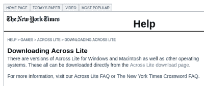

# NYT 纵横字谜决定许多难题

> 原文：<https://hackaday.com/2021/09/24/nyt-crossword-decision-puzzles-many/>

在《纽约时报》( NYT)的填字游戏服务台，[新任命的游戏编辑总监 Everdeen Mason](https://www.nytco.com/press/everdeen-mason-joins-the-times-as-editorial-director-for-games/) 在数字解谜者中引起了一点骚动和喧嚣(都是六个字母的单词，其中*T3U*是第二和第五个字母)。在 8 月初发表的一篇短文中，梅森女士宣布 Lite 不再支持这个纵横字谜游戏，突然终止了两家公司长达 25 年的合作关系。但是其影响远远不止一个应用程序。

早在 1942 年，NYT 首次出版了现在著名的填字游戏，每周日出版，1950 年，它成为了每日特写。1993 年，威尔·肖兹被选为第四任纵横字谜编辑，他至今仍担任这一职务。NYT 在线纵横字谜首次出现于 1996 年——字谜文件可以通过调制解调器下载，并使用 Lite 中的程序[离线解答。](https://www.litsoft.com/across/alite/download/index.html)

 除了调制解调器，这种基本方法一直延续到现在，多年来涌现出了各种各样的程序和应用程序，不仅允许离线游戏，还提供量身定制的功能集，如支持视障人士、谜题狂热者、谜题创作者、团队游戏等。自然，NYT 也加入了这场派对，在网上和通过智能手机应用程序提供填字游戏。

这个问题的核心是跨建兴`.puz`文件，这种格式已经二十年没有升级了。尽管 puz 文件已经过时并且是专有的，但围绕 puz 文件的可用性，一个由求解者、开发者和检查者组成的完整社区已经涌现出来，使它们成为事实上的标准。puz 文件不仅用于分发日常纵横字谜，NYT 还以 puz 格式保存了其所有纵横字谜的档案，可追溯到 1993 年，甚至在在线谜题推出之前。有各种新的格式，但随着 puz 格式的巩固，没有一个成为明显的赢家。跨建兴团队甚至[在 2015 年 NYT 的要求下开发了一种新格式](https://twitter.com/litsoft/status/1423316436412366848)，但奇怪的是，NYT 从未使用过。

## 今天在这里，明天就不见了

通过这一声明，梅森女士不仅仅是放弃了对跨建兴的支持，而是似乎扼杀了整个生态系统，这让益智迷非常懊恼。几天后，她的推特试图解释这个决定，但似乎只会让粉丝更加激动:

> 你好。我是打这个电话的人，我这样做是出于编辑的原因。我试图建立一些东西，编辑可以实际编辑和制作游戏，而不是适应我们无法控制的工具。这需要很多时间，我相信这对我的团队来说是最好的选择

根据目前可用的信息，有些事情对社区中的许多人来说没有意义。为什么突然通知，而不是一个过渡期，给社会时间，使有序过渡到这个新的"东西"？既然问题在于准备 puz 格式的文件，而不是维护它们，为什么 puz 文件的存档被删除了？几乎在一夜之间，[脚本已经出现](https://github.com/Q726kbXuN/nytxw_puz)将 NYT 网站的纵横字谜转换成 puz 格式，类似的脚本已经存在一段时间了。这就引出了一个问题，准备 puz 文件到底有多难？除了把你的谜题印在纸上，这个声明结束了离线解谜的能力，比如当你在飞行的时候。

许多第三方益智应用和程序开发商已经联系梅森，要求她重新考虑。一个这样的应用程序 Puzzazz，[要求只接收任何格式](https://twitter.com/RoyLeban/status/1422812321752047619)，他们的应用程序可以解析它。我认为 Puzzazz 的创始人 Roy Leban 在他的[关于 NYT 填字游戏](https://www.puzzazz.com/nytpuz)情况的公开声明中很好地总结了事情:

> 我们从未因此获得任何收入——事实上，我们每年都要为此付出代价。《时代周刊》,而不是 Puzzazz，从每个在 Puzzazz 解决问题的订阅者身上赚钱。我们这样做是因为几年前我们就知道解谜者转向数字是不可避免的(我们显然是对的)，我们相信最好的填字游戏应该出现在最好的应用程序中，我们觉得解谜者应该得到编辑想要的谜题，并且“水涨船高。”

## 与时俱进

公平地说，我并非不赞同梅森女士的观点。首先，她的职责是监督一套数字游戏和字谜，而不仅仅是填字游戏。支持一种已有 25 年历史的文件格式是一个合理的考虑，这种格式的支持者甚至承认它已经过时了，需要更新。当梅森女士说她的团队应该专注于他们的核心任务——编辑拼图时，我完全同意。

但这让她决定放弃成功且成熟的第三方应用和文件格式，转而开发新的内部工具，显得有些不协调。从各方面来看，目前 NYT 的益智应用和网站都不是这类游戏的典范。我想知道梅森女士的团队，她承认规模小，资源有限，是否能令人满意地填补由此产生的空白。诚然，我并不完全了解导致这一决定的所有事实和问题。但从表面上看，这似乎是有问题的，或者至少是沟通不畅。

当威尔·肖兹在 1993 年被雇佣时，他的任务之一就是带领 NYT 填字游戏进入数字时代，他在这项任务上取得了压倒性的成功。随着最近除了填字游戏之外的逻辑游戏的加入，我们希望 Everdeen Mason 的团队最终会决定在过去 25 年的成功和社区关系的基础上再接再厉，而不是将它们扔到一边，并在开发这种新的“东西”时牢记格言“水涨船高”。在不久的将来，我们会看到一个新的 NYT 益智游戏格式发布给开发者吗？它会治愈这些最近的社区裂痕，并为每个人改善益智游戏生态系统吗？你有什么看法？