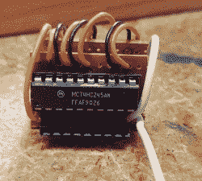

# 旧的 CNC 大脑换成了 Arduino

> 原文：<https://hackaday.com/2022/07/11/old-cnc-brain-swapped-with-an-arduino/>

[Sebastian]和[Stefan Shütz]家里有一台 ISEL EP1090 数控机床，闲置不用，他们决定让它发挥作用。有了[相当好的机械规格，](https://reprap.org/forum/read.php?131,782507)这台 CNC 看起来很有前途——唉，它被它的控制器严重制约了。内置 CPU 的软件严重过时，编程的电机驱动算法很差，与 CNC 的通信也很有限，因为其他设备不使用专有的 ISEL 通信协议。两兄弟把中央处理器从 PLCC 插座上拆下来，接着把一个以`grbl`为燃料的 Arduino 接入控制器盒。

他们对电机驱动器连接进行了逆向工程，这些连接通过原始 CPU 和驱动器之间的 74HC245 缓冲区。最初，他们将 Arduino 放在 CNC 的控制箱内，它非常适合，但结果是 Arduino 的 CPU 会在每次主轴旋转时重新启动，显然，EMC 会抬起头来。因此，他们将 Arduino 放在盒子外面，并使用两根 CAT7 电缆连接电机和终点挡板信号。

为了接入这些信号，他们将 74HC245 从插座中取出，并用两个小原板和一些引脚接头制作了一个插入器，使它们可以连接到 STEP 和 DIR 线，而无需将导线焊接到原始 PCB 中。在他们的 GitHub repo 中有大量的文档、GRBL 设置和更多的图片[，还有](https://github.com/Sebastian-Schuetz/ISEL-EP1090)——如果你有一台类似的 CNC 并且想学习升级它的控制板！

经过这一改造，数控启动没有麻烦。现在，兄弟们应该开始了！通常，让一台旧的数控机床工作起来确实很容易，旧的控制器改造[已经成为我们的主食。](https://hackaday.com/2009/12/28/industrial-cnc-controller-retrofit/)你确实可以使用 Arduino，这是各种预制的控制器板之一，如[沙鼠](https://hackaday.com/2018/12/04/replace-legacy-cnc-pcs-with-a-gerbil/)或 [TinyG、](https://hackaday.com/2015/09/08/how-to-upgrade-a-chinese-cnc-machine/)甚至[树莓派](https://hackaday.com/2018/05/15/direct-cnc-control-with-the-raspberry-pi/)——任何可以帮助你在你和你应该开始摆弄的桌面机器之间架起一座桥梁的东西。