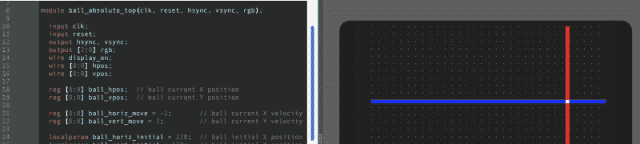

# 旧游戏开发 IDE 走向 FPGA

> 原文：<https://hackaday.com/2018/12/22/old-game-development-ide-goes-fpga/>

如果你对老游戏开发感兴趣——比如 Atari 2600 或类似时期的街机游戏——你可能已经知道了 [8bitworkshop](http://8bitworkshop.com) IDE。您可以在浏览器中为这些平台开发代码。在最近的一篇博客文章中，该网站宣布你现在也可以在 IDE 中进行 [FPGA 开发。](http://8bitworkshop.com/blog/release/2018/12/15/verilog-programming.html)

根据该网站:

> 大多数计算机的速度足以以 60 Hz 的速度渲染游戏，这需要以每秒近 500 万次的速度模拟 Verilog。

要激活 Verilog，你需要选择左上角的汉堡菜单，选择平台，然后在硬件下，勾选 Verilog。与 EDA Playground 不同的是，它的输出可以是波形，也可以是虚拟电视监视器的输出。例如，这里有一个例子:

Verilog 代码产生水平和垂直同步以及 RGB 输出，结果显示在显示器右侧。屏幕底部有一个手柄。如果你向上拖动它，你会看到逻辑分析仪的输出。向下拖动它，你会再次看到屏幕。示例包括 8 位和 16 位 CPU，以及甚至可以读取鼠标的示例游戏。

老实说，我们认为没有人会建议使用 Verilog 来编写浏览器内游戏。这不是问题的关键。然而，如果你正试图学习 Verilog，能够产生一些东西而不仅仅是从模拟中抽象出波形是非常有趣的。唯一的缺点是，要转移到真正的硬件上，您需要复制 ide 提供的接口。这不会很难，当然，如果你只是用它来学习，你可以在现实世界中尝试不同的项目。

如果你需要帮助进入 Verilog，我们有一系列的训练营可以帮助你。这些教程使用 EDA 操场，但他们可能也在这里工作。如果您在 IDE 中尝试它们，请务必让我们知道您的体验。