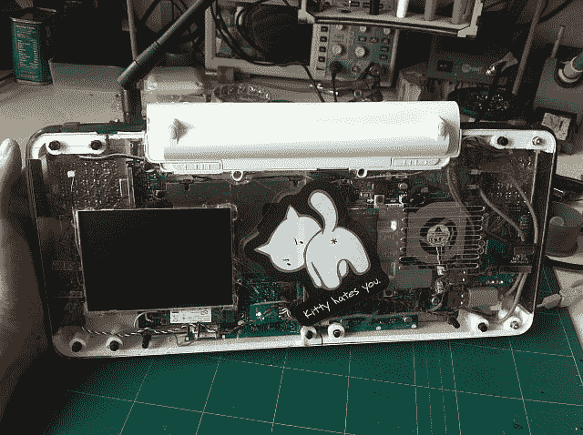

# 旧笔记本电脑？移动 X86 游戏系统！

> 原文：<https://hackaday.com/2018/07/12/old-laptop-reborn-as-mobile-x86-game-system/>

在智能手机和平板电脑之间，计算在本质上变得越来越移动。过去每个人都有一台台式电脑，后来笔记本电脑成为常态，现在许多人除了移动设备之外什么都没有。除非你是那种真正*需要*一台“真正的”电脑所提供的能力和多功能性的人，否则移动设备只是浏览网页和消费内容的一个更方便的选择。

 但是如果你的需求在中间呢？您想要一台 x86 计算机和完整的操作系统，但您还想要比平板电脑更具移动性的产品？如果你像[mnt]一样，你[把一台快不行了的旧 Atom 笔记本电脑改装成 Hacktop](https://codeninja.de/hacktop/)。

[mnt]将 Hacktop 描述为一个“紧急游戏/黑客站”，并说他去哪里都用它。受他的任天堂 DSi 的启发，游戏控件被放在 Hacktop 的前端和中央，他用这台机器玩从*半衰期*到经典模拟器的一切东西。

但是 Hacktop 不仅仅能够玩 Amiga 游戏。手工焊接的 QWERTZ 键盘可以用他的拇指使用，D-Pad 也可以用作光标键。外壳背面有一个笔记本电脑触摸板，10 英寸的液晶显示屏也是一个触摸屏。这个东西上绝对不缺输入设备。它还打包了一些有趣的特殊功能，如集成的 RTL-SDR 和用于移动探索和实验的 LIRC 硬件。[mnt]表示，九芯电池应该可以让它持续工作 12 个小时左右，但这当然取决于他外出时会接触什么样的东西。

黑客们已经[开发他们自己的移动设备很长时间了](https://hackaday.com/2012/02/06/diy-windows-8-tablet/)，与移动消费技术的千篇一律的世界相比，我们总是被[个人采取的创造性方法](https://hackaday.com/2016/09/17/hacklet-125-diy-laptops/)所震惊。