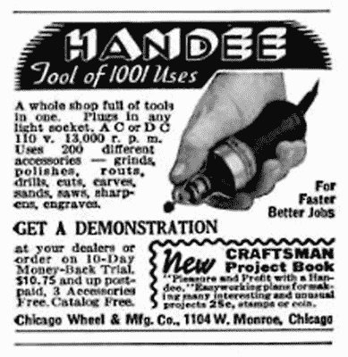
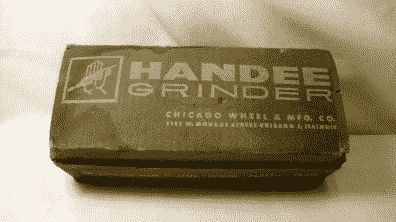
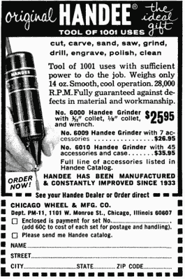

# 不是 Dremel 做的老式旋转工具

> 原文：<https://hackaday.com/2020/05/18/old-school-rotary-tools-that-werent-made-by-dremel/>

Albert Dremel 开发了现在著名的旋转工具，并于 1932 年成立了公司，生产刀片刃磨器。直到 1935 年，该公司才生产出这种被公认为现代 Dremel 的祖先的摩托工具。

Dremel 取得了如此大的优势，以至于今天这个名字是旋转工具的同义词，就像施乐意味着影印，瓦罐是任何慢炖锅一样。当然，你可以从普通的廉价工具商店买到仿制品，但是一般来说，人们会去买 Dremel，即使它并不是真的 Dremel。今天，这种工具可能真的是一个黑色和德克尔或 Dewalt，甚至是一个廉价的品牌，如文或芝加哥电气。但是在 20 世纪上半叶，你可能会伸手去拿一只手。

##  一整店的工具

Handee 是芝加哥车轮和制造公司的产品，在 1937 年，它被宣传为“一个充满工具的商店”，正如你在这个广告中看到的。虽然 10.75 美元听起来像是港口运费便宜工具的价格，但经通胀调整后，2020 年的价格约为 200 美元。至少以这个价格，你可以从 200 多个配件中得到 3 个免费配件。

我不记得 Handee 了，我想看看我是否能弄清楚它发生了什么事，以及制造它的公司。毕竟，有了互联网，这能有多难呢？事实证明，我确实学到了很多东西，但最终，从过去开始追踪这样一家公司并不像你想象的那么容易。

这个工具似乎有很长的历史，我后来知道他们声称从 1933 年就开始制造了。1937 年型号的 13，000 转/分是相当可观的。(现代 Dremel 的转速范围是 3000 到 37000 转/分。)到 1952 年，[该工具转速高达 25000 转/分](https://archive.org/details/PopularMechanics1952/page/n371/mode/2up)，并附带 51 个配件，售价 27.50 美元(约合今天的 270 美元)。

    

他们在像易贝这样的网站上展示了一些，所以看起来他们在那个时代很常见。此外，价格表明供应充足，或者——也许——需求不多。

## 继承的财富

追踪这样一家公司的起源可能会很棘手。《钢铁》第 76 卷报道:

> 芝加哥砂轮制造公司……生产刚玉和金刚砂砂轮等。请告知我们，1899 年的营业额超过了他们开业以来的任何一年。米勒先生最近买下了施奈德先生的股份，施奈德先生与他有着长期的联系。

因此，你可以猜测该公司自 1898 年以来就存在了，或者可能更早，这取决于他们对夸张的偏好。

然而，这一点点给了我在 1911 年的“芝加哥之书”中查找的东西。这位米勒先生就是亨利·爱德华·米勒。1888 年，他成为芝加哥刚玉车轮公司的经理。1895 年，他和四个合伙人买下了这家公司，并改名。

## 他们现在在哪里？

 我能找到的关于芝加哥车轮和制造公司的最后一篇参考文献是在 1967 年[的一篇《大众机械学》](https://archive.org/details/PopularMechanics1967/page/n187/mode/2up/search/handee?q=handee)的文章中。我能找到的最后一个广告是在 1966 年版的同一本上。Handee——“理想的礼物”——售价 26 美元，转速高达 28000 转/分。那则广告声称该工具自 1933 年就已制造。这让你想知道 1932 年成立的 Dremel 是否看到了他们的工具，反之亦然，因为他们几乎是在同一时间开始的。

当你翻阅旧杂志时，你不得不怀疑所有这些公司都发生了什么，尤其是像这样一个似乎是一个相当大的问题。你喜欢认为一切都在互联网上，但在这种情况下，这家公司几乎没有留下任何踪迹。当然，我们可以指出他们多年来保留的一些地址，并在一些杂志上追踪他们的广告，但仅此而已。

公司被卖掉了吗？歇业？也许普通读者知道整个故事。或者，如果你有 Handee，请在评论中告诉我们。与此同时，如果你想升级你的廉价 Dremel 山寨机，[去吧](https://hackaday.com/2019/07/22/a-drop-in-upgrade-module-for-cheap-rotary-tools/)。或者[建造你自己的](https://hackaday.com/2017/11/22/roll-your-own-rotary-tool/)，但是要小心:让一些马达超过 12000 转/分需要比提供的 7.4V 更多的能量

如果这激起了你对旧的学校工具的兴趣，你会想花些时间看的一页是 http://www.flamingsteel.com/my-vintage-tool-collection.php。这里是[，本文的主要图片来自](http://www.flamingsteel.com/my-vintage-tool-collection.php#I4941)，这里堆满了可以追溯到很久以前的老式工具。