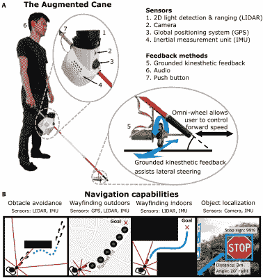

# 全轮手杖引导视力障碍者远离障碍物

> 原文：<https://hackaday.com/2021/10/24/omni-wheeled-cane-steers-the-visually-impaired-away-from-obstacles/>

当然，有智能手杖在那里，商业和其他。这些年来我们见过不少。但是斯坦福大学的一群学生已经成功地给这种增强手杖带来了一些新奇的东西。

 他们的特点是一个机动化的全向轮，在正常的手杖操作过程中从左向右平滑地扫过，当手杖感应到一个物体被证明是一个障碍时，[全向轮进入主动模式，将用户从危险的路径中拉出](https://techxplore.com/news/2021-10-self-navigating-smart-cane.html)。

这个版本最好的部分是，他们用开放硬件制作了这个项目，[在回购中发布了所有血淋淋的细节，所以任何人都可以花大约 400 美元复制它。](https://zenodo.org/record/5535187#.YW7uwhxOmMo)

手杖使用带摄像头的 Raspi 4 来检测物体，并使用二维激光雷达来测量与这些物体的距离。有一个 GPS 和一个 9 自由度 IMU 来找到用户的位置和方向。他们的论文也是公开的，并且附有 BOM 和构建说明。请务必在休息后查看它的运行情况。

有不止一种方法可以用触觉反馈来引导人们。这是我们最近见过的最漂亮的一双鞋。

 [https://www.youtube.com/embed/N8JZXI2oyqk?version=3&rel=1&showsearch=0&showinfo=1&iv_load_policy=1&fs=1&hl=en-US&autohide=2&wmode=transparent](https://www.youtube.com/embed/N8JZXI2oyqk?version=3&rel=1&showsearch=0&showinfo=1&iv_load_policy=1&fs=1&hl=en-US&autohide=2&wmode=transparent)

