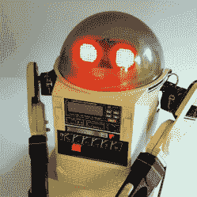

# 80 年代的 Omnibot 有 LED 矩阵眼睛和摄像头

> 原文：<https://hackaday.com/2021/05/18/omnibot-from-the-80s-gets-led-matrix-eyes-camera/>

【Ramin assadollahi】一直忙于重建和改进一个 Omnibot 5402，他想升级的最后一块硬件是[一些 LED 矩阵眼和一个用于计算机视觉的高质量树莓派摄像头](https://assadollahi.de/omnibot-5402-adding-led-matrix-eyes-and-computer-vision/)。Omnibot 是大多数有技术头脑的年轻人在 80 年代垂涎三尺的东西，当[ramin]在网上买了几个二手设备后，他直接去工作台给老式机器升级。毕竟， [Omnibot 5402](http://www.theoldrobots.com/omnibot.html) 在当时是相当了不起的，但通过一些现代硬件可以做得更多。一个需要改进的地方是眼睛。

最初的 Omnibot 的眼睛可以发光，但这是它们所能做到的。第一次升级是安装两个 8×8 LED 矩阵显示器，形成[ramin]所说的最小表情眼睛(MEE)，由树莓 Pi 供电。在 3D 打印适配器和一些巧妙布局的帮助下，LED 矩阵显示器安装在眼板后面，保持原有的外观，同时开辟了新的输出可能性。

添加一个带有广角镜头的高质量 Raspberry Pi 相机更具挑战性，需要超长的相机带状连接器，但镜头位于眼睛下方，相机具有良好的视野，当眼睛被照亮时不会特别明显。已经升级了其余的硬件，现在剩下的就是软件工作，我们迫不及待地想看到结果。

下面嵌入了硬件的两个短视频，一定要给他们一睹为快。当你准备好更多的 80 年代机器人升级行动时，请看看英雄 Jr 。

 [https://www.youtube.com/embed/OCCRxGG5pnA?version=3&rel=1&showsearch=0&showinfo=1&iv_load_policy=1&fs=1&hl=en-US&autohide=2&wmode=transparent](https://www.youtube.com/embed/OCCRxGG5pnA?version=3&rel=1&showsearch=0&showinfo=1&iv_load_policy=1&fs=1&hl=en-US&autohide=2&wmode=transparent)

r

 [https://www.youtube.com/embed/Y6OnrJYyLro?version=3&rel=1&showsearch=0&showinfo=1&iv_load_policy=1&fs=1&hl=en-US&autohide=2&wmode=transparent](https://www.youtube.com/embed/Y6OnrJYyLro?version=3&rel=1&showsearch=0&showinfo=1&iv_load_policy=1&fs=1&hl=en-US&autohide=2&wmode=transparent)

