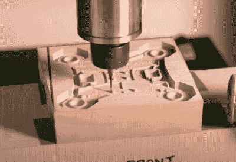

# Omnibot 展示了十多年的数控技术实力

> 原文：<https://hackaday.com/2022/04/23/omnibot-shows-off-over-a-decade-of-cnc-prowess/>

乍一看，你可能认为 Omnibot v3 只不过是一个基本的 3D 打印机器人平台，但你在这两个问题上都错了。实际上没有 3D 打印的部件，虽然你可以把这个平台描述得过于简单，但称它为 basic 肯定不符合巧妙的设计。[在休息之后的视频中](https://www.youtube.com/watch?v=Gp5zqOIEvws)，创作者【Michal】带我们经历了设计和建造这个高质量机器人的过程。

构建开始于 CAD 程序中的大量时间和精力，该程序设计了 Omnibot v3，它具有四轮转向和原地旋转等奇特功能。随着 CAD 和 3D 渲染的出现，从数字到物理的转换过程从 CNC 路由器开始。

 不是用合适的材料把单个的部件加工出来，【迈克尔】切割成型。那些模型仅仅是为了制造硅胶模具而制作的。这些硅模具然后被用来浇注聚氨酯树脂的实际部分。正是这些树脂部件组成了实际的 Omnibot v3，视频最后是手动演示的。

总而言之，这是一个流程简洁的项目。如果我们到此为止，事情就基本完成了，你会点击下一篇伟大的 Hackaday 文章。但是这里还有更多。你看，[Michal]也是 CNC 和树脂铸造游击队指南的支持者。用他自己的话说:“*数控加工和树脂铸造是一种不被看好的生产工程级零件的方法，但这一过程快速、可预测，并且对车库友好。*“看到结果后，我们忍不住要认同。

顺便说一下，在任何人在评论中大喊“欺骗！”，我们已经知道了。你看，我们之前精选过一次数控和树脂铸造的游击指南，[差不多正好 11.5](https://hackaday.com/2010/12/22/guerilla-guide-to-cnc-machining/) *[年前](https://hackaday.com/2010/12/22/guerilla-guide-to-cnc-machining/)！*从那时起，它就一直在更新，对于任何想成为[Michal]的人来说，它似乎是一座绝对的信息金矿。

 [https://www.youtube.com/embed/Gp5zqOIEvws?version=3&rel=1&showsearch=0&showinfo=1&iv_load_policy=1&fs=1&hl=en-US&autohide=2&wmode=transparent](https://www.youtube.com/embed/Gp5zqOIEvws?version=3&rel=1&showsearch=0&showinfo=1&iv_load_policy=1&fs=1&hl=en-US&autohide=2&wmode=transparent)

