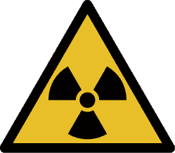
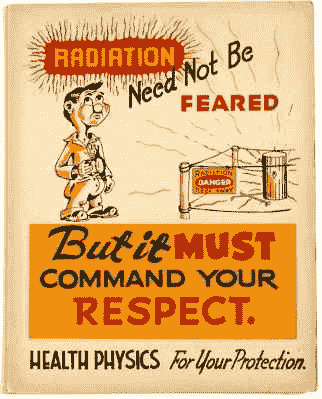

# 5G 和对辐射的恐惧

> 原文：<https://hackaday.com/2020/04/08/on-5g-and-the-fear-of-radiation/>

我们周围的世界是一个可怕的地方，有许多可见和不可见的危险。有些看不见的危险是显而易见的，比如暴露在外的电线造成的电击。有些不太明显，例如众所周知的紫外线辐射对人的皮肤和眼睛的危害，但也被许多人严重低估，直到为时已晚。仅在美国，每五个人中就有一个人患皮肤癌。

也许具有讽刺意味的是，虽然紫外线辐射之类的危险经常被低估，但其他类型的电磁辐射却被大大高估了。太多时候，区分什么是有害的，什么不是有害的，似乎纯粹是基于它是否是“自然”辐射。太阳是“天然的”，因此紫外线辐射不会有害，但来自微波或 5G 无线收发器的电磁辐射是人为的，因此是有害的。这当然是倒退了。

与其无视这种对辐射的非理性恐惧，不如让我们看看辐射背后的科学以及人类对“危险”的分类方式，比如 5G 手机信号塔。

## 电离与非电离

Ionizing radiation gets a warning sign, non-ionizing does not.

关于辐射，你首先应该问的是它是否会电离。电离辐射有足够的能量将原子内的电子踢出轨道。因此，电离辐射顾名思义是有害的，我们的细胞有修复机制来修复我们每天暴露在背景辐射中所遭受的损害。电离辐射会导致癌症，如果它到达生殖细胞，会产生可遗传的遗传疾病，并导致直接的组织损伤。电离辐射的形式要么是带电粒子(α和β辐射)，要么是能量足以间接电离原子的光子(γ射线)。

相反，非电离辐射利用产生的电磁场使分子运动。以微波炉为例，它产生大约 2.45 GHz 的非电离电磁辐射，这个频率可以很好地影响水分子的偶极矩。通过在交变电磁场中不同方向之间快速移动水分子，水分子开始在称为[介电加热](https://en.wikipedia.org/wiki/Dielectric_heating)的过程中以热的形式耗散其动能。重要的区别在于，非电离辐射不会改变水的化学性质，它只会加热水。

紫外光是一个有趣的例外，因为它跨越了非电离辐射和电离辐射的界限，即使是非电离辐射也可能对人类造成危险。虽然在 UV-A 到 UV-C 范围内的紫外线不会电离，但它会损害 DNA 和眼睛的某些部分。这就是为什么 UV-C 辐射被用于实验室和医院的表面消毒:通过破坏 DNA 和 RNA，它杀死细菌和病毒。极端紫外线( [EUV](https://en.wikipedia.org/wiki/Extreme_ultraviolet) )与紫外线-C 略有重叠，电离作用如此强烈，通常只能通过真空传播。

## 非电离辐射相当热

电介质加热原理适用于所有非电离辐射:对人体的主要影响包括影响我们组织中分子的偶极矩，导致局部加热。这就是为什么站在阳光下，或者在红外线加热灯前，或者在工作的雷达天线前会让人感到温暖。我们所感知的物体辐射的“热”主要在红外光谱中，这就是为什么红外敏感传感器通常用于测量这一点，例如红外摄像机。

虽然在极端情况下，这种类型的辐射也会影响细胞膜，但这需要更多的能量。到那时，产生的热量将被血液带到身体的核心，在那里它将破坏必要的酶和其他功能。扰乱这种核心体温几乎不可避免地会致命，甚至会在细胞受损之前就让你丧命。

此外，电磁辐射(EMR)进入生物组织的穿透深度在大约 10 MHz 后急剧下降，这意味着高频 EMR 主要影响皮肤及其正下方的组织。在该区域的细胞膜破裂成为问题之前，一个人的核心体温已经上升到并超过致命水平，表现为中暑。

## 恐惧心理学

能够快速识别环境中的威胁，并找出如何应对这些危险是一种基本的生存特征。与这种威胁相关的情绪被称为恐惧。恐惧反应可以是理性的(有理由的反应)也可以是非理性的(恐惧症)。个人也可能完全忽视实际威胁，或利用假设因素减轻威胁。后者的一个例子是来自吸烟和饮酒的非常真实的威胁，在这种情况下，吸烟和饮酒被认为是应对压力等的一种机制。

这种有选择地应对环境威胁的方法常常导致各种缓解因素的拼凑，以及在不存在威胁的情况下感知到的威胁。这些感知到的威胁可能是前述的恐惧症，但也可能源自偏执狂。在偏执狂的情况下，一个想法或观念被焦虑和恐惧放大，常常达到妄想和无理性的程度。这些错觉往往伴随着阴谋因素，一个人或一个团体被指控是这种感知威胁的幕后黑手。同时，[认知偏差](https://en.wikipedia.org/wiki/Cognitive_bias)阻碍了对应该改变他们想法的信息的理解。

 几十年来，对无线设备安全的恐惧与日俱增，还有“非自然”辐射，包括来自室内交流电源线路的辐射。早在 1903 年，这些人就被称为“辐射恐惧者”，其中一些人声称对电磁辐射过敏。对辐射的普遍恐惧影响了政治家们做出灾难性的决定，并促使瑞士等国家暂停 5G，因为“事实证明高频电磁场对人体有害”。

研究大概表明，远低于国际非电离辐射防护委员会(ICNIRP)建议(T2)的辐射水平会导致各种癌症的增加。此外，世界卫生组织[已经将](https://www.ncbi.nlm.nih.gov/pmc/articles/PMC5504984/)射频(射频电磁)风险归类为‘2B 组’，意思是‘可能的人类致癌物’。与此同时，主流报纸文章提倡阴谋论，暗示来自射频电磁辐射危害的真相对我们是隐藏的，就像烟草一样。

最近，[出现了一个谣言](https://www.bbc.co.uk/news/uk-england-52164358)说 5G 在某种程度上对[新型冠状病毒](https://en.wikipedia.org/wiki/Severe_acute_respiratory_syndrome_coronavirus_2)(非正式地:“冠状病毒”)疫情负责，或者与之有关，人们甚至烧毁了包含 5G 和其他无线收发器的塔。正如 ExtremeTech [的[Joel Hruska]简洁地指出的](https://www.extremetech.com/extreme/307939-5g-doesnt-cause-coronavirus-but-coronavirus-might-cause-5g)，人们感到不安的 5G 毫米波(20+ GHz)部分范围非常小，这意味着我们体验到的“5G 辐射”的绝大部分将与 4G (LTE)和 WiFi 处于大致相同的频率范围。

你感到害怕了吗？

## 辐射安全科学

科学方法的全部意义在于系统地检查和发现我们周围的一切是如何工作的，无论是在宏观、微观还是量子水平上。当一群人声称他们可以以某种方式“感应”电磁场，以至于影响到他们的身体健康时，这就引发了很多问题。主要的一点是，没有已知的生物机制表明人类会受到 EMR 的影响。

自然，如果这不能阻止科学家建立控制测试，让声称患有过敏症的受试者参与，那就不是科学了。在不同的研究人员进行了 28 次这样的研究后，另一组研究人员会写一篇综述文章来总结这些研究的发现。毫不奇怪，电磁(超)敏感性的证据完全不存在。

这就留下了一个问题，即来自手机信号塔和 WiFi 接入点的非电离辐射是否有害，正如一些人所说的。当然有可能，如果它能显著加热组织的话。然而，4G 和 5G 无线发射塔的辐射量，以及通话时手持手机的辐射量，几乎不会产生任何热量，因为[涉及的能量水平很低](https://ieeexplore.ieee.org/document/8247178)。就这样吗？

也许可以反驳手机射频辐射潜在危害的最明确的证据来自有史以来对超过 50 亿手机用户进行的最大规模的实验。尽管在过去的几十年里，随着手机的普及，射频辐射的暴露量有了绝对惊人的增长，但肿瘤或其他有害影响并没有相应增加。不是来自模拟手机网络，也不是来自 2G、3G、4G 或 WiFi。

美国国家癌症研究所在他们的情况说明书上也提到了这一事实，以及一份详尽的队列、实验和其他研究清单。正如他们注意到的，除了热加热的影响还没有显示出来。涉及肿瘤和其他有害影响的研究结果无法复制，而且众所周知，不可靠的队列研究不得不全盘接受，尤其是当实验研究未能发现低水平射频电磁辐射使用的任何生物机制时。这些结果很可能是由其他不可控因素造成的。[英国癌症研究中心](https://www.cancerresearchuk.org/about-cancer/causes-of-cancer/cancer-controversies/do-mobile-phones-cause-cancer)和其他机构同意 NCI 的观点。这就是科学。

## 注意安全，不要害怕

因此，问题的本质似乎是恐惧和偏执的人要求行业毫无疑问地证明，像手机使用的射频电磁辐射是“绝对安全的”。不幸的是，与数学不同，[科学不处理证明](https://www.psychologytoday.com/us/blog/the-scientific-fundamentalist/200811/common-misconceptions-about-science-i-scientific-proof)，只处理证据。虽然证据可以很容易地反驳一个理论，但它不能证明某种东西是安全的——科学所能做的只是排除潜在的伤害原因。到目前为止，这已经完成了。

据我们所知*今天*，我们可以自信地说，除了热效应之外，没有来自非电离辐射的影响，除了紫外线辐射的边缘情况。未来可能会有新的发现表明 e 对射频 EMR 的安全性过于乐观吗？自 20 世纪 80 年代以来，关于手机使用的数据和证据并不支持任何使用手机有害的说法，也不支持任何对照研究。

直到今天，使用智能手机唯一真正可以证明的危害是走进打开的井盖，撞到路灯杆，当然还会导致交通事故。因此，最好的建议是，只有在安全的情况下才使用手机，避免在开车或走路时使用手机。此外，要小心不要相信来自任何你自己都没有验证过的人的随机信息。如有疑问，请咨询该领域真正的专家。

注意安全，享受您的无线自由。请停止烧毁手机信号塔。